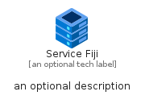
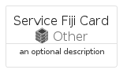
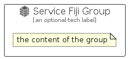

# ServiceFiji


```text
azure-17/Item/Other/ServiceFiji
```

```text
include('azure-17/Item/Other/ServiceFiji')
```


| Illustration | ServiceFiji | ServiceFijiCard | ServiceFijiGroup |
| :---: | :---: | :---: | :---: |
|  |  |  |  |


## Sprites
The item provides the following sriptes:

- `<$ServiceFijiXs>`
- `<$ServiceFijiSm>`
- `<$ServiceFijiMd>`
- `<$ServiceFijiLg>`


## ServiceFiji

### Load remotely
```plantuml
@startuml
' configures the library
!global $LIB_BASE_LOCATION="https://raw.githubusercontent.com/tmorin/plantuml-libs/master/distribution"

' loads the library's bootstrap
!include $LIB_BASE_LOCATION/bootstrap.puml

' loads the package bootstrap
include('azure-17/bootstrap')

' loads the Item which embeds the element ServiceFiji
include('azure-17/Item/Other/ServiceFiji')

' renders the element
ServiceFiji('ServiceFiji', 'Service Fiji', 'an optional tech label', 'an optional description')
@enduml
```

### Load locally
```plantuml
@startuml
' configures the library
!global $INCLUSION_MODE="local"
!global $LIB_BASE_LOCATION="../../.."

' loads the library's bootstrap
!include $LIB_BASE_LOCATION/bootstrap.puml

' loads the package bootstrap
include('azure-17/bootstrap')

' loads the Item which embeds the element ServiceFiji
include('azure-17/Item/Other/ServiceFiji')

' renders the element
ServiceFiji('ServiceFiji', 'Service Fiji', 'an optional tech label', 'an optional description')
@enduml
```

## ServiceFijiCard

### Load remotely
```plantuml
@startuml
' configures the library
!global $LIB_BASE_LOCATION="https://raw.githubusercontent.com/tmorin/plantuml-libs/master/distribution"

' loads the library's bootstrap
!include $LIB_BASE_LOCATION/bootstrap.puml

' loads the package bootstrap
include('azure-17/bootstrap')

' loads the Item which embeds the element ServiceFijiCard
include('azure-17/Item/Other/ServiceFiji')

' renders the element
ServiceFijiCard('ServiceFijiCard', 'Service Fiji Card', 'an optional description')
@enduml
```

### Load locally
```plantuml
@startuml
' configures the library
!global $INCLUSION_MODE="local"
!global $LIB_BASE_LOCATION="../../.."

' loads the library's bootstrap
!include $LIB_BASE_LOCATION/bootstrap.puml

' loads the package bootstrap
include('azure-17/bootstrap')

' loads the Item which embeds the element ServiceFijiCard
include('azure-17/Item/Other/ServiceFiji')

' renders the element
ServiceFijiCard('ServiceFijiCard', 'Service Fiji Card', 'an optional description')
@enduml
```

## ServiceFijiGroup

### Load remotely
```plantuml
@startuml
' configures the library
!global $LIB_BASE_LOCATION="https://raw.githubusercontent.com/tmorin/plantuml-libs/master/distribution"

' loads the library's bootstrap
!include $LIB_BASE_LOCATION/bootstrap.puml

' loads the package bootstrap
include('azure-17/bootstrap')

' loads the Item which embeds the element ServiceFijiGroup
include('azure-17/Item/Other/ServiceFiji')

' renders the element
ServiceFijiGroup('ServiceFijiGroup', 'Service Fiji Group', 'an optional tech label') {
    note as note
        the content of the group
    end note
}
@enduml
```

### Load locally
```plantuml
@startuml
' configures the library
!global $INCLUSION_MODE="local"
!global $LIB_BASE_LOCATION="../../.."

' loads the library's bootstrap
!include $LIB_BASE_LOCATION/bootstrap.puml

' loads the package bootstrap
include('azure-17/bootstrap')

' loads the Item which embeds the element ServiceFijiGroup
include('azure-17/Item/Other/ServiceFiji')

' renders the element
ServiceFijiGroup('ServiceFijiGroup', 'Service Fiji Group', 'an optional tech label') {
    note as note
        the content of the group
    end note
}
@enduml
```

