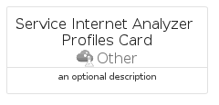

# ServiceInternetAnalyzerProfiles


```text
azure-17/Item/Other/ServiceInternetAnalyzerProfiles
```

```text
include('azure-17/Item/Other/ServiceInternetAnalyzerProfiles')
```


| Illustration | ServiceInternetAnalyzerProfiles | ServiceInternetAnalyzerProfilesCard | ServiceInternetAnalyzerProfilesGroup |
| :---: | :---: | :---: | :---: |
|  |  |  |  |


## Sprites
The item provides the following sriptes:

- `<$ServiceInternetAnalyzerProfilesXs>`
- `<$ServiceInternetAnalyzerProfilesSm>`
- `<$ServiceInternetAnalyzerProfilesMd>`
- `<$ServiceInternetAnalyzerProfilesLg>`


## ServiceInternetAnalyzerProfiles

### Load remotely
```plantuml
@startuml
' configures the library
!global $LIB_BASE_LOCATION="https://raw.githubusercontent.com/tmorin/plantuml-libs/master/distribution"

' loads the library's bootstrap
!include $LIB_BASE_LOCATION/bootstrap.puml

' loads the package bootstrap
include('azure-17/bootstrap')

' loads the Item which embeds the element ServiceInternetAnalyzerProfiles
include('azure-17/Item/Other/ServiceInternetAnalyzerProfiles')

' renders the element
ServiceInternetAnalyzerProfiles('ServiceInternetAnalyzerProfiles', 'Service Internet Analyzer Profiles', 'an optional tech label', 'an optional description')
@enduml
```

### Load locally
```plantuml
@startuml
' configures the library
!global $INCLUSION_MODE="local"
!global $LIB_BASE_LOCATION="../../.."

' loads the library's bootstrap
!include $LIB_BASE_LOCATION/bootstrap.puml

' loads the package bootstrap
include('azure-17/bootstrap')

' loads the Item which embeds the element ServiceInternetAnalyzerProfiles
include('azure-17/Item/Other/ServiceInternetAnalyzerProfiles')

' renders the element
ServiceInternetAnalyzerProfiles('ServiceInternetAnalyzerProfiles', 'Service Internet Analyzer Profiles', 'an optional tech label', 'an optional description')
@enduml
```

## ServiceInternetAnalyzerProfilesCard

### Load remotely
```plantuml
@startuml
' configures the library
!global $LIB_BASE_LOCATION="https://raw.githubusercontent.com/tmorin/plantuml-libs/master/distribution"

' loads the library's bootstrap
!include $LIB_BASE_LOCATION/bootstrap.puml

' loads the package bootstrap
include('azure-17/bootstrap')

' loads the Item which embeds the element ServiceInternetAnalyzerProfilesCard
include('azure-17/Item/Other/ServiceInternetAnalyzerProfiles')

' renders the element
ServiceInternetAnalyzerProfilesCard('ServiceInternetAnalyzerProfilesCard', 'Service Internet Analyzer Profiles Card', 'an optional description')
@enduml
```

### Load locally
```plantuml
@startuml
' configures the library
!global $INCLUSION_MODE="local"
!global $LIB_BASE_LOCATION="../../.."

' loads the library's bootstrap
!include $LIB_BASE_LOCATION/bootstrap.puml

' loads the package bootstrap
include('azure-17/bootstrap')

' loads the Item which embeds the element ServiceInternetAnalyzerProfilesCard
include('azure-17/Item/Other/ServiceInternetAnalyzerProfiles')

' renders the element
ServiceInternetAnalyzerProfilesCard('ServiceInternetAnalyzerProfilesCard', 'Service Internet Analyzer Profiles Card', 'an optional description')
@enduml
```

## ServiceInternetAnalyzerProfilesGroup

### Load remotely
```plantuml
@startuml
' configures the library
!global $LIB_BASE_LOCATION="https://raw.githubusercontent.com/tmorin/plantuml-libs/master/distribution"

' loads the library's bootstrap
!include $LIB_BASE_LOCATION/bootstrap.puml

' loads the package bootstrap
include('azure-17/bootstrap')

' loads the Item which embeds the element ServiceInternetAnalyzerProfilesGroup
include('azure-17/Item/Other/ServiceInternetAnalyzerProfiles')

' renders the element
ServiceInternetAnalyzerProfilesGroup('ServiceInternetAnalyzerProfilesGroup', 'Service Internet Analyzer Profiles Group', 'an optional tech label') {
    note as note
        the content of the group
    end note
}
@enduml
```

### Load locally
```plantuml
@startuml
' configures the library
!global $INCLUSION_MODE="local"
!global $LIB_BASE_LOCATION="../../.."

' loads the library's bootstrap
!include $LIB_BASE_LOCATION/bootstrap.puml

' loads the package bootstrap
include('azure-17/bootstrap')

' loads the Item which embeds the element ServiceInternetAnalyzerProfilesGroup
include('azure-17/Item/Other/ServiceInternetAnalyzerProfiles')

' renders the element
ServiceInternetAnalyzerProfilesGroup('ServiceInternetAnalyzerProfilesGroup', 'Service Internet Analyzer Profiles Group', 'an optional tech label') {
    note as note
        the content of the group
    end note
}
@enduml
```

