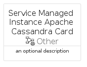

# ServiceManagedInstanceApacheCassandra


```text
azure-17/Item/Other/ServiceManagedInstanceApacheCassandra
```

```text
include('azure-17/Item/Other/ServiceManagedInstanceApacheCassandra')
```


| Illustration | ServiceManagedInstanceApacheCassandra | ServiceManagedInstanceApacheCassandraCard | ServiceManagedInstanceApacheCassandraGroup |
| :---: | :---: | :---: | :---: |
|  |  |  |  |


## Sprites
The item provides the following sriptes:

- `<$ServiceManagedInstanceApacheCassandraXs>`
- `<$ServiceManagedInstanceApacheCassandraSm>`
- `<$ServiceManagedInstanceApacheCassandraMd>`
- `<$ServiceManagedInstanceApacheCassandraLg>`


## ServiceManagedInstanceApacheCassandra

### Load remotely
```plantuml
@startuml
' configures the library
!global $LIB_BASE_LOCATION="https://raw.githubusercontent.com/tmorin/plantuml-libs/master/distribution"

' loads the library's bootstrap
!include $LIB_BASE_LOCATION/bootstrap.puml

' loads the package bootstrap
include('azure-17/bootstrap')

' loads the Item which embeds the element ServiceManagedInstanceApacheCassandra
include('azure-17/Item/Other/ServiceManagedInstanceApacheCassandra')

' renders the element
ServiceManagedInstanceApacheCassandra('ServiceManagedInstanceApacheCassandra', 'Service Managed Instance Apache Cassandra', 'an optional tech label', 'an optional description')
@enduml
```

### Load locally
```plantuml
@startuml
' configures the library
!global $INCLUSION_MODE="local"
!global $LIB_BASE_LOCATION="../../.."

' loads the library's bootstrap
!include $LIB_BASE_LOCATION/bootstrap.puml

' loads the package bootstrap
include('azure-17/bootstrap')

' loads the Item which embeds the element ServiceManagedInstanceApacheCassandra
include('azure-17/Item/Other/ServiceManagedInstanceApacheCassandra')

' renders the element
ServiceManagedInstanceApacheCassandra('ServiceManagedInstanceApacheCassandra', 'Service Managed Instance Apache Cassandra', 'an optional tech label', 'an optional description')
@enduml
```

## ServiceManagedInstanceApacheCassandraCard

### Load remotely
```plantuml
@startuml
' configures the library
!global $LIB_BASE_LOCATION="https://raw.githubusercontent.com/tmorin/plantuml-libs/master/distribution"

' loads the library's bootstrap
!include $LIB_BASE_LOCATION/bootstrap.puml

' loads the package bootstrap
include('azure-17/bootstrap')

' loads the Item which embeds the element ServiceManagedInstanceApacheCassandraCard
include('azure-17/Item/Other/ServiceManagedInstanceApacheCassandra')

' renders the element
ServiceManagedInstanceApacheCassandraCard('ServiceManagedInstanceApacheCassandraCard', 'Service Managed Instance Apache Cassandra Card', 'an optional description')
@enduml
```

### Load locally
```plantuml
@startuml
' configures the library
!global $INCLUSION_MODE="local"
!global $LIB_BASE_LOCATION="../../.."

' loads the library's bootstrap
!include $LIB_BASE_LOCATION/bootstrap.puml

' loads the package bootstrap
include('azure-17/bootstrap')

' loads the Item which embeds the element ServiceManagedInstanceApacheCassandraCard
include('azure-17/Item/Other/ServiceManagedInstanceApacheCassandra')

' renders the element
ServiceManagedInstanceApacheCassandraCard('ServiceManagedInstanceApacheCassandraCard', 'Service Managed Instance Apache Cassandra Card', 'an optional description')
@enduml
```

## ServiceManagedInstanceApacheCassandraGroup

### Load remotely
```plantuml
@startuml
' configures the library
!global $LIB_BASE_LOCATION="https://raw.githubusercontent.com/tmorin/plantuml-libs/master/distribution"

' loads the library's bootstrap
!include $LIB_BASE_LOCATION/bootstrap.puml

' loads the package bootstrap
include('azure-17/bootstrap')

' loads the Item which embeds the element ServiceManagedInstanceApacheCassandraGroup
include('azure-17/Item/Other/ServiceManagedInstanceApacheCassandra')

' renders the element
ServiceManagedInstanceApacheCassandraGroup('ServiceManagedInstanceApacheCassandraGroup', 'Service Managed Instance Apache Cassandra Group', 'an optional tech label') {
    note as note
        the content of the group
    end note
}
@enduml
```

### Load locally
```plantuml
@startuml
' configures the library
!global $INCLUSION_MODE="local"
!global $LIB_BASE_LOCATION="../../.."

' loads the library's bootstrap
!include $LIB_BASE_LOCATION/bootstrap.puml

' loads the package bootstrap
include('azure-17/bootstrap')

' loads the Item which embeds the element ServiceManagedInstanceApacheCassandraGroup
include('azure-17/Item/Other/ServiceManagedInstanceApacheCassandra')

' renders the element
ServiceManagedInstanceApacheCassandraGroup('ServiceManagedInstanceApacheCassandraGroup', 'Service Managed Instance Apache Cassandra Group', 'an optional tech label') {
    note as note
        the content of the group
    end note
}
@enduml
```

