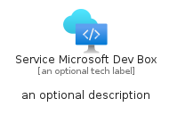
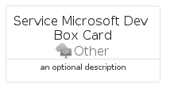

# ServiceMicrosoftDevBox


```text
azure-17/Item/Other/ServiceMicrosoftDevBox
```

```text
include('azure-17/Item/Other/ServiceMicrosoftDevBox')
```


| Illustration | ServiceMicrosoftDevBox | ServiceMicrosoftDevBoxCard | ServiceMicrosoftDevBoxGroup |
| :---: | :---: | :---: | :---: |
|  |  |  |  |


## Sprites
The item provides the following sriptes:

- `<$ServiceMicrosoftDevBoxXs>`
- `<$ServiceMicrosoftDevBoxSm>`
- `<$ServiceMicrosoftDevBoxMd>`
- `<$ServiceMicrosoftDevBoxLg>`


## ServiceMicrosoftDevBox

### Load remotely
```plantuml
@startuml
' configures the library
!global $LIB_BASE_LOCATION="https://raw.githubusercontent.com/tmorin/plantuml-libs/master/distribution"

' loads the library's bootstrap
!include $LIB_BASE_LOCATION/bootstrap.puml

' loads the package bootstrap
include('azure-17/bootstrap')

' loads the Item which embeds the element ServiceMicrosoftDevBox
include('azure-17/Item/Other/ServiceMicrosoftDevBox')

' renders the element
ServiceMicrosoftDevBox('ServiceMicrosoftDevBox', 'Service Microsoft Dev Box', 'an optional tech label', 'an optional description')
@enduml
```

### Load locally
```plantuml
@startuml
' configures the library
!global $INCLUSION_MODE="local"
!global $LIB_BASE_LOCATION="../../.."

' loads the library's bootstrap
!include $LIB_BASE_LOCATION/bootstrap.puml

' loads the package bootstrap
include('azure-17/bootstrap')

' loads the Item which embeds the element ServiceMicrosoftDevBox
include('azure-17/Item/Other/ServiceMicrosoftDevBox')

' renders the element
ServiceMicrosoftDevBox('ServiceMicrosoftDevBox', 'Service Microsoft Dev Box', 'an optional tech label', 'an optional description')
@enduml
```

## ServiceMicrosoftDevBoxCard

### Load remotely
```plantuml
@startuml
' configures the library
!global $LIB_BASE_LOCATION="https://raw.githubusercontent.com/tmorin/plantuml-libs/master/distribution"

' loads the library's bootstrap
!include $LIB_BASE_LOCATION/bootstrap.puml

' loads the package bootstrap
include('azure-17/bootstrap')

' loads the Item which embeds the element ServiceMicrosoftDevBoxCard
include('azure-17/Item/Other/ServiceMicrosoftDevBox')

' renders the element
ServiceMicrosoftDevBoxCard('ServiceMicrosoftDevBoxCard', 'Service Microsoft Dev Box Card', 'an optional description')
@enduml
```

### Load locally
```plantuml
@startuml
' configures the library
!global $INCLUSION_MODE="local"
!global $LIB_BASE_LOCATION="../../.."

' loads the library's bootstrap
!include $LIB_BASE_LOCATION/bootstrap.puml

' loads the package bootstrap
include('azure-17/bootstrap')

' loads the Item which embeds the element ServiceMicrosoftDevBoxCard
include('azure-17/Item/Other/ServiceMicrosoftDevBox')

' renders the element
ServiceMicrosoftDevBoxCard('ServiceMicrosoftDevBoxCard', 'Service Microsoft Dev Box Card', 'an optional description')
@enduml
```

## ServiceMicrosoftDevBoxGroup

### Load remotely
```plantuml
@startuml
' configures the library
!global $LIB_BASE_LOCATION="https://raw.githubusercontent.com/tmorin/plantuml-libs/master/distribution"

' loads the library's bootstrap
!include $LIB_BASE_LOCATION/bootstrap.puml

' loads the package bootstrap
include('azure-17/bootstrap')

' loads the Item which embeds the element ServiceMicrosoftDevBoxGroup
include('azure-17/Item/Other/ServiceMicrosoftDevBox')

' renders the element
ServiceMicrosoftDevBoxGroup('ServiceMicrosoftDevBoxGroup', 'Service Microsoft Dev Box Group', 'an optional tech label') {
    note as note
        the content of the group
    end note
}
@enduml
```

### Load locally
```plantuml
@startuml
' configures the library
!global $INCLUSION_MODE="local"
!global $LIB_BASE_LOCATION="../../.."

' loads the library's bootstrap
!include $LIB_BASE_LOCATION/bootstrap.puml

' loads the package bootstrap
include('azure-17/bootstrap')

' loads the Item which embeds the element ServiceMicrosoftDevBoxGroup
include('azure-17/Item/Other/ServiceMicrosoftDevBox')

' renders the element
ServiceMicrosoftDevBoxGroup('ServiceMicrosoftDevBoxGroup', 'Service Microsoft Dev Box Group', 'an optional tech label') {
    note as note
        the content of the group
    end note
}
@enduml
```

