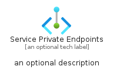

# ServicePrivateEndpoints


```text
azure-17/Item/Other/ServicePrivateEndpoints
```

```text
include('azure-17/Item/Other/ServicePrivateEndpoints')
```


| Illustration | ServicePrivateEndpoints | ServicePrivateEndpointsCard | ServicePrivateEndpointsGroup |
| :---: | :---: | :---: | :---: |
|  |  |  |  |


## Sprites
The item provides the following sriptes:

- `<$ServicePrivateEndpointsXs>`
- `<$ServicePrivateEndpointsSm>`
- `<$ServicePrivateEndpointsMd>`
- `<$ServicePrivateEndpointsLg>`


## ServicePrivateEndpoints

### Load remotely
```plantuml
@startuml
' configures the library
!global $LIB_BASE_LOCATION="https://raw.githubusercontent.com/tmorin/plantuml-libs/master/distribution"

' loads the library's bootstrap
!include $LIB_BASE_LOCATION/bootstrap.puml

' loads the package bootstrap
include('azure-17/bootstrap')

' loads the Item which embeds the element ServicePrivateEndpoints
include('azure-17/Item/Other/ServicePrivateEndpoints')

' renders the element
ServicePrivateEndpoints('ServicePrivateEndpoints', 'Service Private Endpoints', 'an optional tech label', 'an optional description')
@enduml
```

### Load locally
```plantuml
@startuml
' configures the library
!global $INCLUSION_MODE="local"
!global $LIB_BASE_LOCATION="../../.."

' loads the library's bootstrap
!include $LIB_BASE_LOCATION/bootstrap.puml

' loads the package bootstrap
include('azure-17/bootstrap')

' loads the Item which embeds the element ServicePrivateEndpoints
include('azure-17/Item/Other/ServicePrivateEndpoints')

' renders the element
ServicePrivateEndpoints('ServicePrivateEndpoints', 'Service Private Endpoints', 'an optional tech label', 'an optional description')
@enduml
```

## ServicePrivateEndpointsCard

### Load remotely
```plantuml
@startuml
' configures the library
!global $LIB_BASE_LOCATION="https://raw.githubusercontent.com/tmorin/plantuml-libs/master/distribution"

' loads the library's bootstrap
!include $LIB_BASE_LOCATION/bootstrap.puml

' loads the package bootstrap
include('azure-17/bootstrap')

' loads the Item which embeds the element ServicePrivateEndpointsCard
include('azure-17/Item/Other/ServicePrivateEndpoints')

' renders the element
ServicePrivateEndpointsCard('ServicePrivateEndpointsCard', 'Service Private Endpoints Card', 'an optional description')
@enduml
```

### Load locally
```plantuml
@startuml
' configures the library
!global $INCLUSION_MODE="local"
!global $LIB_BASE_LOCATION="../../.."

' loads the library's bootstrap
!include $LIB_BASE_LOCATION/bootstrap.puml

' loads the package bootstrap
include('azure-17/bootstrap')

' loads the Item which embeds the element ServicePrivateEndpointsCard
include('azure-17/Item/Other/ServicePrivateEndpoints')

' renders the element
ServicePrivateEndpointsCard('ServicePrivateEndpointsCard', 'Service Private Endpoints Card', 'an optional description')
@enduml
```

## ServicePrivateEndpointsGroup

### Load remotely
```plantuml
@startuml
' configures the library
!global $LIB_BASE_LOCATION="https://raw.githubusercontent.com/tmorin/plantuml-libs/master/distribution"

' loads the library's bootstrap
!include $LIB_BASE_LOCATION/bootstrap.puml

' loads the package bootstrap
include('azure-17/bootstrap')

' loads the Item which embeds the element ServicePrivateEndpointsGroup
include('azure-17/Item/Other/ServicePrivateEndpoints')

' renders the element
ServicePrivateEndpointsGroup('ServicePrivateEndpointsGroup', 'Service Private Endpoints Group', 'an optional tech label') {
    note as note
        the content of the group
    end note
}
@enduml
```

### Load locally
```plantuml
@startuml
' configures the library
!global $INCLUSION_MODE="local"
!global $LIB_BASE_LOCATION="../../.."

' loads the library's bootstrap
!include $LIB_BASE_LOCATION/bootstrap.puml

' loads the package bootstrap
include('azure-17/bootstrap')

' loads the Item which embeds the element ServicePrivateEndpointsGroup
include('azure-17/Item/Other/ServicePrivateEndpoints')

' renders the element
ServicePrivateEndpointsGroup('ServicePrivateEndpointsGroup', 'Service Private Endpoints Group', 'an optional tech label') {
    note as note
        the content of the group
    end note
}
@enduml
```

