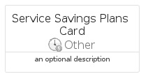
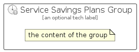

# ServiceSavingsPlans


```text
azure-17/Item/Other/ServiceSavingsPlans
```

```text
include('azure-17/Item/Other/ServiceSavingsPlans')
```


| Illustration | ServiceSavingsPlans | ServiceSavingsPlansCard | ServiceSavingsPlansGroup |
| :---: | :---: | :---: | :---: |
|  |  |  |  |


## Sprites
The item provides the following sriptes:

- `<$ServiceSavingsPlansXs>`
- `<$ServiceSavingsPlansSm>`
- `<$ServiceSavingsPlansMd>`
- `<$ServiceSavingsPlansLg>`


## ServiceSavingsPlans

### Load remotely
```plantuml
@startuml
' configures the library
!global $LIB_BASE_LOCATION="https://raw.githubusercontent.com/tmorin/plantuml-libs/master/distribution"

' loads the library's bootstrap
!include $LIB_BASE_LOCATION/bootstrap.puml

' loads the package bootstrap
include('azure-17/bootstrap')

' loads the Item which embeds the element ServiceSavingsPlans
include('azure-17/Item/Other/ServiceSavingsPlans')

' renders the element
ServiceSavingsPlans('ServiceSavingsPlans', 'Service Savings Plans', 'an optional tech label', 'an optional description')
@enduml
```

### Load locally
```plantuml
@startuml
' configures the library
!global $INCLUSION_MODE="local"
!global $LIB_BASE_LOCATION="../../.."

' loads the library's bootstrap
!include $LIB_BASE_LOCATION/bootstrap.puml

' loads the package bootstrap
include('azure-17/bootstrap')

' loads the Item which embeds the element ServiceSavingsPlans
include('azure-17/Item/Other/ServiceSavingsPlans')

' renders the element
ServiceSavingsPlans('ServiceSavingsPlans', 'Service Savings Plans', 'an optional tech label', 'an optional description')
@enduml
```

## ServiceSavingsPlansCard

### Load remotely
```plantuml
@startuml
' configures the library
!global $LIB_BASE_LOCATION="https://raw.githubusercontent.com/tmorin/plantuml-libs/master/distribution"

' loads the library's bootstrap
!include $LIB_BASE_LOCATION/bootstrap.puml

' loads the package bootstrap
include('azure-17/bootstrap')

' loads the Item which embeds the element ServiceSavingsPlansCard
include('azure-17/Item/Other/ServiceSavingsPlans')

' renders the element
ServiceSavingsPlansCard('ServiceSavingsPlansCard', 'Service Savings Plans Card', 'an optional description')
@enduml
```

### Load locally
```plantuml
@startuml
' configures the library
!global $INCLUSION_MODE="local"
!global $LIB_BASE_LOCATION="../../.."

' loads the library's bootstrap
!include $LIB_BASE_LOCATION/bootstrap.puml

' loads the package bootstrap
include('azure-17/bootstrap')

' loads the Item which embeds the element ServiceSavingsPlansCard
include('azure-17/Item/Other/ServiceSavingsPlans')

' renders the element
ServiceSavingsPlansCard('ServiceSavingsPlansCard', 'Service Savings Plans Card', 'an optional description')
@enduml
```

## ServiceSavingsPlansGroup

### Load remotely
```plantuml
@startuml
' configures the library
!global $LIB_BASE_LOCATION="https://raw.githubusercontent.com/tmorin/plantuml-libs/master/distribution"

' loads the library's bootstrap
!include $LIB_BASE_LOCATION/bootstrap.puml

' loads the package bootstrap
include('azure-17/bootstrap')

' loads the Item which embeds the element ServiceSavingsPlansGroup
include('azure-17/Item/Other/ServiceSavingsPlans')

' renders the element
ServiceSavingsPlansGroup('ServiceSavingsPlansGroup', 'Service Savings Plans Group', 'an optional tech label') {
    note as note
        the content of the group
    end note
}
@enduml
```

### Load locally
```plantuml
@startuml
' configures the library
!global $INCLUSION_MODE="local"
!global $LIB_BASE_LOCATION="../../.."

' loads the library's bootstrap
!include $LIB_BASE_LOCATION/bootstrap.puml

' loads the package bootstrap
include('azure-17/bootstrap')

' loads the Item which embeds the element ServiceSavingsPlansGroup
include('azure-17/Item/Other/ServiceSavingsPlans')

' renders the element
ServiceSavingsPlansGroup('ServiceSavingsPlansGroup', 'Service Savings Plans Group', 'an optional tech label') {
    note as note
        the content of the group
    end note
}
@enduml
```

