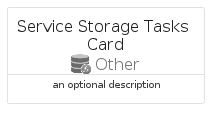
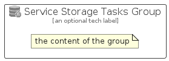

# ServiceStorageTasks


```text
azure-17/Item/Other/ServiceStorageTasks
```

```text
include('azure-17/Item/Other/ServiceStorageTasks')
```


| Illustration | ServiceStorageTasks | ServiceStorageTasksCard | ServiceStorageTasksGroup |
| :---: | :---: | :---: | :---: |
|  |  |  |  |


## Sprites
The item provides the following sriptes:

- `<$ServiceStorageTasksXs>`
- `<$ServiceStorageTasksSm>`
- `<$ServiceStorageTasksMd>`
- `<$ServiceStorageTasksLg>`


## ServiceStorageTasks

### Load remotely
```plantuml
@startuml
' configures the library
!global $LIB_BASE_LOCATION="https://raw.githubusercontent.com/tmorin/plantuml-libs/master/distribution"

' loads the library's bootstrap
!include $LIB_BASE_LOCATION/bootstrap.puml

' loads the package bootstrap
include('azure-17/bootstrap')

' loads the Item which embeds the element ServiceStorageTasks
include('azure-17/Item/Other/ServiceStorageTasks')

' renders the element
ServiceStorageTasks('ServiceStorageTasks', 'Service Storage Tasks', 'an optional tech label', 'an optional description')
@enduml
```

### Load locally
```plantuml
@startuml
' configures the library
!global $INCLUSION_MODE="local"
!global $LIB_BASE_LOCATION="../../.."

' loads the library's bootstrap
!include $LIB_BASE_LOCATION/bootstrap.puml

' loads the package bootstrap
include('azure-17/bootstrap')

' loads the Item which embeds the element ServiceStorageTasks
include('azure-17/Item/Other/ServiceStorageTasks')

' renders the element
ServiceStorageTasks('ServiceStorageTasks', 'Service Storage Tasks', 'an optional tech label', 'an optional description')
@enduml
```

## ServiceStorageTasksCard

### Load remotely
```plantuml
@startuml
' configures the library
!global $LIB_BASE_LOCATION="https://raw.githubusercontent.com/tmorin/plantuml-libs/master/distribution"

' loads the library's bootstrap
!include $LIB_BASE_LOCATION/bootstrap.puml

' loads the package bootstrap
include('azure-17/bootstrap')

' loads the Item which embeds the element ServiceStorageTasksCard
include('azure-17/Item/Other/ServiceStorageTasks')

' renders the element
ServiceStorageTasksCard('ServiceStorageTasksCard', 'Service Storage Tasks Card', 'an optional description')
@enduml
```

### Load locally
```plantuml
@startuml
' configures the library
!global $INCLUSION_MODE="local"
!global $LIB_BASE_LOCATION="../../.."

' loads the library's bootstrap
!include $LIB_BASE_LOCATION/bootstrap.puml

' loads the package bootstrap
include('azure-17/bootstrap')

' loads the Item which embeds the element ServiceStorageTasksCard
include('azure-17/Item/Other/ServiceStorageTasks')

' renders the element
ServiceStorageTasksCard('ServiceStorageTasksCard', 'Service Storage Tasks Card', 'an optional description')
@enduml
```

## ServiceStorageTasksGroup

### Load remotely
```plantuml
@startuml
' configures the library
!global $LIB_BASE_LOCATION="https://raw.githubusercontent.com/tmorin/plantuml-libs/master/distribution"

' loads the library's bootstrap
!include $LIB_BASE_LOCATION/bootstrap.puml

' loads the package bootstrap
include('azure-17/bootstrap')

' loads the Item which embeds the element ServiceStorageTasksGroup
include('azure-17/Item/Other/ServiceStorageTasks')

' renders the element
ServiceStorageTasksGroup('ServiceStorageTasksGroup', 'Service Storage Tasks Group', 'an optional tech label') {
    note as note
        the content of the group
    end note
}
@enduml
```

### Load locally
```plantuml
@startuml
' configures the library
!global $INCLUSION_MODE="local"
!global $LIB_BASE_LOCATION="../../.."

' loads the library's bootstrap
!include $LIB_BASE_LOCATION/bootstrap.puml

' loads the package bootstrap
include('azure-17/bootstrap')

' loads the Item which embeds the element ServiceStorageTasksGroup
include('azure-17/Item/Other/ServiceStorageTasks')

' renders the element
ServiceStorageTasksGroup('ServiceStorageTasksGroup', 'Service Storage Tasks Group', 'an optional tech label') {
    note as note
        the content of the group
    end note
}
@enduml
```

