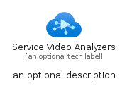
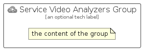

# ServiceVideoAnalyzers


```text
azure-17/Item/Other/ServiceVideoAnalyzers
```

```text
include('azure-17/Item/Other/ServiceVideoAnalyzers')
```


| Illustration | ServiceVideoAnalyzers | ServiceVideoAnalyzersCard | ServiceVideoAnalyzersGroup |
| :---: | :---: | :---: | :---: |
|  |  |  |  |


## Sprites
The item provides the following sriptes:

- `<$ServiceVideoAnalyzersXs>`
- `<$ServiceVideoAnalyzersSm>`
- `<$ServiceVideoAnalyzersMd>`
- `<$ServiceVideoAnalyzersLg>`


## ServiceVideoAnalyzers

### Load remotely
```plantuml
@startuml
' configures the library
!global $LIB_BASE_LOCATION="https://raw.githubusercontent.com/tmorin/plantuml-libs/master/distribution"

' loads the library's bootstrap
!include $LIB_BASE_LOCATION/bootstrap.puml

' loads the package bootstrap
include('azure-17/bootstrap')

' loads the Item which embeds the element ServiceVideoAnalyzers
include('azure-17/Item/Other/ServiceVideoAnalyzers')

' renders the element
ServiceVideoAnalyzers('ServiceVideoAnalyzers', 'Service Video Analyzers', 'an optional tech label', 'an optional description')
@enduml
```

### Load locally
```plantuml
@startuml
' configures the library
!global $INCLUSION_MODE="local"
!global $LIB_BASE_LOCATION="../../.."

' loads the library's bootstrap
!include $LIB_BASE_LOCATION/bootstrap.puml

' loads the package bootstrap
include('azure-17/bootstrap')

' loads the Item which embeds the element ServiceVideoAnalyzers
include('azure-17/Item/Other/ServiceVideoAnalyzers')

' renders the element
ServiceVideoAnalyzers('ServiceVideoAnalyzers', 'Service Video Analyzers', 'an optional tech label', 'an optional description')
@enduml
```

## ServiceVideoAnalyzersCard

### Load remotely
```plantuml
@startuml
' configures the library
!global $LIB_BASE_LOCATION="https://raw.githubusercontent.com/tmorin/plantuml-libs/master/distribution"

' loads the library's bootstrap
!include $LIB_BASE_LOCATION/bootstrap.puml

' loads the package bootstrap
include('azure-17/bootstrap')

' loads the Item which embeds the element ServiceVideoAnalyzersCard
include('azure-17/Item/Other/ServiceVideoAnalyzers')

' renders the element
ServiceVideoAnalyzersCard('ServiceVideoAnalyzersCard', 'Service Video Analyzers Card', 'an optional description')
@enduml
```

### Load locally
```plantuml
@startuml
' configures the library
!global $INCLUSION_MODE="local"
!global $LIB_BASE_LOCATION="../../.."

' loads the library's bootstrap
!include $LIB_BASE_LOCATION/bootstrap.puml

' loads the package bootstrap
include('azure-17/bootstrap')

' loads the Item which embeds the element ServiceVideoAnalyzersCard
include('azure-17/Item/Other/ServiceVideoAnalyzers')

' renders the element
ServiceVideoAnalyzersCard('ServiceVideoAnalyzersCard', 'Service Video Analyzers Card', 'an optional description')
@enduml
```

## ServiceVideoAnalyzersGroup

### Load remotely
```plantuml
@startuml
' configures the library
!global $LIB_BASE_LOCATION="https://raw.githubusercontent.com/tmorin/plantuml-libs/master/distribution"

' loads the library's bootstrap
!include $LIB_BASE_LOCATION/bootstrap.puml

' loads the package bootstrap
include('azure-17/bootstrap')

' loads the Item which embeds the element ServiceVideoAnalyzersGroup
include('azure-17/Item/Other/ServiceVideoAnalyzers')

' renders the element
ServiceVideoAnalyzersGroup('ServiceVideoAnalyzersGroup', 'Service Video Analyzers Group', 'an optional tech label') {
    note as note
        the content of the group
    end note
}
@enduml
```

### Load locally
```plantuml
@startuml
' configures the library
!global $INCLUSION_MODE="local"
!global $LIB_BASE_LOCATION="../../.."

' loads the library's bootstrap
!include $LIB_BASE_LOCATION/bootstrap.puml

' loads the package bootstrap
include('azure-17/bootstrap')

' loads the Item which embeds the element ServiceVideoAnalyzersGroup
include('azure-17/Item/Other/ServiceVideoAnalyzers')

' renders the element
ServiceVideoAnalyzersGroup('ServiceVideoAnalyzersGroup', 'Service Video Analyzers Group', 'an optional tech label') {
    note as note
        the content of the group
    end note
}
@enduml
```

