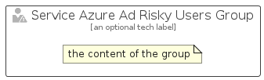

# ServiceAzureAdRiskyUsers


```text
azure-17/Item/Security/ServiceAzureAdRiskyUsers
```

```text
include('azure-17/Item/Security/ServiceAzureAdRiskyUsers')
```


| Illustration | ServiceAzureAdRiskyUsers | ServiceAzureAdRiskyUsersCard | ServiceAzureAdRiskyUsersGroup |
| :---: | :---: | :---: | :---: |
|  |  |  |  |


## Sprites
The item provides the following sriptes:

- `<$ServiceAzureAdRiskyUsersXs>`
- `<$ServiceAzureAdRiskyUsersSm>`
- `<$ServiceAzureAdRiskyUsersMd>`
- `<$ServiceAzureAdRiskyUsersLg>`


## ServiceAzureAdRiskyUsers

### Load remotely
```plantuml
@startuml
' configures the library
!global $LIB_BASE_LOCATION="https://raw.githubusercontent.com/tmorin/plantuml-libs/master/distribution"

' loads the library's bootstrap
!include $LIB_BASE_LOCATION/bootstrap.puml

' loads the package bootstrap
include('azure-17/bootstrap')

' loads the Item which embeds the element ServiceAzureAdRiskyUsers
include('azure-17/Item/Security/ServiceAzureAdRiskyUsers')

' renders the element
ServiceAzureAdRiskyUsers('ServiceAzureAdRiskyUsers', 'Service Azure Ad Risky Users', 'an optional tech label', 'an optional description')
@enduml
```

### Load locally
```plantuml
@startuml
' configures the library
!global $INCLUSION_MODE="local"
!global $LIB_BASE_LOCATION="../../.."

' loads the library's bootstrap
!include $LIB_BASE_LOCATION/bootstrap.puml

' loads the package bootstrap
include('azure-17/bootstrap')

' loads the Item which embeds the element ServiceAzureAdRiskyUsers
include('azure-17/Item/Security/ServiceAzureAdRiskyUsers')

' renders the element
ServiceAzureAdRiskyUsers('ServiceAzureAdRiskyUsers', 'Service Azure Ad Risky Users', 'an optional tech label', 'an optional description')
@enduml
```

## ServiceAzureAdRiskyUsersCard

### Load remotely
```plantuml
@startuml
' configures the library
!global $LIB_BASE_LOCATION="https://raw.githubusercontent.com/tmorin/plantuml-libs/master/distribution"

' loads the library's bootstrap
!include $LIB_BASE_LOCATION/bootstrap.puml

' loads the package bootstrap
include('azure-17/bootstrap')

' loads the Item which embeds the element ServiceAzureAdRiskyUsersCard
include('azure-17/Item/Security/ServiceAzureAdRiskyUsers')

' renders the element
ServiceAzureAdRiskyUsersCard('ServiceAzureAdRiskyUsersCard', 'Service Azure Ad Risky Users Card', 'an optional description')
@enduml
```

### Load locally
```plantuml
@startuml
' configures the library
!global $INCLUSION_MODE="local"
!global $LIB_BASE_LOCATION="../../.."

' loads the library's bootstrap
!include $LIB_BASE_LOCATION/bootstrap.puml

' loads the package bootstrap
include('azure-17/bootstrap')

' loads the Item which embeds the element ServiceAzureAdRiskyUsersCard
include('azure-17/Item/Security/ServiceAzureAdRiskyUsers')

' renders the element
ServiceAzureAdRiskyUsersCard('ServiceAzureAdRiskyUsersCard', 'Service Azure Ad Risky Users Card', 'an optional description')
@enduml
```

## ServiceAzureAdRiskyUsersGroup

### Load remotely
```plantuml
@startuml
' configures the library
!global $LIB_BASE_LOCATION="https://raw.githubusercontent.com/tmorin/plantuml-libs/master/distribution"

' loads the library's bootstrap
!include $LIB_BASE_LOCATION/bootstrap.puml

' loads the package bootstrap
include('azure-17/bootstrap')

' loads the Item which embeds the element ServiceAzureAdRiskyUsersGroup
include('azure-17/Item/Security/ServiceAzureAdRiskyUsers')

' renders the element
ServiceAzureAdRiskyUsersGroup('ServiceAzureAdRiskyUsersGroup', 'Service Azure Ad Risky Users Group', 'an optional tech label') {
    note as note
        the content of the group
    end note
}
@enduml
```

### Load locally
```plantuml
@startuml
' configures the library
!global $INCLUSION_MODE="local"
!global $LIB_BASE_LOCATION="../../.."

' loads the library's bootstrap
!include $LIB_BASE_LOCATION/bootstrap.puml

' loads the package bootstrap
include('azure-17/bootstrap')

' loads the Item which embeds the element ServiceAzureAdRiskyUsersGroup
include('azure-17/Item/Security/ServiceAzureAdRiskyUsers')

' renders the element
ServiceAzureAdRiskyUsersGroup('ServiceAzureAdRiskyUsersGroup', 'Service Azure Ad Risky Users Group', 'an optional tech label') {
    note as note
        the content of the group
    end note
}
@enduml
```

