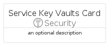
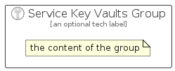

# ServiceKeyVaults


```text
azure-17/Item/Security/ServiceKeyVaults
```

```text
include('azure-17/Item/Security/ServiceKeyVaults')
```


| Illustration | ServiceKeyVaults | ServiceKeyVaultsCard | ServiceKeyVaultsGroup |
| :---: | :---: | :---: | :---: |
|  |  |  |  |


## Sprites
The item provides the following sriptes:

- `<$ServiceKeyVaultsXs>`
- `<$ServiceKeyVaultsSm>`
- `<$ServiceKeyVaultsMd>`
- `<$ServiceKeyVaultsLg>`


## ServiceKeyVaults

### Load remotely
```plantuml
@startuml
' configures the library
!global $LIB_BASE_LOCATION="https://raw.githubusercontent.com/tmorin/plantuml-libs/master/distribution"

' loads the library's bootstrap
!include $LIB_BASE_LOCATION/bootstrap.puml

' loads the package bootstrap
include('azure-17/bootstrap')

' loads the Item which embeds the element ServiceKeyVaults
include('azure-17/Item/Security/ServiceKeyVaults')

' renders the element
ServiceKeyVaults('ServiceKeyVaults', 'Service Key Vaults', 'an optional tech label', 'an optional description')
@enduml
```

### Load locally
```plantuml
@startuml
' configures the library
!global $INCLUSION_MODE="local"
!global $LIB_BASE_LOCATION="../../.."

' loads the library's bootstrap
!include $LIB_BASE_LOCATION/bootstrap.puml

' loads the package bootstrap
include('azure-17/bootstrap')

' loads the Item which embeds the element ServiceKeyVaults
include('azure-17/Item/Security/ServiceKeyVaults')

' renders the element
ServiceKeyVaults('ServiceKeyVaults', 'Service Key Vaults', 'an optional tech label', 'an optional description')
@enduml
```

## ServiceKeyVaultsCard

### Load remotely
```plantuml
@startuml
' configures the library
!global $LIB_BASE_LOCATION="https://raw.githubusercontent.com/tmorin/plantuml-libs/master/distribution"

' loads the library's bootstrap
!include $LIB_BASE_LOCATION/bootstrap.puml

' loads the package bootstrap
include('azure-17/bootstrap')

' loads the Item which embeds the element ServiceKeyVaultsCard
include('azure-17/Item/Security/ServiceKeyVaults')

' renders the element
ServiceKeyVaultsCard('ServiceKeyVaultsCard', 'Service Key Vaults Card', 'an optional description')
@enduml
```

### Load locally
```plantuml
@startuml
' configures the library
!global $INCLUSION_MODE="local"
!global $LIB_BASE_LOCATION="../../.."

' loads the library's bootstrap
!include $LIB_BASE_LOCATION/bootstrap.puml

' loads the package bootstrap
include('azure-17/bootstrap')

' loads the Item which embeds the element ServiceKeyVaultsCard
include('azure-17/Item/Security/ServiceKeyVaults')

' renders the element
ServiceKeyVaultsCard('ServiceKeyVaultsCard', 'Service Key Vaults Card', 'an optional description')
@enduml
```

## ServiceKeyVaultsGroup

### Load remotely
```plantuml
@startuml
' configures the library
!global $LIB_BASE_LOCATION="https://raw.githubusercontent.com/tmorin/plantuml-libs/master/distribution"

' loads the library's bootstrap
!include $LIB_BASE_LOCATION/bootstrap.puml

' loads the package bootstrap
include('azure-17/bootstrap')

' loads the Item which embeds the element ServiceKeyVaultsGroup
include('azure-17/Item/Security/ServiceKeyVaults')

' renders the element
ServiceKeyVaultsGroup('ServiceKeyVaultsGroup', 'Service Key Vaults Group', 'an optional tech label') {
    note as note
        the content of the group
    end note
}
@enduml
```

### Load locally
```plantuml
@startuml
' configures the library
!global $INCLUSION_MODE="local"
!global $LIB_BASE_LOCATION="../../.."

' loads the library's bootstrap
!include $LIB_BASE_LOCATION/bootstrap.puml

' loads the package bootstrap
include('azure-17/bootstrap')

' loads the Item which embeds the element ServiceKeyVaultsGroup
include('azure-17/Item/Security/ServiceKeyVaults')

' renders the element
ServiceKeyVaultsGroup('ServiceKeyVaultsGroup', 'Service Key Vaults Group', 'an optional tech label') {
    note as note
        the content of the group
    end note
}
@enduml
```

