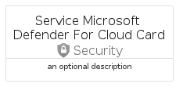
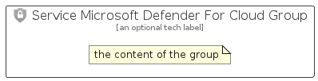

# ServiceMicrosoftDefenderForCloud


```text
azure-17/Item/Security/ServiceMicrosoftDefenderForCloud
```

```text
include('azure-17/Item/Security/ServiceMicrosoftDefenderForCloud')
```


| Illustration | ServiceMicrosoftDefenderForCloud | ServiceMicrosoftDefenderForCloudCard | ServiceMicrosoftDefenderForCloudGroup |
| :---: | :---: | :---: | :---: |
|  |  |  |  |


## Sprites
The item provides the following sriptes:

- `<$ServiceMicrosoftDefenderForCloudXs>`
- `<$ServiceMicrosoftDefenderForCloudSm>`
- `<$ServiceMicrosoftDefenderForCloudMd>`
- `<$ServiceMicrosoftDefenderForCloudLg>`


## ServiceMicrosoftDefenderForCloud

### Load remotely
```plantuml
@startuml
' configures the library
!global $LIB_BASE_LOCATION="https://raw.githubusercontent.com/tmorin/plantuml-libs/master/distribution"

' loads the library's bootstrap
!include $LIB_BASE_LOCATION/bootstrap.puml

' loads the package bootstrap
include('azure-17/bootstrap')

' loads the Item which embeds the element ServiceMicrosoftDefenderForCloud
include('azure-17/Item/Security/ServiceMicrosoftDefenderForCloud')

' renders the element
ServiceMicrosoftDefenderForCloud('ServiceMicrosoftDefenderForCloud', 'Service Microsoft Defender For Cloud', 'an optional tech label', 'an optional description')
@enduml
```

### Load locally
```plantuml
@startuml
' configures the library
!global $INCLUSION_MODE="local"
!global $LIB_BASE_LOCATION="../../.."

' loads the library's bootstrap
!include $LIB_BASE_LOCATION/bootstrap.puml

' loads the package bootstrap
include('azure-17/bootstrap')

' loads the Item which embeds the element ServiceMicrosoftDefenderForCloud
include('azure-17/Item/Security/ServiceMicrosoftDefenderForCloud')

' renders the element
ServiceMicrosoftDefenderForCloud('ServiceMicrosoftDefenderForCloud', 'Service Microsoft Defender For Cloud', 'an optional tech label', 'an optional description')
@enduml
```

## ServiceMicrosoftDefenderForCloudCard

### Load remotely
```plantuml
@startuml
' configures the library
!global $LIB_BASE_LOCATION="https://raw.githubusercontent.com/tmorin/plantuml-libs/master/distribution"

' loads the library's bootstrap
!include $LIB_BASE_LOCATION/bootstrap.puml

' loads the package bootstrap
include('azure-17/bootstrap')

' loads the Item which embeds the element ServiceMicrosoftDefenderForCloudCard
include('azure-17/Item/Security/ServiceMicrosoftDefenderForCloud')

' renders the element
ServiceMicrosoftDefenderForCloudCard('ServiceMicrosoftDefenderForCloudCard', 'Service Microsoft Defender For Cloud Card', 'an optional description')
@enduml
```

### Load locally
```plantuml
@startuml
' configures the library
!global $INCLUSION_MODE="local"
!global $LIB_BASE_LOCATION="../../.."

' loads the library's bootstrap
!include $LIB_BASE_LOCATION/bootstrap.puml

' loads the package bootstrap
include('azure-17/bootstrap')

' loads the Item which embeds the element ServiceMicrosoftDefenderForCloudCard
include('azure-17/Item/Security/ServiceMicrosoftDefenderForCloud')

' renders the element
ServiceMicrosoftDefenderForCloudCard('ServiceMicrosoftDefenderForCloudCard', 'Service Microsoft Defender For Cloud Card', 'an optional description')
@enduml
```

## ServiceMicrosoftDefenderForCloudGroup

### Load remotely
```plantuml
@startuml
' configures the library
!global $LIB_BASE_LOCATION="https://raw.githubusercontent.com/tmorin/plantuml-libs/master/distribution"

' loads the library's bootstrap
!include $LIB_BASE_LOCATION/bootstrap.puml

' loads the package bootstrap
include('azure-17/bootstrap')

' loads the Item which embeds the element ServiceMicrosoftDefenderForCloudGroup
include('azure-17/Item/Security/ServiceMicrosoftDefenderForCloud')

' renders the element
ServiceMicrosoftDefenderForCloudGroup('ServiceMicrosoftDefenderForCloudGroup', 'Service Microsoft Defender For Cloud Group', 'an optional tech label') {
    note as note
        the content of the group
    end note
}
@enduml
```

### Load locally
```plantuml
@startuml
' configures the library
!global $INCLUSION_MODE="local"
!global $LIB_BASE_LOCATION="../../.."

' loads the library's bootstrap
!include $LIB_BASE_LOCATION/bootstrap.puml

' loads the package bootstrap
include('azure-17/bootstrap')

' loads the Item which embeds the element ServiceMicrosoftDefenderForCloudGroup
include('azure-17/Item/Security/ServiceMicrosoftDefenderForCloud')

' renders the element
ServiceMicrosoftDefenderForCloudGroup('ServiceMicrosoftDefenderForCloudGroup', 'Service Microsoft Defender For Cloud Group', 'an optional tech label') {
    note as note
        the content of the group
    end note
}
@enduml
```

