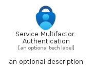
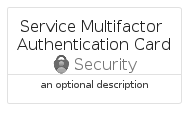
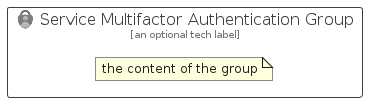

# ServiceMultifactorAuthentication


```text
azure-17/Item/Security/ServiceMultifactorAuthentication
```

```text
include('azure-17/Item/Security/ServiceMultifactorAuthentication')
```


| Illustration | ServiceMultifactorAuthentication | ServiceMultifactorAuthenticationCard | ServiceMultifactorAuthenticationGroup |
| :---: | :---: | :---: | :---: |
|  |  |  |  |


## Sprites
The item provides the following sriptes:

- `<$ServiceMultifactorAuthenticationXs>`
- `<$ServiceMultifactorAuthenticationSm>`
- `<$ServiceMultifactorAuthenticationMd>`
- `<$ServiceMultifactorAuthenticationLg>`


## ServiceMultifactorAuthentication

### Load remotely
```plantuml
@startuml
' configures the library
!global $LIB_BASE_LOCATION="https://raw.githubusercontent.com/tmorin/plantuml-libs/master/distribution"

' loads the library's bootstrap
!include $LIB_BASE_LOCATION/bootstrap.puml

' loads the package bootstrap
include('azure-17/bootstrap')

' loads the Item which embeds the element ServiceMultifactorAuthentication
include('azure-17/Item/Security/ServiceMultifactorAuthentication')

' renders the element
ServiceMultifactorAuthentication('ServiceMultifactorAuthentication', 'Service Multifactor Authentication', 'an optional tech label', 'an optional description')
@enduml
```

### Load locally
```plantuml
@startuml
' configures the library
!global $INCLUSION_MODE="local"
!global $LIB_BASE_LOCATION="../../.."

' loads the library's bootstrap
!include $LIB_BASE_LOCATION/bootstrap.puml

' loads the package bootstrap
include('azure-17/bootstrap')

' loads the Item which embeds the element ServiceMultifactorAuthentication
include('azure-17/Item/Security/ServiceMultifactorAuthentication')

' renders the element
ServiceMultifactorAuthentication('ServiceMultifactorAuthentication', 'Service Multifactor Authentication', 'an optional tech label', 'an optional description')
@enduml
```

## ServiceMultifactorAuthenticationCard

### Load remotely
```plantuml
@startuml
' configures the library
!global $LIB_BASE_LOCATION="https://raw.githubusercontent.com/tmorin/plantuml-libs/master/distribution"

' loads the library's bootstrap
!include $LIB_BASE_LOCATION/bootstrap.puml

' loads the package bootstrap
include('azure-17/bootstrap')

' loads the Item which embeds the element ServiceMultifactorAuthenticationCard
include('azure-17/Item/Security/ServiceMultifactorAuthentication')

' renders the element
ServiceMultifactorAuthenticationCard('ServiceMultifactorAuthenticationCard', 'Service Multifactor Authentication Card', 'an optional description')
@enduml
```

### Load locally
```plantuml
@startuml
' configures the library
!global $INCLUSION_MODE="local"
!global $LIB_BASE_LOCATION="../../.."

' loads the library's bootstrap
!include $LIB_BASE_LOCATION/bootstrap.puml

' loads the package bootstrap
include('azure-17/bootstrap')

' loads the Item which embeds the element ServiceMultifactorAuthenticationCard
include('azure-17/Item/Security/ServiceMultifactorAuthentication')

' renders the element
ServiceMultifactorAuthenticationCard('ServiceMultifactorAuthenticationCard', 'Service Multifactor Authentication Card', 'an optional description')
@enduml
```

## ServiceMultifactorAuthenticationGroup

### Load remotely
```plantuml
@startuml
' configures the library
!global $LIB_BASE_LOCATION="https://raw.githubusercontent.com/tmorin/plantuml-libs/master/distribution"

' loads the library's bootstrap
!include $LIB_BASE_LOCATION/bootstrap.puml

' loads the package bootstrap
include('azure-17/bootstrap')

' loads the Item which embeds the element ServiceMultifactorAuthenticationGroup
include('azure-17/Item/Security/ServiceMultifactorAuthentication')

' renders the element
ServiceMultifactorAuthenticationGroup('ServiceMultifactorAuthenticationGroup', 'Service Multifactor Authentication Group', 'an optional tech label') {
    note as note
        the content of the group
    end note
}
@enduml
```

### Load locally
```plantuml
@startuml
' configures the library
!global $INCLUSION_MODE="local"
!global $LIB_BASE_LOCATION="../../.."

' loads the library's bootstrap
!include $LIB_BASE_LOCATION/bootstrap.puml

' loads the package bootstrap
include('azure-17/bootstrap')

' loads the Item which embeds the element ServiceMultifactorAuthenticationGroup
include('azure-17/Item/Security/ServiceMultifactorAuthentication')

' renders the element
ServiceMultifactorAuthenticationGroup('ServiceMultifactorAuthenticationGroup', 'Service Multifactor Authentication Group', 'an optional tech label') {
    note as note
        the content of the group
    end note
}
@enduml
```

