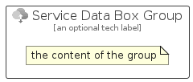

# ServiceDataBox


```text
azure-17/Item/Storage/ServiceDataBox
```

```text
include('azure-17/Item/Storage/ServiceDataBox')
```


| Illustration | ServiceDataBox | ServiceDataBoxCard | ServiceDataBoxGroup |
| :---: | :---: | :---: | :---: |
|  |  |  |  |


## Sprites
The item provides the following sriptes:

- `<$ServiceDataBoxXs>`
- `<$ServiceDataBoxSm>`
- `<$ServiceDataBoxMd>`
- `<$ServiceDataBoxLg>`


## ServiceDataBox

### Load remotely
```plantuml
@startuml
' configures the library
!global $LIB_BASE_LOCATION="https://raw.githubusercontent.com/tmorin/plantuml-libs/master/distribution"

' loads the library's bootstrap
!include $LIB_BASE_LOCATION/bootstrap.puml

' loads the package bootstrap
include('azure-17/bootstrap')

' loads the Item which embeds the element ServiceDataBox
include('azure-17/Item/Storage/ServiceDataBox')

' renders the element
ServiceDataBox('ServiceDataBox', 'Service Data Box', 'an optional tech label', 'an optional description')
@enduml
```

### Load locally
```plantuml
@startuml
' configures the library
!global $INCLUSION_MODE="local"
!global $LIB_BASE_LOCATION="../../.."

' loads the library's bootstrap
!include $LIB_BASE_LOCATION/bootstrap.puml

' loads the package bootstrap
include('azure-17/bootstrap')

' loads the Item which embeds the element ServiceDataBox
include('azure-17/Item/Storage/ServiceDataBox')

' renders the element
ServiceDataBox('ServiceDataBox', 'Service Data Box', 'an optional tech label', 'an optional description')
@enduml
```

## ServiceDataBoxCard

### Load remotely
```plantuml
@startuml
' configures the library
!global $LIB_BASE_LOCATION="https://raw.githubusercontent.com/tmorin/plantuml-libs/master/distribution"

' loads the library's bootstrap
!include $LIB_BASE_LOCATION/bootstrap.puml

' loads the package bootstrap
include('azure-17/bootstrap')

' loads the Item which embeds the element ServiceDataBoxCard
include('azure-17/Item/Storage/ServiceDataBox')

' renders the element
ServiceDataBoxCard('ServiceDataBoxCard', 'Service Data Box Card', 'an optional description')
@enduml
```

### Load locally
```plantuml
@startuml
' configures the library
!global $INCLUSION_MODE="local"
!global $LIB_BASE_LOCATION="../../.."

' loads the library's bootstrap
!include $LIB_BASE_LOCATION/bootstrap.puml

' loads the package bootstrap
include('azure-17/bootstrap')

' loads the Item which embeds the element ServiceDataBoxCard
include('azure-17/Item/Storage/ServiceDataBox')

' renders the element
ServiceDataBoxCard('ServiceDataBoxCard', 'Service Data Box Card', 'an optional description')
@enduml
```

## ServiceDataBoxGroup

### Load remotely
```plantuml
@startuml
' configures the library
!global $LIB_BASE_LOCATION="https://raw.githubusercontent.com/tmorin/plantuml-libs/master/distribution"

' loads the library's bootstrap
!include $LIB_BASE_LOCATION/bootstrap.puml

' loads the package bootstrap
include('azure-17/bootstrap')

' loads the Item which embeds the element ServiceDataBoxGroup
include('azure-17/Item/Storage/ServiceDataBox')

' renders the element
ServiceDataBoxGroup('ServiceDataBoxGroup', 'Service Data Box Group', 'an optional tech label') {
    note as note
        the content of the group
    end note
}
@enduml
```

### Load locally
```plantuml
@startuml
' configures the library
!global $INCLUSION_MODE="local"
!global $LIB_BASE_LOCATION="../../.."

' loads the library's bootstrap
!include $LIB_BASE_LOCATION/bootstrap.puml

' loads the package bootstrap
include('azure-17/bootstrap')

' loads the Item which embeds the element ServiceDataBoxGroup
include('azure-17/Item/Storage/ServiceDataBox')

' renders the element
ServiceDataBoxGroup('ServiceDataBoxGroup', 'Service Data Box Group', 'an optional tech label') {
    note as note
        the content of the group
    end note
}
@enduml
```

