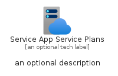

# ServiceAppServicePlans


```text
azure-17/Item/Web/ServiceAppServicePlans
```

```text
include('azure-17/Item/Web/ServiceAppServicePlans')
```


| Illustration | ServiceAppServicePlans | ServiceAppServicePlansCard | ServiceAppServicePlansGroup |
| :---: | :---: | :---: | :---: |
|  |  |  |  |


## Sprites
The item provides the following sriptes:

- `<$ServiceAppServicePlansXs>`
- `<$ServiceAppServicePlansSm>`
- `<$ServiceAppServicePlansMd>`
- `<$ServiceAppServicePlansLg>`


## ServiceAppServicePlans

### Load remotely
```plantuml
@startuml
' configures the library
!global $LIB_BASE_LOCATION="https://raw.githubusercontent.com/tmorin/plantuml-libs/master/distribution"

' loads the library's bootstrap
!include $LIB_BASE_LOCATION/bootstrap.puml

' loads the package bootstrap
include('azure-17/bootstrap')

' loads the Item which embeds the element ServiceAppServicePlans
include('azure-17/Item/Web/ServiceAppServicePlans')

' renders the element
ServiceAppServicePlans('ServiceAppServicePlans', 'Service App Service Plans', 'an optional tech label', 'an optional description')
@enduml
```

### Load locally
```plantuml
@startuml
' configures the library
!global $INCLUSION_MODE="local"
!global $LIB_BASE_LOCATION="../../.."

' loads the library's bootstrap
!include $LIB_BASE_LOCATION/bootstrap.puml

' loads the package bootstrap
include('azure-17/bootstrap')

' loads the Item which embeds the element ServiceAppServicePlans
include('azure-17/Item/Web/ServiceAppServicePlans')

' renders the element
ServiceAppServicePlans('ServiceAppServicePlans', 'Service App Service Plans', 'an optional tech label', 'an optional description')
@enduml
```

## ServiceAppServicePlansCard

### Load remotely
```plantuml
@startuml
' configures the library
!global $LIB_BASE_LOCATION="https://raw.githubusercontent.com/tmorin/plantuml-libs/master/distribution"

' loads the library's bootstrap
!include $LIB_BASE_LOCATION/bootstrap.puml

' loads the package bootstrap
include('azure-17/bootstrap')

' loads the Item which embeds the element ServiceAppServicePlansCard
include('azure-17/Item/Web/ServiceAppServicePlans')

' renders the element
ServiceAppServicePlansCard('ServiceAppServicePlansCard', 'Service App Service Plans Card', 'an optional description')
@enduml
```

### Load locally
```plantuml
@startuml
' configures the library
!global $INCLUSION_MODE="local"
!global $LIB_BASE_LOCATION="../../.."

' loads the library's bootstrap
!include $LIB_BASE_LOCATION/bootstrap.puml

' loads the package bootstrap
include('azure-17/bootstrap')

' loads the Item which embeds the element ServiceAppServicePlansCard
include('azure-17/Item/Web/ServiceAppServicePlans')

' renders the element
ServiceAppServicePlansCard('ServiceAppServicePlansCard', 'Service App Service Plans Card', 'an optional description')
@enduml
```

## ServiceAppServicePlansGroup

### Load remotely
```plantuml
@startuml
' configures the library
!global $LIB_BASE_LOCATION="https://raw.githubusercontent.com/tmorin/plantuml-libs/master/distribution"

' loads the library's bootstrap
!include $LIB_BASE_LOCATION/bootstrap.puml

' loads the package bootstrap
include('azure-17/bootstrap')

' loads the Item which embeds the element ServiceAppServicePlansGroup
include('azure-17/Item/Web/ServiceAppServicePlans')

' renders the element
ServiceAppServicePlansGroup('ServiceAppServicePlansGroup', 'Service App Service Plans Group', 'an optional tech label') {
    note as note
        the content of the group
    end note
}
@enduml
```

### Load locally
```plantuml
@startuml
' configures the library
!global $INCLUSION_MODE="local"
!global $LIB_BASE_LOCATION="../../.."

' loads the library's bootstrap
!include $LIB_BASE_LOCATION/bootstrap.puml

' loads the package bootstrap
include('azure-17/bootstrap')

' loads the Item which embeds the element ServiceAppServicePlansGroup
include('azure-17/Item/Web/ServiceAppServicePlans')

' renders the element
ServiceAppServicePlansGroup('ServiceAppServicePlansGroup', 'Service App Service Plans Group', 'an optional tech label') {
    note as note
        the content of the group
    end note
}
@enduml
```

