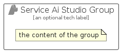

# ServiceAiStudio


```text
azure-19/Item/AiMachineLearning/ServiceAiStudio
```

```text
include('azure-19/Item/AiMachineLearning/ServiceAiStudio')
```


| Illustration | ServiceAiStudio | ServiceAiStudioCard | ServiceAiStudioGroup |
| :---: | :---: | :---: | :---: |
|  |  |  |  |


## Sprites
The item provides the following sriptes:

- `<$ServiceAiStudioXs>`
- `<$ServiceAiStudioSm>`
- `<$ServiceAiStudioMd>`
- `<$ServiceAiStudioLg>`


## ServiceAiStudio

### Load remotely
```plantuml
@startuml
' configures the library
!global $LIB_BASE_LOCATION="https://raw.githubusercontent.com/tmorin/plantuml-libs/master/distribution"

' loads the library's bootstrap
!include $LIB_BASE_LOCATION/bootstrap.puml

' loads the package bootstrap
include('azure-19/bootstrap')

' loads the Item which embeds the element ServiceAiStudio
include('azure-19/Item/AiMachineLearning/ServiceAiStudio')

' renders the element
ServiceAiStudio('ServiceAiStudio', 'Service Ai Studio', 'an optional tech label', 'an optional description')
@enduml
```

### Load locally
```plantuml
@startuml
' configures the library
!global $INCLUSION_MODE="local"
!global $LIB_BASE_LOCATION="../../.."

' loads the library's bootstrap
!include $LIB_BASE_LOCATION/bootstrap.puml

' loads the package bootstrap
include('azure-19/bootstrap')

' loads the Item which embeds the element ServiceAiStudio
include('azure-19/Item/AiMachineLearning/ServiceAiStudio')

' renders the element
ServiceAiStudio('ServiceAiStudio', 'Service Ai Studio', 'an optional tech label', 'an optional description')
@enduml
```

## ServiceAiStudioCard

### Load remotely
```plantuml
@startuml
' configures the library
!global $LIB_BASE_LOCATION="https://raw.githubusercontent.com/tmorin/plantuml-libs/master/distribution"

' loads the library's bootstrap
!include $LIB_BASE_LOCATION/bootstrap.puml

' loads the package bootstrap
include('azure-19/bootstrap')

' loads the Item which embeds the element ServiceAiStudioCard
include('azure-19/Item/AiMachineLearning/ServiceAiStudio')

' renders the element
ServiceAiStudioCard('ServiceAiStudioCard', 'Service Ai Studio Card', 'an optional description')
@enduml
```

### Load locally
```plantuml
@startuml
' configures the library
!global $INCLUSION_MODE="local"
!global $LIB_BASE_LOCATION="../../.."

' loads the library's bootstrap
!include $LIB_BASE_LOCATION/bootstrap.puml

' loads the package bootstrap
include('azure-19/bootstrap')

' loads the Item which embeds the element ServiceAiStudioCard
include('azure-19/Item/AiMachineLearning/ServiceAiStudio')

' renders the element
ServiceAiStudioCard('ServiceAiStudioCard', 'Service Ai Studio Card', 'an optional description')
@enduml
```

## ServiceAiStudioGroup

### Load remotely
```plantuml
@startuml
' configures the library
!global $LIB_BASE_LOCATION="https://raw.githubusercontent.com/tmorin/plantuml-libs/master/distribution"

' loads the library's bootstrap
!include $LIB_BASE_LOCATION/bootstrap.puml

' loads the package bootstrap
include('azure-19/bootstrap')

' loads the Item which embeds the element ServiceAiStudioGroup
include('azure-19/Item/AiMachineLearning/ServiceAiStudio')

' renders the element
ServiceAiStudioGroup('ServiceAiStudioGroup', 'Service Ai Studio Group', 'an optional tech label') {
    note as note
        the content of the group
    end note
}
@enduml
```

### Load locally
```plantuml
@startuml
' configures the library
!global $INCLUSION_MODE="local"
!global $LIB_BASE_LOCATION="../../.."

' loads the library's bootstrap
!include $LIB_BASE_LOCATION/bootstrap.puml

' loads the package bootstrap
include('azure-19/bootstrap')

' loads the Item which embeds the element ServiceAiStudioGroup
include('azure-19/Item/AiMachineLearning/ServiceAiStudio')

' renders the element
ServiceAiStudioGroup('ServiceAiStudioGroup', 'Service Ai Studio Group', 'an optional tech label') {
    note as note
        the content of the group
    end note
}
@enduml
```

