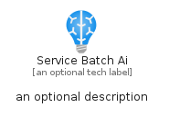

# ServiceBatchAi


```text
azure-19/Item/AiMachineLearning/ServiceBatchAi
```

```text
include('azure-19/Item/AiMachineLearning/ServiceBatchAi')
```


| Illustration | ServiceBatchAi | ServiceBatchAiCard | ServiceBatchAiGroup |
| :---: | :---: | :---: | :---: |
|  |  |  |  |


## Sprites
The item provides the following sriptes:

- `<$ServiceBatchAiXs>`
- `<$ServiceBatchAiSm>`
- `<$ServiceBatchAiMd>`
- `<$ServiceBatchAiLg>`


## ServiceBatchAi

### Load remotely
```plantuml
@startuml
' configures the library
!global $LIB_BASE_LOCATION="https://raw.githubusercontent.com/tmorin/plantuml-libs/master/distribution"

' loads the library's bootstrap
!include $LIB_BASE_LOCATION/bootstrap.puml

' loads the package bootstrap
include('azure-19/bootstrap')

' loads the Item which embeds the element ServiceBatchAi
include('azure-19/Item/AiMachineLearning/ServiceBatchAi')

' renders the element
ServiceBatchAi('ServiceBatchAi', 'Service Batch Ai', 'an optional tech label', 'an optional description')
@enduml
```

### Load locally
```plantuml
@startuml
' configures the library
!global $INCLUSION_MODE="local"
!global $LIB_BASE_LOCATION="../../.."

' loads the library's bootstrap
!include $LIB_BASE_LOCATION/bootstrap.puml

' loads the package bootstrap
include('azure-19/bootstrap')

' loads the Item which embeds the element ServiceBatchAi
include('azure-19/Item/AiMachineLearning/ServiceBatchAi')

' renders the element
ServiceBatchAi('ServiceBatchAi', 'Service Batch Ai', 'an optional tech label', 'an optional description')
@enduml
```

## ServiceBatchAiCard

### Load remotely
```plantuml
@startuml
' configures the library
!global $LIB_BASE_LOCATION="https://raw.githubusercontent.com/tmorin/plantuml-libs/master/distribution"

' loads the library's bootstrap
!include $LIB_BASE_LOCATION/bootstrap.puml

' loads the package bootstrap
include('azure-19/bootstrap')

' loads the Item which embeds the element ServiceBatchAiCard
include('azure-19/Item/AiMachineLearning/ServiceBatchAi')

' renders the element
ServiceBatchAiCard('ServiceBatchAiCard', 'Service Batch Ai Card', 'an optional description')
@enduml
```

### Load locally
```plantuml
@startuml
' configures the library
!global $INCLUSION_MODE="local"
!global $LIB_BASE_LOCATION="../../.."

' loads the library's bootstrap
!include $LIB_BASE_LOCATION/bootstrap.puml

' loads the package bootstrap
include('azure-19/bootstrap')

' loads the Item which embeds the element ServiceBatchAiCard
include('azure-19/Item/AiMachineLearning/ServiceBatchAi')

' renders the element
ServiceBatchAiCard('ServiceBatchAiCard', 'Service Batch Ai Card', 'an optional description')
@enduml
```

## ServiceBatchAiGroup

### Load remotely
```plantuml
@startuml
' configures the library
!global $LIB_BASE_LOCATION="https://raw.githubusercontent.com/tmorin/plantuml-libs/master/distribution"

' loads the library's bootstrap
!include $LIB_BASE_LOCATION/bootstrap.puml

' loads the package bootstrap
include('azure-19/bootstrap')

' loads the Item which embeds the element ServiceBatchAiGroup
include('azure-19/Item/AiMachineLearning/ServiceBatchAi')

' renders the element
ServiceBatchAiGroup('ServiceBatchAiGroup', 'Service Batch Ai Group', 'an optional tech label') {
    note as note
        the content of the group
    end note
}
@enduml
```

### Load locally
```plantuml
@startuml
' configures the library
!global $INCLUSION_MODE="local"
!global $LIB_BASE_LOCATION="../../.."

' loads the library's bootstrap
!include $LIB_BASE_LOCATION/bootstrap.puml

' loads the package bootstrap
include('azure-19/bootstrap')

' loads the Item which embeds the element ServiceBatchAiGroup
include('azure-19/Item/AiMachineLearning/ServiceBatchAi')

' renders the element
ServiceBatchAiGroup('ServiceBatchAiGroup', 'Service Batch Ai Group', 'an optional tech label') {
    note as note
        the content of the group
    end note
}
@enduml
```

