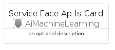
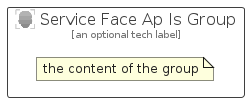

# ServiceFaceApIs


```text
azure-19/Item/AiMachineLearning/ServiceFaceApIs
```

```text
include('azure-19/Item/AiMachineLearning/ServiceFaceApIs')
```


| Illustration | ServiceFaceApIs | ServiceFaceApIsCard | ServiceFaceApIsGroup |
| :---: | :---: | :---: | :---: |
|  |  |  |  |


## Sprites
The item provides the following sriptes:

- `<$ServiceFaceApIsXs>`
- `<$ServiceFaceApIsSm>`
- `<$ServiceFaceApIsMd>`
- `<$ServiceFaceApIsLg>`


## ServiceFaceApIs

### Load remotely
```plantuml
@startuml
' configures the library
!global $LIB_BASE_LOCATION="https://raw.githubusercontent.com/tmorin/plantuml-libs/master/distribution"

' loads the library's bootstrap
!include $LIB_BASE_LOCATION/bootstrap.puml

' loads the package bootstrap
include('azure-19/bootstrap')

' loads the Item which embeds the element ServiceFaceApIs
include('azure-19/Item/AiMachineLearning/ServiceFaceApIs')

' renders the element
ServiceFaceApIs('ServiceFaceApIs', 'Service Face Ap Is', 'an optional tech label', 'an optional description')
@enduml
```

### Load locally
```plantuml
@startuml
' configures the library
!global $INCLUSION_MODE="local"
!global $LIB_BASE_LOCATION="../../.."

' loads the library's bootstrap
!include $LIB_BASE_LOCATION/bootstrap.puml

' loads the package bootstrap
include('azure-19/bootstrap')

' loads the Item which embeds the element ServiceFaceApIs
include('azure-19/Item/AiMachineLearning/ServiceFaceApIs')

' renders the element
ServiceFaceApIs('ServiceFaceApIs', 'Service Face Ap Is', 'an optional tech label', 'an optional description')
@enduml
```

## ServiceFaceApIsCard

### Load remotely
```plantuml
@startuml
' configures the library
!global $LIB_BASE_LOCATION="https://raw.githubusercontent.com/tmorin/plantuml-libs/master/distribution"

' loads the library's bootstrap
!include $LIB_BASE_LOCATION/bootstrap.puml

' loads the package bootstrap
include('azure-19/bootstrap')

' loads the Item which embeds the element ServiceFaceApIsCard
include('azure-19/Item/AiMachineLearning/ServiceFaceApIs')

' renders the element
ServiceFaceApIsCard('ServiceFaceApIsCard', 'Service Face Ap Is Card', 'an optional description')
@enduml
```

### Load locally
```plantuml
@startuml
' configures the library
!global $INCLUSION_MODE="local"
!global $LIB_BASE_LOCATION="../../.."

' loads the library's bootstrap
!include $LIB_BASE_LOCATION/bootstrap.puml

' loads the package bootstrap
include('azure-19/bootstrap')

' loads the Item which embeds the element ServiceFaceApIsCard
include('azure-19/Item/AiMachineLearning/ServiceFaceApIs')

' renders the element
ServiceFaceApIsCard('ServiceFaceApIsCard', 'Service Face Ap Is Card', 'an optional description')
@enduml
```

## ServiceFaceApIsGroup

### Load remotely
```plantuml
@startuml
' configures the library
!global $LIB_BASE_LOCATION="https://raw.githubusercontent.com/tmorin/plantuml-libs/master/distribution"

' loads the library's bootstrap
!include $LIB_BASE_LOCATION/bootstrap.puml

' loads the package bootstrap
include('azure-19/bootstrap')

' loads the Item which embeds the element ServiceFaceApIsGroup
include('azure-19/Item/AiMachineLearning/ServiceFaceApIs')

' renders the element
ServiceFaceApIsGroup('ServiceFaceApIsGroup', 'Service Face Ap Is Group', 'an optional tech label') {
    note as note
        the content of the group
    end note
}
@enduml
```

### Load locally
```plantuml
@startuml
' configures the library
!global $INCLUSION_MODE="local"
!global $LIB_BASE_LOCATION="../../.."

' loads the library's bootstrap
!include $LIB_BASE_LOCATION/bootstrap.puml

' loads the package bootstrap
include('azure-19/bootstrap')

' loads the Item which embeds the element ServiceFaceApIsGroup
include('azure-19/Item/AiMachineLearning/ServiceFaceApIs')

' renders the element
ServiceFaceApIsGroup('ServiceFaceApIsGroup', 'Service Face Ap Is Group', 'an optional tech label') {
    note as note
        the content of the group
    end note
}
@enduml
```

