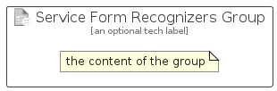

# ServiceFormRecognizers


```text
azure-19/Item/AiMachineLearning/ServiceFormRecognizers
```

```text
include('azure-19/Item/AiMachineLearning/ServiceFormRecognizers')
```


| Illustration | ServiceFormRecognizers | ServiceFormRecognizersCard | ServiceFormRecognizersGroup |
| :---: | :---: | :---: | :---: |
|  |  |  |  |


## Sprites
The item provides the following sriptes:

- `<$ServiceFormRecognizersXs>`
- `<$ServiceFormRecognizersSm>`
- `<$ServiceFormRecognizersMd>`
- `<$ServiceFormRecognizersLg>`


## ServiceFormRecognizers

### Load remotely
```plantuml
@startuml
' configures the library
!global $LIB_BASE_LOCATION="https://raw.githubusercontent.com/tmorin/plantuml-libs/master/distribution"

' loads the library's bootstrap
!include $LIB_BASE_LOCATION/bootstrap.puml

' loads the package bootstrap
include('azure-19/bootstrap')

' loads the Item which embeds the element ServiceFormRecognizers
include('azure-19/Item/AiMachineLearning/ServiceFormRecognizers')

' renders the element
ServiceFormRecognizers('ServiceFormRecognizers', 'Service Form Recognizers', 'an optional tech label', 'an optional description')
@enduml
```

### Load locally
```plantuml
@startuml
' configures the library
!global $INCLUSION_MODE="local"
!global $LIB_BASE_LOCATION="../../.."

' loads the library's bootstrap
!include $LIB_BASE_LOCATION/bootstrap.puml

' loads the package bootstrap
include('azure-19/bootstrap')

' loads the Item which embeds the element ServiceFormRecognizers
include('azure-19/Item/AiMachineLearning/ServiceFormRecognizers')

' renders the element
ServiceFormRecognizers('ServiceFormRecognizers', 'Service Form Recognizers', 'an optional tech label', 'an optional description')
@enduml
```

## ServiceFormRecognizersCard

### Load remotely
```plantuml
@startuml
' configures the library
!global $LIB_BASE_LOCATION="https://raw.githubusercontent.com/tmorin/plantuml-libs/master/distribution"

' loads the library's bootstrap
!include $LIB_BASE_LOCATION/bootstrap.puml

' loads the package bootstrap
include('azure-19/bootstrap')

' loads the Item which embeds the element ServiceFormRecognizersCard
include('azure-19/Item/AiMachineLearning/ServiceFormRecognizers')

' renders the element
ServiceFormRecognizersCard('ServiceFormRecognizersCard', 'Service Form Recognizers Card', 'an optional description')
@enduml
```

### Load locally
```plantuml
@startuml
' configures the library
!global $INCLUSION_MODE="local"
!global $LIB_BASE_LOCATION="../../.."

' loads the library's bootstrap
!include $LIB_BASE_LOCATION/bootstrap.puml

' loads the package bootstrap
include('azure-19/bootstrap')

' loads the Item which embeds the element ServiceFormRecognizersCard
include('azure-19/Item/AiMachineLearning/ServiceFormRecognizers')

' renders the element
ServiceFormRecognizersCard('ServiceFormRecognizersCard', 'Service Form Recognizers Card', 'an optional description')
@enduml
```

## ServiceFormRecognizersGroup

### Load remotely
```plantuml
@startuml
' configures the library
!global $LIB_BASE_LOCATION="https://raw.githubusercontent.com/tmorin/plantuml-libs/master/distribution"

' loads the library's bootstrap
!include $LIB_BASE_LOCATION/bootstrap.puml

' loads the package bootstrap
include('azure-19/bootstrap')

' loads the Item which embeds the element ServiceFormRecognizersGroup
include('azure-19/Item/AiMachineLearning/ServiceFormRecognizers')

' renders the element
ServiceFormRecognizersGroup('ServiceFormRecognizersGroup', 'Service Form Recognizers Group', 'an optional tech label') {
    note as note
        the content of the group
    end note
}
@enduml
```

### Load locally
```plantuml
@startuml
' configures the library
!global $INCLUSION_MODE="local"
!global $LIB_BASE_LOCATION="../../.."

' loads the library's bootstrap
!include $LIB_BASE_LOCATION/bootstrap.puml

' loads the package bootstrap
include('azure-19/bootstrap')

' loads the Item which embeds the element ServiceFormRecognizersGroup
include('azure-19/Item/AiMachineLearning/ServiceFormRecognizers')

' renders the element
ServiceFormRecognizersGroup('ServiceFormRecognizersGroup', 'Service Form Recognizers Group', 'an optional tech label') {
    note as note
        the content of the group
    end note
}
@enduml
```

