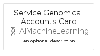
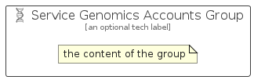

# ServiceGenomicsAccounts


```text
azure-19/Item/AiMachineLearning/ServiceGenomicsAccounts
```

```text
include('azure-19/Item/AiMachineLearning/ServiceGenomicsAccounts')
```


| Illustration | ServiceGenomicsAccounts | ServiceGenomicsAccountsCard | ServiceGenomicsAccountsGroup |
| :---: | :---: | :---: | :---: |
|  |  |  |  |


## Sprites
The item provides the following sriptes:

- `<$ServiceGenomicsAccountsXs>`
- `<$ServiceGenomicsAccountsSm>`
- `<$ServiceGenomicsAccountsMd>`
- `<$ServiceGenomicsAccountsLg>`


## ServiceGenomicsAccounts

### Load remotely
```plantuml
@startuml
' configures the library
!global $LIB_BASE_LOCATION="https://raw.githubusercontent.com/tmorin/plantuml-libs/master/distribution"

' loads the library's bootstrap
!include $LIB_BASE_LOCATION/bootstrap.puml

' loads the package bootstrap
include('azure-19/bootstrap')

' loads the Item which embeds the element ServiceGenomicsAccounts
include('azure-19/Item/AiMachineLearning/ServiceGenomicsAccounts')

' renders the element
ServiceGenomicsAccounts('ServiceGenomicsAccounts', 'Service Genomics Accounts', 'an optional tech label', 'an optional description')
@enduml
```

### Load locally
```plantuml
@startuml
' configures the library
!global $INCLUSION_MODE="local"
!global $LIB_BASE_LOCATION="../../.."

' loads the library's bootstrap
!include $LIB_BASE_LOCATION/bootstrap.puml

' loads the package bootstrap
include('azure-19/bootstrap')

' loads the Item which embeds the element ServiceGenomicsAccounts
include('azure-19/Item/AiMachineLearning/ServiceGenomicsAccounts')

' renders the element
ServiceGenomicsAccounts('ServiceGenomicsAccounts', 'Service Genomics Accounts', 'an optional tech label', 'an optional description')
@enduml
```

## ServiceGenomicsAccountsCard

### Load remotely
```plantuml
@startuml
' configures the library
!global $LIB_BASE_LOCATION="https://raw.githubusercontent.com/tmorin/plantuml-libs/master/distribution"

' loads the library's bootstrap
!include $LIB_BASE_LOCATION/bootstrap.puml

' loads the package bootstrap
include('azure-19/bootstrap')

' loads the Item which embeds the element ServiceGenomicsAccountsCard
include('azure-19/Item/AiMachineLearning/ServiceGenomicsAccounts')

' renders the element
ServiceGenomicsAccountsCard('ServiceGenomicsAccountsCard', 'Service Genomics Accounts Card', 'an optional description')
@enduml
```

### Load locally
```plantuml
@startuml
' configures the library
!global $INCLUSION_MODE="local"
!global $LIB_BASE_LOCATION="../../.."

' loads the library's bootstrap
!include $LIB_BASE_LOCATION/bootstrap.puml

' loads the package bootstrap
include('azure-19/bootstrap')

' loads the Item which embeds the element ServiceGenomicsAccountsCard
include('azure-19/Item/AiMachineLearning/ServiceGenomicsAccounts')

' renders the element
ServiceGenomicsAccountsCard('ServiceGenomicsAccountsCard', 'Service Genomics Accounts Card', 'an optional description')
@enduml
```

## ServiceGenomicsAccountsGroup

### Load remotely
```plantuml
@startuml
' configures the library
!global $LIB_BASE_LOCATION="https://raw.githubusercontent.com/tmorin/plantuml-libs/master/distribution"

' loads the library's bootstrap
!include $LIB_BASE_LOCATION/bootstrap.puml

' loads the package bootstrap
include('azure-19/bootstrap')

' loads the Item which embeds the element ServiceGenomicsAccountsGroup
include('azure-19/Item/AiMachineLearning/ServiceGenomicsAccounts')

' renders the element
ServiceGenomicsAccountsGroup('ServiceGenomicsAccountsGroup', 'Service Genomics Accounts Group', 'an optional tech label') {
    note as note
        the content of the group
    end note
}
@enduml
```

### Load locally
```plantuml
@startuml
' configures the library
!global $INCLUSION_MODE="local"
!global $LIB_BASE_LOCATION="../../.."

' loads the library's bootstrap
!include $LIB_BASE_LOCATION/bootstrap.puml

' loads the package bootstrap
include('azure-19/bootstrap')

' loads the Item which embeds the element ServiceGenomicsAccountsGroup
include('azure-19/Item/AiMachineLearning/ServiceGenomicsAccounts')

' renders the element
ServiceGenomicsAccountsGroup('ServiceGenomicsAccountsGroup', 'Service Genomics Accounts Group', 'an optional tech label') {
    note as note
        the content of the group
    end note
}
@enduml
```

