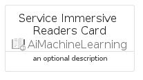
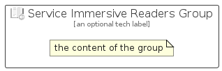

# ServiceImmersiveReaders


```text
azure-19/Item/AiMachineLearning/ServiceImmersiveReaders
```

```text
include('azure-19/Item/AiMachineLearning/ServiceImmersiveReaders')
```


| Illustration | ServiceImmersiveReaders | ServiceImmersiveReadersCard | ServiceImmersiveReadersGroup |
| :---: | :---: | :---: | :---: |
|  |  |  |  |


## Sprites
The item provides the following sriptes:

- `<$ServiceImmersiveReadersXs>`
- `<$ServiceImmersiveReadersSm>`
- `<$ServiceImmersiveReadersMd>`
- `<$ServiceImmersiveReadersLg>`


## ServiceImmersiveReaders

### Load remotely
```plantuml
@startuml
' configures the library
!global $LIB_BASE_LOCATION="https://raw.githubusercontent.com/tmorin/plantuml-libs/master/distribution"

' loads the library's bootstrap
!include $LIB_BASE_LOCATION/bootstrap.puml

' loads the package bootstrap
include('azure-19/bootstrap')

' loads the Item which embeds the element ServiceImmersiveReaders
include('azure-19/Item/AiMachineLearning/ServiceImmersiveReaders')

' renders the element
ServiceImmersiveReaders('ServiceImmersiveReaders', 'Service Immersive Readers', 'an optional tech label', 'an optional description')
@enduml
```

### Load locally
```plantuml
@startuml
' configures the library
!global $INCLUSION_MODE="local"
!global $LIB_BASE_LOCATION="../../.."

' loads the library's bootstrap
!include $LIB_BASE_LOCATION/bootstrap.puml

' loads the package bootstrap
include('azure-19/bootstrap')

' loads the Item which embeds the element ServiceImmersiveReaders
include('azure-19/Item/AiMachineLearning/ServiceImmersiveReaders')

' renders the element
ServiceImmersiveReaders('ServiceImmersiveReaders', 'Service Immersive Readers', 'an optional tech label', 'an optional description')
@enduml
```

## ServiceImmersiveReadersCard

### Load remotely
```plantuml
@startuml
' configures the library
!global $LIB_BASE_LOCATION="https://raw.githubusercontent.com/tmorin/plantuml-libs/master/distribution"

' loads the library's bootstrap
!include $LIB_BASE_LOCATION/bootstrap.puml

' loads the package bootstrap
include('azure-19/bootstrap')

' loads the Item which embeds the element ServiceImmersiveReadersCard
include('azure-19/Item/AiMachineLearning/ServiceImmersiveReaders')

' renders the element
ServiceImmersiveReadersCard('ServiceImmersiveReadersCard', 'Service Immersive Readers Card', 'an optional description')
@enduml
```

### Load locally
```plantuml
@startuml
' configures the library
!global $INCLUSION_MODE="local"
!global $LIB_BASE_LOCATION="../../.."

' loads the library's bootstrap
!include $LIB_BASE_LOCATION/bootstrap.puml

' loads the package bootstrap
include('azure-19/bootstrap')

' loads the Item which embeds the element ServiceImmersiveReadersCard
include('azure-19/Item/AiMachineLearning/ServiceImmersiveReaders')

' renders the element
ServiceImmersiveReadersCard('ServiceImmersiveReadersCard', 'Service Immersive Readers Card', 'an optional description')
@enduml
```

## ServiceImmersiveReadersGroup

### Load remotely
```plantuml
@startuml
' configures the library
!global $LIB_BASE_LOCATION="https://raw.githubusercontent.com/tmorin/plantuml-libs/master/distribution"

' loads the library's bootstrap
!include $LIB_BASE_LOCATION/bootstrap.puml

' loads the package bootstrap
include('azure-19/bootstrap')

' loads the Item which embeds the element ServiceImmersiveReadersGroup
include('azure-19/Item/AiMachineLearning/ServiceImmersiveReaders')

' renders the element
ServiceImmersiveReadersGroup('ServiceImmersiveReadersGroup', 'Service Immersive Readers Group', 'an optional tech label') {
    note as note
        the content of the group
    end note
}
@enduml
```

### Load locally
```plantuml
@startuml
' configures the library
!global $INCLUSION_MODE="local"
!global $LIB_BASE_LOCATION="../../.."

' loads the library's bootstrap
!include $LIB_BASE_LOCATION/bootstrap.puml

' loads the package bootstrap
include('azure-19/bootstrap')

' loads the Item which embeds the element ServiceImmersiveReadersGroup
include('azure-19/Item/AiMachineLearning/ServiceImmersiveReaders')

' renders the element
ServiceImmersiveReadersGroup('ServiceImmersiveReadersGroup', 'Service Immersive Readers Group', 'an optional tech label') {
    note as note
        the content of the group
    end note
}
@enduml
```

