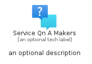
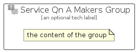

# ServiceQnAMakers


```text
azure-19/Item/AiMachineLearning/ServiceQnAMakers
```

```text
include('azure-19/Item/AiMachineLearning/ServiceQnAMakers')
```


| Illustration | ServiceQnAMakers | ServiceQnAMakersCard | ServiceQnAMakersGroup |
| :---: | :---: | :---: | :---: |
|  |  |  |  |


## Sprites
The item provides the following sriptes:

- `<$ServiceQnAMakersXs>`
- `<$ServiceQnAMakersSm>`
- `<$ServiceQnAMakersMd>`
- `<$ServiceQnAMakersLg>`


## ServiceQnAMakers

### Load remotely
```plantuml
@startuml
' configures the library
!global $LIB_BASE_LOCATION="https://raw.githubusercontent.com/tmorin/plantuml-libs/master/distribution"

' loads the library's bootstrap
!include $LIB_BASE_LOCATION/bootstrap.puml

' loads the package bootstrap
include('azure-19/bootstrap')

' loads the Item which embeds the element ServiceQnAMakers
include('azure-19/Item/AiMachineLearning/ServiceQnAMakers')

' renders the element
ServiceQnAMakers('ServiceQnAMakers', 'Service Qn A Makers', 'an optional tech label', 'an optional description')
@enduml
```

### Load locally
```plantuml
@startuml
' configures the library
!global $INCLUSION_MODE="local"
!global $LIB_BASE_LOCATION="../../.."

' loads the library's bootstrap
!include $LIB_BASE_LOCATION/bootstrap.puml

' loads the package bootstrap
include('azure-19/bootstrap')

' loads the Item which embeds the element ServiceQnAMakers
include('azure-19/Item/AiMachineLearning/ServiceQnAMakers')

' renders the element
ServiceQnAMakers('ServiceQnAMakers', 'Service Qn A Makers', 'an optional tech label', 'an optional description')
@enduml
```

## ServiceQnAMakersCard

### Load remotely
```plantuml
@startuml
' configures the library
!global $LIB_BASE_LOCATION="https://raw.githubusercontent.com/tmorin/plantuml-libs/master/distribution"

' loads the library's bootstrap
!include $LIB_BASE_LOCATION/bootstrap.puml

' loads the package bootstrap
include('azure-19/bootstrap')

' loads the Item which embeds the element ServiceQnAMakersCard
include('azure-19/Item/AiMachineLearning/ServiceQnAMakers')

' renders the element
ServiceQnAMakersCard('ServiceQnAMakersCard', 'Service Qn A Makers Card', 'an optional description')
@enduml
```

### Load locally
```plantuml
@startuml
' configures the library
!global $INCLUSION_MODE="local"
!global $LIB_BASE_LOCATION="../../.."

' loads the library's bootstrap
!include $LIB_BASE_LOCATION/bootstrap.puml

' loads the package bootstrap
include('azure-19/bootstrap')

' loads the Item which embeds the element ServiceQnAMakersCard
include('azure-19/Item/AiMachineLearning/ServiceQnAMakers')

' renders the element
ServiceQnAMakersCard('ServiceQnAMakersCard', 'Service Qn A Makers Card', 'an optional description')
@enduml
```

## ServiceQnAMakersGroup

### Load remotely
```plantuml
@startuml
' configures the library
!global $LIB_BASE_LOCATION="https://raw.githubusercontent.com/tmorin/plantuml-libs/master/distribution"

' loads the library's bootstrap
!include $LIB_BASE_LOCATION/bootstrap.puml

' loads the package bootstrap
include('azure-19/bootstrap')

' loads the Item which embeds the element ServiceQnAMakersGroup
include('azure-19/Item/AiMachineLearning/ServiceQnAMakers')

' renders the element
ServiceQnAMakersGroup('ServiceQnAMakersGroup', 'Service Qn A Makers Group', 'an optional tech label') {
    note as note
        the content of the group
    end note
}
@enduml
```

### Load locally
```plantuml
@startuml
' configures the library
!global $INCLUSION_MODE="local"
!global $LIB_BASE_LOCATION="../../.."

' loads the library's bootstrap
!include $LIB_BASE_LOCATION/bootstrap.puml

' loads the package bootstrap
include('azure-19/bootstrap')

' loads the Item which embeds the element ServiceQnAMakersGroup
include('azure-19/Item/AiMachineLearning/ServiceQnAMakers')

' renders the element
ServiceQnAMakersGroup('ServiceQnAMakersGroup', 'Service Qn A Makers Group', 'an optional tech label') {
    note as note
        the content of the group
    end note
}
@enduml
```

