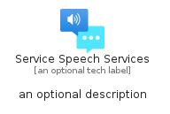
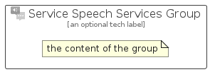

# ServiceSpeechServices


```text
azure-19/Item/AiMachineLearning/ServiceSpeechServices
```

```text
include('azure-19/Item/AiMachineLearning/ServiceSpeechServices')
```


| Illustration | ServiceSpeechServices | ServiceSpeechServicesCard | ServiceSpeechServicesGroup |
| :---: | :---: | :---: | :---: |
|  |  |  |  |


## Sprites
The item provides the following sriptes:

- `<$ServiceSpeechServicesXs>`
- `<$ServiceSpeechServicesSm>`
- `<$ServiceSpeechServicesMd>`
- `<$ServiceSpeechServicesLg>`


## ServiceSpeechServices

### Load remotely
```plantuml
@startuml
' configures the library
!global $LIB_BASE_LOCATION="https://raw.githubusercontent.com/tmorin/plantuml-libs/master/distribution"

' loads the library's bootstrap
!include $LIB_BASE_LOCATION/bootstrap.puml

' loads the package bootstrap
include('azure-19/bootstrap')

' loads the Item which embeds the element ServiceSpeechServices
include('azure-19/Item/AiMachineLearning/ServiceSpeechServices')

' renders the element
ServiceSpeechServices('ServiceSpeechServices', 'Service Speech Services', 'an optional tech label', 'an optional description')
@enduml
```

### Load locally
```plantuml
@startuml
' configures the library
!global $INCLUSION_MODE="local"
!global $LIB_BASE_LOCATION="../../.."

' loads the library's bootstrap
!include $LIB_BASE_LOCATION/bootstrap.puml

' loads the package bootstrap
include('azure-19/bootstrap')

' loads the Item which embeds the element ServiceSpeechServices
include('azure-19/Item/AiMachineLearning/ServiceSpeechServices')

' renders the element
ServiceSpeechServices('ServiceSpeechServices', 'Service Speech Services', 'an optional tech label', 'an optional description')
@enduml
```

## ServiceSpeechServicesCard

### Load remotely
```plantuml
@startuml
' configures the library
!global $LIB_BASE_LOCATION="https://raw.githubusercontent.com/tmorin/plantuml-libs/master/distribution"

' loads the library's bootstrap
!include $LIB_BASE_LOCATION/bootstrap.puml

' loads the package bootstrap
include('azure-19/bootstrap')

' loads the Item which embeds the element ServiceSpeechServicesCard
include('azure-19/Item/AiMachineLearning/ServiceSpeechServices')

' renders the element
ServiceSpeechServicesCard('ServiceSpeechServicesCard', 'Service Speech Services Card', 'an optional description')
@enduml
```

### Load locally
```plantuml
@startuml
' configures the library
!global $INCLUSION_MODE="local"
!global $LIB_BASE_LOCATION="../../.."

' loads the library's bootstrap
!include $LIB_BASE_LOCATION/bootstrap.puml

' loads the package bootstrap
include('azure-19/bootstrap')

' loads the Item which embeds the element ServiceSpeechServicesCard
include('azure-19/Item/AiMachineLearning/ServiceSpeechServices')

' renders the element
ServiceSpeechServicesCard('ServiceSpeechServicesCard', 'Service Speech Services Card', 'an optional description')
@enduml
```

## ServiceSpeechServicesGroup

### Load remotely
```plantuml
@startuml
' configures the library
!global $LIB_BASE_LOCATION="https://raw.githubusercontent.com/tmorin/plantuml-libs/master/distribution"

' loads the library's bootstrap
!include $LIB_BASE_LOCATION/bootstrap.puml

' loads the package bootstrap
include('azure-19/bootstrap')

' loads the Item which embeds the element ServiceSpeechServicesGroup
include('azure-19/Item/AiMachineLearning/ServiceSpeechServices')

' renders the element
ServiceSpeechServicesGroup('ServiceSpeechServicesGroup', 'Service Speech Services Group', 'an optional tech label') {
    note as note
        the content of the group
    end note
}
@enduml
```

### Load locally
```plantuml
@startuml
' configures the library
!global $INCLUSION_MODE="local"
!global $LIB_BASE_LOCATION="../../.."

' loads the library's bootstrap
!include $LIB_BASE_LOCATION/bootstrap.puml

' loads the package bootstrap
include('azure-19/bootstrap')

' loads the Item which embeds the element ServiceSpeechServicesGroup
include('azure-19/Item/AiMachineLearning/ServiceSpeechServices')

' renders the element
ServiceSpeechServicesGroup('ServiceSpeechServicesGroup', 'Service Speech Services Group', 'an optional tech label') {
    note as note
        the content of the group
    end note
}
@enduml
```

