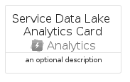

# ServiceDataLakeAnalytics


```text
azure-19/Item/Analytics/ServiceDataLakeAnalytics
```

```text
include('azure-19/Item/Analytics/ServiceDataLakeAnalytics')
```


| Illustration | ServiceDataLakeAnalytics | ServiceDataLakeAnalyticsCard | ServiceDataLakeAnalyticsGroup |
| :---: | :---: | :---: | :---: |
|  |  |  |  |


## Sprites
The item provides the following sriptes:

- `<$ServiceDataLakeAnalyticsXs>`
- `<$ServiceDataLakeAnalyticsSm>`
- `<$ServiceDataLakeAnalyticsMd>`
- `<$ServiceDataLakeAnalyticsLg>`


## ServiceDataLakeAnalytics

### Load remotely
```plantuml
@startuml
' configures the library
!global $LIB_BASE_LOCATION="https://raw.githubusercontent.com/tmorin/plantuml-libs/master/distribution"

' loads the library's bootstrap
!include $LIB_BASE_LOCATION/bootstrap.puml

' loads the package bootstrap
include('azure-19/bootstrap')

' loads the Item which embeds the element ServiceDataLakeAnalytics
include('azure-19/Item/Analytics/ServiceDataLakeAnalytics')

' renders the element
ServiceDataLakeAnalytics('ServiceDataLakeAnalytics', 'Service Data Lake Analytics', 'an optional tech label', 'an optional description')
@enduml
```

### Load locally
```plantuml
@startuml
' configures the library
!global $INCLUSION_MODE="local"
!global $LIB_BASE_LOCATION="../../.."

' loads the library's bootstrap
!include $LIB_BASE_LOCATION/bootstrap.puml

' loads the package bootstrap
include('azure-19/bootstrap')

' loads the Item which embeds the element ServiceDataLakeAnalytics
include('azure-19/Item/Analytics/ServiceDataLakeAnalytics')

' renders the element
ServiceDataLakeAnalytics('ServiceDataLakeAnalytics', 'Service Data Lake Analytics', 'an optional tech label', 'an optional description')
@enduml
```

## ServiceDataLakeAnalyticsCard

### Load remotely
```plantuml
@startuml
' configures the library
!global $LIB_BASE_LOCATION="https://raw.githubusercontent.com/tmorin/plantuml-libs/master/distribution"

' loads the library's bootstrap
!include $LIB_BASE_LOCATION/bootstrap.puml

' loads the package bootstrap
include('azure-19/bootstrap')

' loads the Item which embeds the element ServiceDataLakeAnalyticsCard
include('azure-19/Item/Analytics/ServiceDataLakeAnalytics')

' renders the element
ServiceDataLakeAnalyticsCard('ServiceDataLakeAnalyticsCard', 'Service Data Lake Analytics Card', 'an optional description')
@enduml
```

### Load locally
```plantuml
@startuml
' configures the library
!global $INCLUSION_MODE="local"
!global $LIB_BASE_LOCATION="../../.."

' loads the library's bootstrap
!include $LIB_BASE_LOCATION/bootstrap.puml

' loads the package bootstrap
include('azure-19/bootstrap')

' loads the Item which embeds the element ServiceDataLakeAnalyticsCard
include('azure-19/Item/Analytics/ServiceDataLakeAnalytics')

' renders the element
ServiceDataLakeAnalyticsCard('ServiceDataLakeAnalyticsCard', 'Service Data Lake Analytics Card', 'an optional description')
@enduml
```

## ServiceDataLakeAnalyticsGroup

### Load remotely
```plantuml
@startuml
' configures the library
!global $LIB_BASE_LOCATION="https://raw.githubusercontent.com/tmorin/plantuml-libs/master/distribution"

' loads the library's bootstrap
!include $LIB_BASE_LOCATION/bootstrap.puml

' loads the package bootstrap
include('azure-19/bootstrap')

' loads the Item which embeds the element ServiceDataLakeAnalyticsGroup
include('azure-19/Item/Analytics/ServiceDataLakeAnalytics')

' renders the element
ServiceDataLakeAnalyticsGroup('ServiceDataLakeAnalyticsGroup', 'Service Data Lake Analytics Group', 'an optional tech label') {
    note as note
        the content of the group
    end note
}
@enduml
```

### Load locally
```plantuml
@startuml
' configures the library
!global $INCLUSION_MODE="local"
!global $LIB_BASE_LOCATION="../../.."

' loads the library's bootstrap
!include $LIB_BASE_LOCATION/bootstrap.puml

' loads the package bootstrap
include('azure-19/bootstrap')

' loads the Item which embeds the element ServiceDataLakeAnalyticsGroup
include('azure-19/Item/Analytics/ServiceDataLakeAnalytics')

' renders the element
ServiceDataLakeAnalyticsGroup('ServiceDataLakeAnalyticsGroup', 'Service Data Lake Analytics Group', 'an optional tech label') {
    note as note
        the content of the group
    end note
}
@enduml
```

