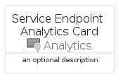

# ServiceEndpointAnalytics


```text
azure-19/Item/Analytics/ServiceEndpointAnalytics
```

```text
include('azure-19/Item/Analytics/ServiceEndpointAnalytics')
```


| Illustration | ServiceEndpointAnalytics | ServiceEndpointAnalyticsCard | ServiceEndpointAnalyticsGroup |
| :---: | :---: | :---: | :---: |
|  |  |  |  |


## Sprites
The item provides the following sriptes:

- `<$ServiceEndpointAnalyticsXs>`
- `<$ServiceEndpointAnalyticsSm>`
- `<$ServiceEndpointAnalyticsMd>`
- `<$ServiceEndpointAnalyticsLg>`


## ServiceEndpointAnalytics

### Load remotely
```plantuml
@startuml
' configures the library
!global $LIB_BASE_LOCATION="https://raw.githubusercontent.com/tmorin/plantuml-libs/master/distribution"

' loads the library's bootstrap
!include $LIB_BASE_LOCATION/bootstrap.puml

' loads the package bootstrap
include('azure-19/bootstrap')

' loads the Item which embeds the element ServiceEndpointAnalytics
include('azure-19/Item/Analytics/ServiceEndpointAnalytics')

' renders the element
ServiceEndpointAnalytics('ServiceEndpointAnalytics', 'Service Endpoint Analytics', 'an optional tech label', 'an optional description')
@enduml
```

### Load locally
```plantuml
@startuml
' configures the library
!global $INCLUSION_MODE="local"
!global $LIB_BASE_LOCATION="../../.."

' loads the library's bootstrap
!include $LIB_BASE_LOCATION/bootstrap.puml

' loads the package bootstrap
include('azure-19/bootstrap')

' loads the Item which embeds the element ServiceEndpointAnalytics
include('azure-19/Item/Analytics/ServiceEndpointAnalytics')

' renders the element
ServiceEndpointAnalytics('ServiceEndpointAnalytics', 'Service Endpoint Analytics', 'an optional tech label', 'an optional description')
@enduml
```

## ServiceEndpointAnalyticsCard

### Load remotely
```plantuml
@startuml
' configures the library
!global $LIB_BASE_LOCATION="https://raw.githubusercontent.com/tmorin/plantuml-libs/master/distribution"

' loads the library's bootstrap
!include $LIB_BASE_LOCATION/bootstrap.puml

' loads the package bootstrap
include('azure-19/bootstrap')

' loads the Item which embeds the element ServiceEndpointAnalyticsCard
include('azure-19/Item/Analytics/ServiceEndpointAnalytics')

' renders the element
ServiceEndpointAnalyticsCard('ServiceEndpointAnalyticsCard', 'Service Endpoint Analytics Card', 'an optional description')
@enduml
```

### Load locally
```plantuml
@startuml
' configures the library
!global $INCLUSION_MODE="local"
!global $LIB_BASE_LOCATION="../../.."

' loads the library's bootstrap
!include $LIB_BASE_LOCATION/bootstrap.puml

' loads the package bootstrap
include('azure-19/bootstrap')

' loads the Item which embeds the element ServiceEndpointAnalyticsCard
include('azure-19/Item/Analytics/ServiceEndpointAnalytics')

' renders the element
ServiceEndpointAnalyticsCard('ServiceEndpointAnalyticsCard', 'Service Endpoint Analytics Card', 'an optional description')
@enduml
```

## ServiceEndpointAnalyticsGroup

### Load remotely
```plantuml
@startuml
' configures the library
!global $LIB_BASE_LOCATION="https://raw.githubusercontent.com/tmorin/plantuml-libs/master/distribution"

' loads the library's bootstrap
!include $LIB_BASE_LOCATION/bootstrap.puml

' loads the package bootstrap
include('azure-19/bootstrap')

' loads the Item which embeds the element ServiceEndpointAnalyticsGroup
include('azure-19/Item/Analytics/ServiceEndpointAnalytics')

' renders the element
ServiceEndpointAnalyticsGroup('ServiceEndpointAnalyticsGroup', 'Service Endpoint Analytics Group', 'an optional tech label') {
    note as note
        the content of the group
    end note
}
@enduml
```

### Load locally
```plantuml
@startuml
' configures the library
!global $INCLUSION_MODE="local"
!global $LIB_BASE_LOCATION="../../.."

' loads the library's bootstrap
!include $LIB_BASE_LOCATION/bootstrap.puml

' loads the package bootstrap
include('azure-19/bootstrap')

' loads the Item which embeds the element ServiceEndpointAnalyticsGroup
include('azure-19/Item/Analytics/ServiceEndpointAnalytics')

' renders the element
ServiceEndpointAnalyticsGroup('ServiceEndpointAnalyticsGroup', 'Service Endpoint Analytics Group', 'an optional tech label') {
    note as note
        the content of the group
    end note
}
@enduml
```

