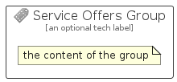

# ServiceOffers


```text
azure-19/Item/AzureStack/ServiceOffers
```

```text
include('azure-19/Item/AzureStack/ServiceOffers')
```


| Illustration | ServiceOffers | ServiceOffersCard | ServiceOffersGroup |
| :---: | :---: | :---: | :---: |
|  |  |  |  |


## Sprites
The item provides the following sriptes:

- `<$ServiceOffersXs>`
- `<$ServiceOffersSm>`
- `<$ServiceOffersMd>`
- `<$ServiceOffersLg>`


## ServiceOffers

### Load remotely
```plantuml
@startuml
' configures the library
!global $LIB_BASE_LOCATION="https://raw.githubusercontent.com/tmorin/plantuml-libs/master/distribution"

' loads the library's bootstrap
!include $LIB_BASE_LOCATION/bootstrap.puml

' loads the package bootstrap
include('azure-19/bootstrap')

' loads the Item which embeds the element ServiceOffers
include('azure-19/Item/AzureStack/ServiceOffers')

' renders the element
ServiceOffers('ServiceOffers', 'Service Offers', 'an optional tech label', 'an optional description')
@enduml
```

### Load locally
```plantuml
@startuml
' configures the library
!global $INCLUSION_MODE="local"
!global $LIB_BASE_LOCATION="../../.."

' loads the library's bootstrap
!include $LIB_BASE_LOCATION/bootstrap.puml

' loads the package bootstrap
include('azure-19/bootstrap')

' loads the Item which embeds the element ServiceOffers
include('azure-19/Item/AzureStack/ServiceOffers')

' renders the element
ServiceOffers('ServiceOffers', 'Service Offers', 'an optional tech label', 'an optional description')
@enduml
```

## ServiceOffersCard

### Load remotely
```plantuml
@startuml
' configures the library
!global $LIB_BASE_LOCATION="https://raw.githubusercontent.com/tmorin/plantuml-libs/master/distribution"

' loads the library's bootstrap
!include $LIB_BASE_LOCATION/bootstrap.puml

' loads the package bootstrap
include('azure-19/bootstrap')

' loads the Item which embeds the element ServiceOffersCard
include('azure-19/Item/AzureStack/ServiceOffers')

' renders the element
ServiceOffersCard('ServiceOffersCard', 'Service Offers Card', 'an optional description')
@enduml
```

### Load locally
```plantuml
@startuml
' configures the library
!global $INCLUSION_MODE="local"
!global $LIB_BASE_LOCATION="../../.."

' loads the library's bootstrap
!include $LIB_BASE_LOCATION/bootstrap.puml

' loads the package bootstrap
include('azure-19/bootstrap')

' loads the Item which embeds the element ServiceOffersCard
include('azure-19/Item/AzureStack/ServiceOffers')

' renders the element
ServiceOffersCard('ServiceOffersCard', 'Service Offers Card', 'an optional description')
@enduml
```

## ServiceOffersGroup

### Load remotely
```plantuml
@startuml
' configures the library
!global $LIB_BASE_LOCATION="https://raw.githubusercontent.com/tmorin/plantuml-libs/master/distribution"

' loads the library's bootstrap
!include $LIB_BASE_LOCATION/bootstrap.puml

' loads the package bootstrap
include('azure-19/bootstrap')

' loads the Item which embeds the element ServiceOffersGroup
include('azure-19/Item/AzureStack/ServiceOffers')

' renders the element
ServiceOffersGroup('ServiceOffersGroup', 'Service Offers Group', 'an optional tech label') {
    note as note
        the content of the group
    end note
}
@enduml
```

### Load locally
```plantuml
@startuml
' configures the library
!global $INCLUSION_MODE="local"
!global $LIB_BASE_LOCATION="../../.."

' loads the library's bootstrap
!include $LIB_BASE_LOCATION/bootstrap.puml

' loads the package bootstrap
include('azure-19/bootstrap')

' loads the Item which embeds the element ServiceOffersGroup
include('azure-19/Item/AzureStack/ServiceOffers')

' renders the element
ServiceOffersGroup('ServiceOffersGroup', 'Service Offers Group', 'an optional tech label') {
    note as note
        the content of the group
    end note
}
@enduml
```

