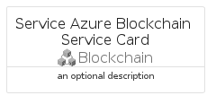
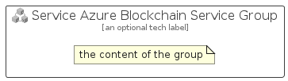

# ServiceAzureBlockchainService


```text
azure-19/Item/Blockchain/ServiceAzureBlockchainService
```

```text
include('azure-19/Item/Blockchain/ServiceAzureBlockchainService')
```


| Illustration | ServiceAzureBlockchainService | ServiceAzureBlockchainServiceCard | ServiceAzureBlockchainServiceGroup |
| :---: | :---: | :---: | :---: |
|  |  |  |  |


## Sprites
The item provides the following sriptes:

- `<$ServiceAzureBlockchainServiceXs>`
- `<$ServiceAzureBlockchainServiceSm>`
- `<$ServiceAzureBlockchainServiceMd>`
- `<$ServiceAzureBlockchainServiceLg>`


## ServiceAzureBlockchainService

### Load remotely
```plantuml
@startuml
' configures the library
!global $LIB_BASE_LOCATION="https://raw.githubusercontent.com/tmorin/plantuml-libs/master/distribution"

' loads the library's bootstrap
!include $LIB_BASE_LOCATION/bootstrap.puml

' loads the package bootstrap
include('azure-19/bootstrap')

' loads the Item which embeds the element ServiceAzureBlockchainService
include('azure-19/Item/Blockchain/ServiceAzureBlockchainService')

' renders the element
ServiceAzureBlockchainService('ServiceAzureBlockchainService', 'Service Azure Blockchain Service', 'an optional tech label', 'an optional description')
@enduml
```

### Load locally
```plantuml
@startuml
' configures the library
!global $INCLUSION_MODE="local"
!global $LIB_BASE_LOCATION="../../.."

' loads the library's bootstrap
!include $LIB_BASE_LOCATION/bootstrap.puml

' loads the package bootstrap
include('azure-19/bootstrap')

' loads the Item which embeds the element ServiceAzureBlockchainService
include('azure-19/Item/Blockchain/ServiceAzureBlockchainService')

' renders the element
ServiceAzureBlockchainService('ServiceAzureBlockchainService', 'Service Azure Blockchain Service', 'an optional tech label', 'an optional description')
@enduml
```

## ServiceAzureBlockchainServiceCard

### Load remotely
```plantuml
@startuml
' configures the library
!global $LIB_BASE_LOCATION="https://raw.githubusercontent.com/tmorin/plantuml-libs/master/distribution"

' loads the library's bootstrap
!include $LIB_BASE_LOCATION/bootstrap.puml

' loads the package bootstrap
include('azure-19/bootstrap')

' loads the Item which embeds the element ServiceAzureBlockchainServiceCard
include('azure-19/Item/Blockchain/ServiceAzureBlockchainService')

' renders the element
ServiceAzureBlockchainServiceCard('ServiceAzureBlockchainServiceCard', 'Service Azure Blockchain Service Card', 'an optional description')
@enduml
```

### Load locally
```plantuml
@startuml
' configures the library
!global $INCLUSION_MODE="local"
!global $LIB_BASE_LOCATION="../../.."

' loads the library's bootstrap
!include $LIB_BASE_LOCATION/bootstrap.puml

' loads the package bootstrap
include('azure-19/bootstrap')

' loads the Item which embeds the element ServiceAzureBlockchainServiceCard
include('azure-19/Item/Blockchain/ServiceAzureBlockchainService')

' renders the element
ServiceAzureBlockchainServiceCard('ServiceAzureBlockchainServiceCard', 'Service Azure Blockchain Service Card', 'an optional description')
@enduml
```

## ServiceAzureBlockchainServiceGroup

### Load remotely
```plantuml
@startuml
' configures the library
!global $LIB_BASE_LOCATION="https://raw.githubusercontent.com/tmorin/plantuml-libs/master/distribution"

' loads the library's bootstrap
!include $LIB_BASE_LOCATION/bootstrap.puml

' loads the package bootstrap
include('azure-19/bootstrap')

' loads the Item which embeds the element ServiceAzureBlockchainServiceGroup
include('azure-19/Item/Blockchain/ServiceAzureBlockchainService')

' renders the element
ServiceAzureBlockchainServiceGroup('ServiceAzureBlockchainServiceGroup', 'Service Azure Blockchain Service Group', 'an optional tech label') {
    note as note
        the content of the group
    end note
}
@enduml
```

### Load locally
```plantuml
@startuml
' configures the library
!global $INCLUSION_MODE="local"
!global $LIB_BASE_LOCATION="../../.."

' loads the library's bootstrap
!include $LIB_BASE_LOCATION/bootstrap.puml

' loads the package bootstrap
include('azure-19/bootstrap')

' loads the Item which embeds the element ServiceAzureBlockchainServiceGroup
include('azure-19/Item/Blockchain/ServiceAzureBlockchainService')

' renders the element
ServiceAzureBlockchainServiceGroup('ServiceAzureBlockchainServiceGroup', 'Service Azure Blockchain Service Group', 'an optional tech label') {
    note as note
        the content of the group
    end note
}
@enduml
```

