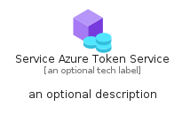
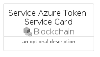
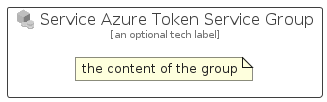

# ServiceAzureTokenService


```text
azure-19/Item/Blockchain/ServiceAzureTokenService
```

```text
include('azure-19/Item/Blockchain/ServiceAzureTokenService')
```


| Illustration | ServiceAzureTokenService | ServiceAzureTokenServiceCard | ServiceAzureTokenServiceGroup |
| :---: | :---: | :---: | :---: |
|  |  |  |  |


## Sprites
The item provides the following sriptes:

- `<$ServiceAzureTokenServiceXs>`
- `<$ServiceAzureTokenServiceSm>`
- `<$ServiceAzureTokenServiceMd>`
- `<$ServiceAzureTokenServiceLg>`


## ServiceAzureTokenService

### Load remotely
```plantuml
@startuml
' configures the library
!global $LIB_BASE_LOCATION="https://raw.githubusercontent.com/tmorin/plantuml-libs/master/distribution"

' loads the library's bootstrap
!include $LIB_BASE_LOCATION/bootstrap.puml

' loads the package bootstrap
include('azure-19/bootstrap')

' loads the Item which embeds the element ServiceAzureTokenService
include('azure-19/Item/Blockchain/ServiceAzureTokenService')

' renders the element
ServiceAzureTokenService('ServiceAzureTokenService', 'Service Azure Token Service', 'an optional tech label', 'an optional description')
@enduml
```

### Load locally
```plantuml
@startuml
' configures the library
!global $INCLUSION_MODE="local"
!global $LIB_BASE_LOCATION="../../.."

' loads the library's bootstrap
!include $LIB_BASE_LOCATION/bootstrap.puml

' loads the package bootstrap
include('azure-19/bootstrap')

' loads the Item which embeds the element ServiceAzureTokenService
include('azure-19/Item/Blockchain/ServiceAzureTokenService')

' renders the element
ServiceAzureTokenService('ServiceAzureTokenService', 'Service Azure Token Service', 'an optional tech label', 'an optional description')
@enduml
```

## ServiceAzureTokenServiceCard

### Load remotely
```plantuml
@startuml
' configures the library
!global $LIB_BASE_LOCATION="https://raw.githubusercontent.com/tmorin/plantuml-libs/master/distribution"

' loads the library's bootstrap
!include $LIB_BASE_LOCATION/bootstrap.puml

' loads the package bootstrap
include('azure-19/bootstrap')

' loads the Item which embeds the element ServiceAzureTokenServiceCard
include('azure-19/Item/Blockchain/ServiceAzureTokenService')

' renders the element
ServiceAzureTokenServiceCard('ServiceAzureTokenServiceCard', 'Service Azure Token Service Card', 'an optional description')
@enduml
```

### Load locally
```plantuml
@startuml
' configures the library
!global $INCLUSION_MODE="local"
!global $LIB_BASE_LOCATION="../../.."

' loads the library's bootstrap
!include $LIB_BASE_LOCATION/bootstrap.puml

' loads the package bootstrap
include('azure-19/bootstrap')

' loads the Item which embeds the element ServiceAzureTokenServiceCard
include('azure-19/Item/Blockchain/ServiceAzureTokenService')

' renders the element
ServiceAzureTokenServiceCard('ServiceAzureTokenServiceCard', 'Service Azure Token Service Card', 'an optional description')
@enduml
```

## ServiceAzureTokenServiceGroup

### Load remotely
```plantuml
@startuml
' configures the library
!global $LIB_BASE_LOCATION="https://raw.githubusercontent.com/tmorin/plantuml-libs/master/distribution"

' loads the library's bootstrap
!include $LIB_BASE_LOCATION/bootstrap.puml

' loads the package bootstrap
include('azure-19/bootstrap')

' loads the Item which embeds the element ServiceAzureTokenServiceGroup
include('azure-19/Item/Blockchain/ServiceAzureTokenService')

' renders the element
ServiceAzureTokenServiceGroup('ServiceAzureTokenServiceGroup', 'Service Azure Token Service Group', 'an optional tech label') {
    note as note
        the content of the group
    end note
}
@enduml
```

### Load locally
```plantuml
@startuml
' configures the library
!global $INCLUSION_MODE="local"
!global $LIB_BASE_LOCATION="../../.."

' loads the library's bootstrap
!include $LIB_BASE_LOCATION/bootstrap.puml

' loads the package bootstrap
include('azure-19/bootstrap')

' loads the Item which embeds the element ServiceAzureTokenServiceGroup
include('azure-19/Item/Blockchain/ServiceAzureTokenService')

' renders the element
ServiceAzureTokenServiceGroup('ServiceAzureTokenServiceGroup', 'Service Azure Token Service Group', 'an optional tech label') {
    note as note
        the content of the group
    end note
}
@enduml
```

