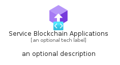
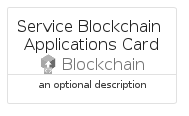

# ServiceBlockchainApplications


```text
azure-19/Item/Blockchain/ServiceBlockchainApplications
```

```text
include('azure-19/Item/Blockchain/ServiceBlockchainApplications')
```


| Illustration | ServiceBlockchainApplications | ServiceBlockchainApplicationsCard | ServiceBlockchainApplicationsGroup |
| :---: | :---: | :---: | :---: |
|  |  |  |  |


## Sprites
The item provides the following sriptes:

- `<$ServiceBlockchainApplicationsXs>`
- `<$ServiceBlockchainApplicationsSm>`
- `<$ServiceBlockchainApplicationsMd>`
- `<$ServiceBlockchainApplicationsLg>`


## ServiceBlockchainApplications

### Load remotely
```plantuml
@startuml
' configures the library
!global $LIB_BASE_LOCATION="https://raw.githubusercontent.com/tmorin/plantuml-libs/master/distribution"

' loads the library's bootstrap
!include $LIB_BASE_LOCATION/bootstrap.puml

' loads the package bootstrap
include('azure-19/bootstrap')

' loads the Item which embeds the element ServiceBlockchainApplications
include('azure-19/Item/Blockchain/ServiceBlockchainApplications')

' renders the element
ServiceBlockchainApplications('ServiceBlockchainApplications', 'Service Blockchain Applications', 'an optional tech label', 'an optional description')
@enduml
```

### Load locally
```plantuml
@startuml
' configures the library
!global $INCLUSION_MODE="local"
!global $LIB_BASE_LOCATION="../../.."

' loads the library's bootstrap
!include $LIB_BASE_LOCATION/bootstrap.puml

' loads the package bootstrap
include('azure-19/bootstrap')

' loads the Item which embeds the element ServiceBlockchainApplications
include('azure-19/Item/Blockchain/ServiceBlockchainApplications')

' renders the element
ServiceBlockchainApplications('ServiceBlockchainApplications', 'Service Blockchain Applications', 'an optional tech label', 'an optional description')
@enduml
```

## ServiceBlockchainApplicationsCard

### Load remotely
```plantuml
@startuml
' configures the library
!global $LIB_BASE_LOCATION="https://raw.githubusercontent.com/tmorin/plantuml-libs/master/distribution"

' loads the library's bootstrap
!include $LIB_BASE_LOCATION/bootstrap.puml

' loads the package bootstrap
include('azure-19/bootstrap')

' loads the Item which embeds the element ServiceBlockchainApplicationsCard
include('azure-19/Item/Blockchain/ServiceBlockchainApplications')

' renders the element
ServiceBlockchainApplicationsCard('ServiceBlockchainApplicationsCard', 'Service Blockchain Applications Card', 'an optional description')
@enduml
```

### Load locally
```plantuml
@startuml
' configures the library
!global $INCLUSION_MODE="local"
!global $LIB_BASE_LOCATION="../../.."

' loads the library's bootstrap
!include $LIB_BASE_LOCATION/bootstrap.puml

' loads the package bootstrap
include('azure-19/bootstrap')

' loads the Item which embeds the element ServiceBlockchainApplicationsCard
include('azure-19/Item/Blockchain/ServiceBlockchainApplications')

' renders the element
ServiceBlockchainApplicationsCard('ServiceBlockchainApplicationsCard', 'Service Blockchain Applications Card', 'an optional description')
@enduml
```

## ServiceBlockchainApplicationsGroup

### Load remotely
```plantuml
@startuml
' configures the library
!global $LIB_BASE_LOCATION="https://raw.githubusercontent.com/tmorin/plantuml-libs/master/distribution"

' loads the library's bootstrap
!include $LIB_BASE_LOCATION/bootstrap.puml

' loads the package bootstrap
include('azure-19/bootstrap')

' loads the Item which embeds the element ServiceBlockchainApplicationsGroup
include('azure-19/Item/Blockchain/ServiceBlockchainApplications')

' renders the element
ServiceBlockchainApplicationsGroup('ServiceBlockchainApplicationsGroup', 'Service Blockchain Applications Group', 'an optional tech label') {
    note as note
        the content of the group
    end note
}
@enduml
```

### Load locally
```plantuml
@startuml
' configures the library
!global $INCLUSION_MODE="local"
!global $LIB_BASE_LOCATION="../../.."

' loads the library's bootstrap
!include $LIB_BASE_LOCATION/bootstrap.puml

' loads the package bootstrap
include('azure-19/bootstrap')

' loads the Item which embeds the element ServiceBlockchainApplicationsGroup
include('azure-19/Item/Blockchain/ServiceBlockchainApplications')

' renders the element
ServiceBlockchainApplicationsGroup('ServiceBlockchainApplicationsGroup', 'Service Blockchain Applications Group', 'an optional tech label') {
    note as note
        the content of the group
    end note
}
@enduml
```

