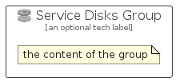

# ServiceDisks


```text
azure-19/Item/Compute/ServiceDisks
```

```text
include('azure-19/Item/Compute/ServiceDisks')
```


| Illustration | ServiceDisks | ServiceDisksCard | ServiceDisksGroup |
| :---: | :---: | :---: | :---: |
|  |  |  |  |


## Sprites
The item provides the following sriptes:

- `<$ServiceDisksXs>`
- `<$ServiceDisksSm>`
- `<$ServiceDisksMd>`
- `<$ServiceDisksLg>`


## ServiceDisks

### Load remotely
```plantuml
@startuml
' configures the library
!global $LIB_BASE_LOCATION="https://raw.githubusercontent.com/tmorin/plantuml-libs/master/distribution"

' loads the library's bootstrap
!include $LIB_BASE_LOCATION/bootstrap.puml

' loads the package bootstrap
include('azure-19/bootstrap')

' loads the Item which embeds the element ServiceDisks
include('azure-19/Item/Compute/ServiceDisks')

' renders the element
ServiceDisks('ServiceDisks', 'Service Disks', 'an optional tech label', 'an optional description')
@enduml
```

### Load locally
```plantuml
@startuml
' configures the library
!global $INCLUSION_MODE="local"
!global $LIB_BASE_LOCATION="../../.."

' loads the library's bootstrap
!include $LIB_BASE_LOCATION/bootstrap.puml

' loads the package bootstrap
include('azure-19/bootstrap')

' loads the Item which embeds the element ServiceDisks
include('azure-19/Item/Compute/ServiceDisks')

' renders the element
ServiceDisks('ServiceDisks', 'Service Disks', 'an optional tech label', 'an optional description')
@enduml
```

## ServiceDisksCard

### Load remotely
```plantuml
@startuml
' configures the library
!global $LIB_BASE_LOCATION="https://raw.githubusercontent.com/tmorin/plantuml-libs/master/distribution"

' loads the library's bootstrap
!include $LIB_BASE_LOCATION/bootstrap.puml

' loads the package bootstrap
include('azure-19/bootstrap')

' loads the Item which embeds the element ServiceDisksCard
include('azure-19/Item/Compute/ServiceDisks')

' renders the element
ServiceDisksCard('ServiceDisksCard', 'Service Disks Card', 'an optional description')
@enduml
```

### Load locally
```plantuml
@startuml
' configures the library
!global $INCLUSION_MODE="local"
!global $LIB_BASE_LOCATION="../../.."

' loads the library's bootstrap
!include $LIB_BASE_LOCATION/bootstrap.puml

' loads the package bootstrap
include('azure-19/bootstrap')

' loads the Item which embeds the element ServiceDisksCard
include('azure-19/Item/Compute/ServiceDisks')

' renders the element
ServiceDisksCard('ServiceDisksCard', 'Service Disks Card', 'an optional description')
@enduml
```

## ServiceDisksGroup

### Load remotely
```plantuml
@startuml
' configures the library
!global $LIB_BASE_LOCATION="https://raw.githubusercontent.com/tmorin/plantuml-libs/master/distribution"

' loads the library's bootstrap
!include $LIB_BASE_LOCATION/bootstrap.puml

' loads the package bootstrap
include('azure-19/bootstrap')

' loads the Item which embeds the element ServiceDisksGroup
include('azure-19/Item/Compute/ServiceDisks')

' renders the element
ServiceDisksGroup('ServiceDisksGroup', 'Service Disks Group', 'an optional tech label') {
    note as note
        the content of the group
    end note
}
@enduml
```

### Load locally
```plantuml
@startuml
' configures the library
!global $INCLUSION_MODE="local"
!global $LIB_BASE_LOCATION="../../.."

' loads the library's bootstrap
!include $LIB_BASE_LOCATION/bootstrap.puml

' loads the package bootstrap
include('azure-19/bootstrap')

' loads the Item which embeds the element ServiceDisksGroup
include('azure-19/Item/Compute/ServiceDisks')

' renders the element
ServiceDisksGroup('ServiceDisksGroup', 'Service Disks Group', 'an optional tech label') {
    note as note
        the content of the group
    end note
}
@enduml
```

