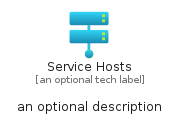

# ServiceHosts


```text
azure-19/Item/Compute/ServiceHosts
```

```text
include('azure-19/Item/Compute/ServiceHosts')
```


| Illustration | ServiceHosts | ServiceHostsCard | ServiceHostsGroup |
| :---: | :---: | :---: | :---: |
|  |  |  |  |


## Sprites
The item provides the following sriptes:

- `<$ServiceHostsXs>`
- `<$ServiceHostsSm>`
- `<$ServiceHostsMd>`
- `<$ServiceHostsLg>`


## ServiceHosts

### Load remotely
```plantuml
@startuml
' configures the library
!global $LIB_BASE_LOCATION="https://raw.githubusercontent.com/tmorin/plantuml-libs/master/distribution"

' loads the library's bootstrap
!include $LIB_BASE_LOCATION/bootstrap.puml

' loads the package bootstrap
include('azure-19/bootstrap')

' loads the Item which embeds the element ServiceHosts
include('azure-19/Item/Compute/ServiceHosts')

' renders the element
ServiceHosts('ServiceHosts', 'Service Hosts', 'an optional tech label', 'an optional description')
@enduml
```

### Load locally
```plantuml
@startuml
' configures the library
!global $INCLUSION_MODE="local"
!global $LIB_BASE_LOCATION="../../.."

' loads the library's bootstrap
!include $LIB_BASE_LOCATION/bootstrap.puml

' loads the package bootstrap
include('azure-19/bootstrap')

' loads the Item which embeds the element ServiceHosts
include('azure-19/Item/Compute/ServiceHosts')

' renders the element
ServiceHosts('ServiceHosts', 'Service Hosts', 'an optional tech label', 'an optional description')
@enduml
```

## ServiceHostsCard

### Load remotely
```plantuml
@startuml
' configures the library
!global $LIB_BASE_LOCATION="https://raw.githubusercontent.com/tmorin/plantuml-libs/master/distribution"

' loads the library's bootstrap
!include $LIB_BASE_LOCATION/bootstrap.puml

' loads the package bootstrap
include('azure-19/bootstrap')

' loads the Item which embeds the element ServiceHostsCard
include('azure-19/Item/Compute/ServiceHosts')

' renders the element
ServiceHostsCard('ServiceHostsCard', 'Service Hosts Card', 'an optional description')
@enduml
```

### Load locally
```plantuml
@startuml
' configures the library
!global $INCLUSION_MODE="local"
!global $LIB_BASE_LOCATION="../../.."

' loads the library's bootstrap
!include $LIB_BASE_LOCATION/bootstrap.puml

' loads the package bootstrap
include('azure-19/bootstrap')

' loads the Item which embeds the element ServiceHostsCard
include('azure-19/Item/Compute/ServiceHosts')

' renders the element
ServiceHostsCard('ServiceHostsCard', 'Service Hosts Card', 'an optional description')
@enduml
```

## ServiceHostsGroup

### Load remotely
```plantuml
@startuml
' configures the library
!global $LIB_BASE_LOCATION="https://raw.githubusercontent.com/tmorin/plantuml-libs/master/distribution"

' loads the library's bootstrap
!include $LIB_BASE_LOCATION/bootstrap.puml

' loads the package bootstrap
include('azure-19/bootstrap')

' loads the Item which embeds the element ServiceHostsGroup
include('azure-19/Item/Compute/ServiceHosts')

' renders the element
ServiceHostsGroup('ServiceHostsGroup', 'Service Hosts Group', 'an optional tech label') {
    note as note
        the content of the group
    end note
}
@enduml
```

### Load locally
```plantuml
@startuml
' configures the library
!global $INCLUSION_MODE="local"
!global $LIB_BASE_LOCATION="../../.."

' loads the library's bootstrap
!include $LIB_BASE_LOCATION/bootstrap.puml

' loads the package bootstrap
include('azure-19/bootstrap')

' loads the Item which embeds the element ServiceHostsGroup
include('azure-19/Item/Compute/ServiceHosts')

' renders the element
ServiceHostsGroup('ServiceHostsGroup', 'Service Hosts Group', 'an optional tech label') {
    note as note
        the content of the group
    end note
}
@enduml
```

