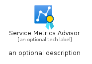
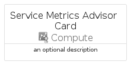
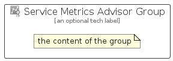

# ServiceMetricsAdvisor


```text
azure-19/Item/Compute/ServiceMetricsAdvisor
```

```text
include('azure-19/Item/Compute/ServiceMetricsAdvisor')
```


| Illustration | ServiceMetricsAdvisor | ServiceMetricsAdvisorCard | ServiceMetricsAdvisorGroup |
| :---: | :---: | :---: | :---: |
|  |  |  |  |


## Sprites
The item provides the following sriptes:

- `<$ServiceMetricsAdvisorXs>`
- `<$ServiceMetricsAdvisorSm>`
- `<$ServiceMetricsAdvisorMd>`
- `<$ServiceMetricsAdvisorLg>`


## ServiceMetricsAdvisor

### Load remotely
```plantuml
@startuml
' configures the library
!global $LIB_BASE_LOCATION="https://raw.githubusercontent.com/tmorin/plantuml-libs/master/distribution"

' loads the library's bootstrap
!include $LIB_BASE_LOCATION/bootstrap.puml

' loads the package bootstrap
include('azure-19/bootstrap')

' loads the Item which embeds the element ServiceMetricsAdvisor
include('azure-19/Item/Compute/ServiceMetricsAdvisor')

' renders the element
ServiceMetricsAdvisor('ServiceMetricsAdvisor', 'Service Metrics Advisor', 'an optional tech label', 'an optional description')
@enduml
```

### Load locally
```plantuml
@startuml
' configures the library
!global $INCLUSION_MODE="local"
!global $LIB_BASE_LOCATION="../../.."

' loads the library's bootstrap
!include $LIB_BASE_LOCATION/bootstrap.puml

' loads the package bootstrap
include('azure-19/bootstrap')

' loads the Item which embeds the element ServiceMetricsAdvisor
include('azure-19/Item/Compute/ServiceMetricsAdvisor')

' renders the element
ServiceMetricsAdvisor('ServiceMetricsAdvisor', 'Service Metrics Advisor', 'an optional tech label', 'an optional description')
@enduml
```

## ServiceMetricsAdvisorCard

### Load remotely
```plantuml
@startuml
' configures the library
!global $LIB_BASE_LOCATION="https://raw.githubusercontent.com/tmorin/plantuml-libs/master/distribution"

' loads the library's bootstrap
!include $LIB_BASE_LOCATION/bootstrap.puml

' loads the package bootstrap
include('azure-19/bootstrap')

' loads the Item which embeds the element ServiceMetricsAdvisorCard
include('azure-19/Item/Compute/ServiceMetricsAdvisor')

' renders the element
ServiceMetricsAdvisorCard('ServiceMetricsAdvisorCard', 'Service Metrics Advisor Card', 'an optional description')
@enduml
```

### Load locally
```plantuml
@startuml
' configures the library
!global $INCLUSION_MODE="local"
!global $LIB_BASE_LOCATION="../../.."

' loads the library's bootstrap
!include $LIB_BASE_LOCATION/bootstrap.puml

' loads the package bootstrap
include('azure-19/bootstrap')

' loads the Item which embeds the element ServiceMetricsAdvisorCard
include('azure-19/Item/Compute/ServiceMetricsAdvisor')

' renders the element
ServiceMetricsAdvisorCard('ServiceMetricsAdvisorCard', 'Service Metrics Advisor Card', 'an optional description')
@enduml
```

## ServiceMetricsAdvisorGroup

### Load remotely
```plantuml
@startuml
' configures the library
!global $LIB_BASE_LOCATION="https://raw.githubusercontent.com/tmorin/plantuml-libs/master/distribution"

' loads the library's bootstrap
!include $LIB_BASE_LOCATION/bootstrap.puml

' loads the package bootstrap
include('azure-19/bootstrap')

' loads the Item which embeds the element ServiceMetricsAdvisorGroup
include('azure-19/Item/Compute/ServiceMetricsAdvisor')

' renders the element
ServiceMetricsAdvisorGroup('ServiceMetricsAdvisorGroup', 'Service Metrics Advisor Group', 'an optional tech label') {
    note as note
        the content of the group
    end note
}
@enduml
```

### Load locally
```plantuml
@startuml
' configures the library
!global $INCLUSION_MODE="local"
!global $LIB_BASE_LOCATION="../../.."

' loads the library's bootstrap
!include $LIB_BASE_LOCATION/bootstrap.puml

' loads the package bootstrap
include('azure-19/bootstrap')

' loads the Item which embeds the element ServiceMetricsAdvisorGroup
include('azure-19/Item/Compute/ServiceMetricsAdvisor')

' renders the element
ServiceMetricsAdvisorGroup('ServiceMetricsAdvisorGroup', 'Service Metrics Advisor Group', 'an optional tech label') {
    note as note
        the content of the group
    end note
}
@enduml
```

