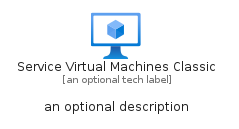

# ServiceVirtualMachinesClassic


```text
azure-19/Item/Compute/ServiceVirtualMachinesClassic
```

```text
include('azure-19/Item/Compute/ServiceVirtualMachinesClassic')
```


| Illustration | ServiceVirtualMachinesClassic | ServiceVirtualMachinesClassicCard | ServiceVirtualMachinesClassicGroup |
| :---: | :---: | :---: | :---: |
|  |  |  |  |


## Sprites
The item provides the following sriptes:

- `<$ServiceVirtualMachinesClassicXs>`
- `<$ServiceVirtualMachinesClassicSm>`
- `<$ServiceVirtualMachinesClassicMd>`
- `<$ServiceVirtualMachinesClassicLg>`


## ServiceVirtualMachinesClassic

### Load remotely
```plantuml
@startuml
' configures the library
!global $LIB_BASE_LOCATION="https://raw.githubusercontent.com/tmorin/plantuml-libs/master/distribution"

' loads the library's bootstrap
!include $LIB_BASE_LOCATION/bootstrap.puml

' loads the package bootstrap
include('azure-19/bootstrap')

' loads the Item which embeds the element ServiceVirtualMachinesClassic
include('azure-19/Item/Compute/ServiceVirtualMachinesClassic')

' renders the element
ServiceVirtualMachinesClassic('ServiceVirtualMachinesClassic', 'Service Virtual Machines Classic', 'an optional tech label', 'an optional description')
@enduml
```

### Load locally
```plantuml
@startuml
' configures the library
!global $INCLUSION_MODE="local"
!global $LIB_BASE_LOCATION="../../.."

' loads the library's bootstrap
!include $LIB_BASE_LOCATION/bootstrap.puml

' loads the package bootstrap
include('azure-19/bootstrap')

' loads the Item which embeds the element ServiceVirtualMachinesClassic
include('azure-19/Item/Compute/ServiceVirtualMachinesClassic')

' renders the element
ServiceVirtualMachinesClassic('ServiceVirtualMachinesClassic', 'Service Virtual Machines Classic', 'an optional tech label', 'an optional description')
@enduml
```

## ServiceVirtualMachinesClassicCard

### Load remotely
```plantuml
@startuml
' configures the library
!global $LIB_BASE_LOCATION="https://raw.githubusercontent.com/tmorin/plantuml-libs/master/distribution"

' loads the library's bootstrap
!include $LIB_BASE_LOCATION/bootstrap.puml

' loads the package bootstrap
include('azure-19/bootstrap')

' loads the Item which embeds the element ServiceVirtualMachinesClassicCard
include('azure-19/Item/Compute/ServiceVirtualMachinesClassic')

' renders the element
ServiceVirtualMachinesClassicCard('ServiceVirtualMachinesClassicCard', 'Service Virtual Machines Classic Card', 'an optional description')
@enduml
```

### Load locally
```plantuml
@startuml
' configures the library
!global $INCLUSION_MODE="local"
!global $LIB_BASE_LOCATION="../../.."

' loads the library's bootstrap
!include $LIB_BASE_LOCATION/bootstrap.puml

' loads the package bootstrap
include('azure-19/bootstrap')

' loads the Item which embeds the element ServiceVirtualMachinesClassicCard
include('azure-19/Item/Compute/ServiceVirtualMachinesClassic')

' renders the element
ServiceVirtualMachinesClassicCard('ServiceVirtualMachinesClassicCard', 'Service Virtual Machines Classic Card', 'an optional description')
@enduml
```

## ServiceVirtualMachinesClassicGroup

### Load remotely
```plantuml
@startuml
' configures the library
!global $LIB_BASE_LOCATION="https://raw.githubusercontent.com/tmorin/plantuml-libs/master/distribution"

' loads the library's bootstrap
!include $LIB_BASE_LOCATION/bootstrap.puml

' loads the package bootstrap
include('azure-19/bootstrap')

' loads the Item which embeds the element ServiceVirtualMachinesClassicGroup
include('azure-19/Item/Compute/ServiceVirtualMachinesClassic')

' renders the element
ServiceVirtualMachinesClassicGroup('ServiceVirtualMachinesClassicGroup', 'Service Virtual Machines Classic Group', 'an optional tech label') {
    note as note
        the content of the group
    end note
}
@enduml
```

### Load locally
```plantuml
@startuml
' configures the library
!global $INCLUSION_MODE="local"
!global $LIB_BASE_LOCATION="../../.."

' loads the library's bootstrap
!include $LIB_BASE_LOCATION/bootstrap.puml

' loads the package bootstrap
include('azure-19/bootstrap')

' loads the Item which embeds the element ServiceVirtualMachinesClassicGroup
include('azure-19/Item/Compute/ServiceVirtualMachinesClassic')

' renders the element
ServiceVirtualMachinesClassicGroup('ServiceVirtualMachinesClassicGroup', 'Service Virtual Machines Classic Group', 'an optional tech label') {
    note as note
        the content of the group
    end note
}
@enduml
```

