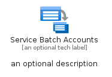
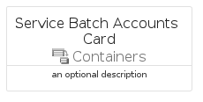

# ServiceBatchAccounts


```text
azure-19/Item/Containers/ServiceBatchAccounts
```

```text
include('azure-19/Item/Containers/ServiceBatchAccounts')
```


| Illustration | ServiceBatchAccounts | ServiceBatchAccountsCard | ServiceBatchAccountsGroup |
| :---: | :---: | :---: | :---: |
|  |  |  |  |


## Sprites
The item provides the following sriptes:

- `<$ServiceBatchAccountsXs>`
- `<$ServiceBatchAccountsSm>`
- `<$ServiceBatchAccountsMd>`
- `<$ServiceBatchAccountsLg>`


## ServiceBatchAccounts

### Load remotely
```plantuml
@startuml
' configures the library
!global $LIB_BASE_LOCATION="https://raw.githubusercontent.com/tmorin/plantuml-libs/master/distribution"

' loads the library's bootstrap
!include $LIB_BASE_LOCATION/bootstrap.puml

' loads the package bootstrap
include('azure-19/bootstrap')

' loads the Item which embeds the element ServiceBatchAccounts
include('azure-19/Item/Containers/ServiceBatchAccounts')

' renders the element
ServiceBatchAccounts('ServiceBatchAccounts', 'Service Batch Accounts', 'an optional tech label', 'an optional description')
@enduml
```

### Load locally
```plantuml
@startuml
' configures the library
!global $INCLUSION_MODE="local"
!global $LIB_BASE_LOCATION="../../.."

' loads the library's bootstrap
!include $LIB_BASE_LOCATION/bootstrap.puml

' loads the package bootstrap
include('azure-19/bootstrap')

' loads the Item which embeds the element ServiceBatchAccounts
include('azure-19/Item/Containers/ServiceBatchAccounts')

' renders the element
ServiceBatchAccounts('ServiceBatchAccounts', 'Service Batch Accounts', 'an optional tech label', 'an optional description')
@enduml
```

## ServiceBatchAccountsCard

### Load remotely
```plantuml
@startuml
' configures the library
!global $LIB_BASE_LOCATION="https://raw.githubusercontent.com/tmorin/plantuml-libs/master/distribution"

' loads the library's bootstrap
!include $LIB_BASE_LOCATION/bootstrap.puml

' loads the package bootstrap
include('azure-19/bootstrap')

' loads the Item which embeds the element ServiceBatchAccountsCard
include('azure-19/Item/Containers/ServiceBatchAccounts')

' renders the element
ServiceBatchAccountsCard('ServiceBatchAccountsCard', 'Service Batch Accounts Card', 'an optional description')
@enduml
```

### Load locally
```plantuml
@startuml
' configures the library
!global $INCLUSION_MODE="local"
!global $LIB_BASE_LOCATION="../../.."

' loads the library's bootstrap
!include $LIB_BASE_LOCATION/bootstrap.puml

' loads the package bootstrap
include('azure-19/bootstrap')

' loads the Item which embeds the element ServiceBatchAccountsCard
include('azure-19/Item/Containers/ServiceBatchAccounts')

' renders the element
ServiceBatchAccountsCard('ServiceBatchAccountsCard', 'Service Batch Accounts Card', 'an optional description')
@enduml
```

## ServiceBatchAccountsGroup

### Load remotely
```plantuml
@startuml
' configures the library
!global $LIB_BASE_LOCATION="https://raw.githubusercontent.com/tmorin/plantuml-libs/master/distribution"

' loads the library's bootstrap
!include $LIB_BASE_LOCATION/bootstrap.puml

' loads the package bootstrap
include('azure-19/bootstrap')

' loads the Item which embeds the element ServiceBatchAccountsGroup
include('azure-19/Item/Containers/ServiceBatchAccounts')

' renders the element
ServiceBatchAccountsGroup('ServiceBatchAccountsGroup', 'Service Batch Accounts Group', 'an optional tech label') {
    note as note
        the content of the group
    end note
}
@enduml
```

### Load locally
```plantuml
@startuml
' configures the library
!global $INCLUSION_MODE="local"
!global $LIB_BASE_LOCATION="../../.."

' loads the library's bootstrap
!include $LIB_BASE_LOCATION/bootstrap.puml

' loads the package bootstrap
include('azure-19/bootstrap')

' loads the Item which embeds the element ServiceBatchAccountsGroup
include('azure-19/Item/Containers/ServiceBatchAccounts')

' renders the element
ServiceBatchAccountsGroup('ServiceBatchAccountsGroup', 'Service Batch Accounts Group', 'an optional tech label') {
    note as note
        the content of the group
    end note
}
@enduml
```

