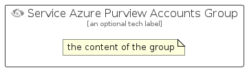

# ServiceAzurePurviewAccounts


```text
azure-19/Item/Databases/ServiceAzurePurviewAccounts
```

```text
include('azure-19/Item/Databases/ServiceAzurePurviewAccounts')
```


| Illustration | ServiceAzurePurviewAccounts | ServiceAzurePurviewAccountsCard | ServiceAzurePurviewAccountsGroup |
| :---: | :---: | :---: | :---: |
|  |  |  |  |


## Sprites
The item provides the following sriptes:

- `<$ServiceAzurePurviewAccountsXs>`
- `<$ServiceAzurePurviewAccountsSm>`
- `<$ServiceAzurePurviewAccountsMd>`
- `<$ServiceAzurePurviewAccountsLg>`


## ServiceAzurePurviewAccounts

### Load remotely
```plantuml
@startuml
' configures the library
!global $LIB_BASE_LOCATION="https://raw.githubusercontent.com/tmorin/plantuml-libs/master/distribution"

' loads the library's bootstrap
!include $LIB_BASE_LOCATION/bootstrap.puml

' loads the package bootstrap
include('azure-19/bootstrap')

' loads the Item which embeds the element ServiceAzurePurviewAccounts
include('azure-19/Item/Databases/ServiceAzurePurviewAccounts')

' renders the element
ServiceAzurePurviewAccounts('ServiceAzurePurviewAccounts', 'Service Azure Purview Accounts', 'an optional tech label', 'an optional description')
@enduml
```

### Load locally
```plantuml
@startuml
' configures the library
!global $INCLUSION_MODE="local"
!global $LIB_BASE_LOCATION="../../.."

' loads the library's bootstrap
!include $LIB_BASE_LOCATION/bootstrap.puml

' loads the package bootstrap
include('azure-19/bootstrap')

' loads the Item which embeds the element ServiceAzurePurviewAccounts
include('azure-19/Item/Databases/ServiceAzurePurviewAccounts')

' renders the element
ServiceAzurePurviewAccounts('ServiceAzurePurviewAccounts', 'Service Azure Purview Accounts', 'an optional tech label', 'an optional description')
@enduml
```

## ServiceAzurePurviewAccountsCard

### Load remotely
```plantuml
@startuml
' configures the library
!global $LIB_BASE_LOCATION="https://raw.githubusercontent.com/tmorin/plantuml-libs/master/distribution"

' loads the library's bootstrap
!include $LIB_BASE_LOCATION/bootstrap.puml

' loads the package bootstrap
include('azure-19/bootstrap')

' loads the Item which embeds the element ServiceAzurePurviewAccountsCard
include('azure-19/Item/Databases/ServiceAzurePurviewAccounts')

' renders the element
ServiceAzurePurviewAccountsCard('ServiceAzurePurviewAccountsCard', 'Service Azure Purview Accounts Card', 'an optional description')
@enduml
```

### Load locally
```plantuml
@startuml
' configures the library
!global $INCLUSION_MODE="local"
!global $LIB_BASE_LOCATION="../../.."

' loads the library's bootstrap
!include $LIB_BASE_LOCATION/bootstrap.puml

' loads the package bootstrap
include('azure-19/bootstrap')

' loads the Item which embeds the element ServiceAzurePurviewAccountsCard
include('azure-19/Item/Databases/ServiceAzurePurviewAccounts')

' renders the element
ServiceAzurePurviewAccountsCard('ServiceAzurePurviewAccountsCard', 'Service Azure Purview Accounts Card', 'an optional description')
@enduml
```

## ServiceAzurePurviewAccountsGroup

### Load remotely
```plantuml
@startuml
' configures the library
!global $LIB_BASE_LOCATION="https://raw.githubusercontent.com/tmorin/plantuml-libs/master/distribution"

' loads the library's bootstrap
!include $LIB_BASE_LOCATION/bootstrap.puml

' loads the package bootstrap
include('azure-19/bootstrap')

' loads the Item which embeds the element ServiceAzurePurviewAccountsGroup
include('azure-19/Item/Databases/ServiceAzurePurviewAccounts')

' renders the element
ServiceAzurePurviewAccountsGroup('ServiceAzurePurviewAccountsGroup', 'Service Azure Purview Accounts Group', 'an optional tech label') {
    note as note
        the content of the group
    end note
}
@enduml
```

### Load locally
```plantuml
@startuml
' configures the library
!global $INCLUSION_MODE="local"
!global $LIB_BASE_LOCATION="../../.."

' loads the library's bootstrap
!include $LIB_BASE_LOCATION/bootstrap.puml

' loads the package bootstrap
include('azure-19/bootstrap')

' loads the Item which embeds the element ServiceAzurePurviewAccountsGroup
include('azure-19/Item/Databases/ServiceAzurePurviewAccounts')

' renders the element
ServiceAzurePurviewAccountsGroup('ServiceAzurePurviewAccountsGroup', 'Service Azure Purview Accounts Group', 'an optional tech label') {
    note as note
        the content of the group
    end note
}
@enduml
```

