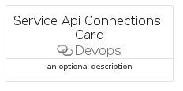

# ServiceApiConnections


```text
azure-19/Item/Devops/ServiceApiConnections
```

```text
include('azure-19/Item/Devops/ServiceApiConnections')
```


| Illustration | ServiceApiConnections | ServiceApiConnectionsCard | ServiceApiConnectionsGroup |
| :---: | :---: | :---: | :---: |
|  |  |  |  |


## Sprites
The item provides the following sriptes:

- `<$ServiceApiConnectionsXs>`
- `<$ServiceApiConnectionsSm>`
- `<$ServiceApiConnectionsMd>`
- `<$ServiceApiConnectionsLg>`


## ServiceApiConnections

### Load remotely
```plantuml
@startuml
' configures the library
!global $LIB_BASE_LOCATION="https://raw.githubusercontent.com/tmorin/plantuml-libs/master/distribution"

' loads the library's bootstrap
!include $LIB_BASE_LOCATION/bootstrap.puml

' loads the package bootstrap
include('azure-19/bootstrap')

' loads the Item which embeds the element ServiceApiConnections
include('azure-19/Item/Devops/ServiceApiConnections')

' renders the element
ServiceApiConnections('ServiceApiConnections', 'Service Api Connections', 'an optional tech label', 'an optional description')
@enduml
```

### Load locally
```plantuml
@startuml
' configures the library
!global $INCLUSION_MODE="local"
!global $LIB_BASE_LOCATION="../../.."

' loads the library's bootstrap
!include $LIB_BASE_LOCATION/bootstrap.puml

' loads the package bootstrap
include('azure-19/bootstrap')

' loads the Item which embeds the element ServiceApiConnections
include('azure-19/Item/Devops/ServiceApiConnections')

' renders the element
ServiceApiConnections('ServiceApiConnections', 'Service Api Connections', 'an optional tech label', 'an optional description')
@enduml
```

## ServiceApiConnectionsCard

### Load remotely
```plantuml
@startuml
' configures the library
!global $LIB_BASE_LOCATION="https://raw.githubusercontent.com/tmorin/plantuml-libs/master/distribution"

' loads the library's bootstrap
!include $LIB_BASE_LOCATION/bootstrap.puml

' loads the package bootstrap
include('azure-19/bootstrap')

' loads the Item which embeds the element ServiceApiConnectionsCard
include('azure-19/Item/Devops/ServiceApiConnections')

' renders the element
ServiceApiConnectionsCard('ServiceApiConnectionsCard', 'Service Api Connections Card', 'an optional description')
@enduml
```

### Load locally
```plantuml
@startuml
' configures the library
!global $INCLUSION_MODE="local"
!global $LIB_BASE_LOCATION="../../.."

' loads the library's bootstrap
!include $LIB_BASE_LOCATION/bootstrap.puml

' loads the package bootstrap
include('azure-19/bootstrap')

' loads the Item which embeds the element ServiceApiConnectionsCard
include('azure-19/Item/Devops/ServiceApiConnections')

' renders the element
ServiceApiConnectionsCard('ServiceApiConnectionsCard', 'Service Api Connections Card', 'an optional description')
@enduml
```

## ServiceApiConnectionsGroup

### Load remotely
```plantuml
@startuml
' configures the library
!global $LIB_BASE_LOCATION="https://raw.githubusercontent.com/tmorin/plantuml-libs/master/distribution"

' loads the library's bootstrap
!include $LIB_BASE_LOCATION/bootstrap.puml

' loads the package bootstrap
include('azure-19/bootstrap')

' loads the Item which embeds the element ServiceApiConnectionsGroup
include('azure-19/Item/Devops/ServiceApiConnections')

' renders the element
ServiceApiConnectionsGroup('ServiceApiConnectionsGroup', 'Service Api Connections Group', 'an optional tech label') {
    note as note
        the content of the group
    end note
}
@enduml
```

### Load locally
```plantuml
@startuml
' configures the library
!global $INCLUSION_MODE="local"
!global $LIB_BASE_LOCATION="../../.."

' loads the library's bootstrap
!include $LIB_BASE_LOCATION/bootstrap.puml

' loads the package bootstrap
include('azure-19/bootstrap')

' loads the Item which embeds the element ServiceApiConnectionsGroup
include('azure-19/Item/Devops/ServiceApiConnections')

' renders the element
ServiceApiConnectionsGroup('ServiceApiConnectionsGroup', 'Service Api Connections Group', 'an optional tech label') {
    note as note
        the content of the group
    end note
}
@enduml
```

