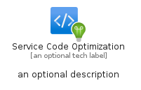
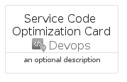

# ServiceCodeOptimization


```text
azure-19/Item/Devops/ServiceCodeOptimization
```

```text
include('azure-19/Item/Devops/ServiceCodeOptimization')
```


| Illustration | ServiceCodeOptimization | ServiceCodeOptimizationCard | ServiceCodeOptimizationGroup |
| :---: | :---: | :---: | :---: |
|  |  |  |  |


## Sprites
The item provides the following sriptes:

- `<$ServiceCodeOptimizationXs>`
- `<$ServiceCodeOptimizationSm>`
- `<$ServiceCodeOptimizationMd>`
- `<$ServiceCodeOptimizationLg>`


## ServiceCodeOptimization

### Load remotely
```plantuml
@startuml
' configures the library
!global $LIB_BASE_LOCATION="https://raw.githubusercontent.com/tmorin/plantuml-libs/master/distribution"

' loads the library's bootstrap
!include $LIB_BASE_LOCATION/bootstrap.puml

' loads the package bootstrap
include('azure-19/bootstrap')

' loads the Item which embeds the element ServiceCodeOptimization
include('azure-19/Item/Devops/ServiceCodeOptimization')

' renders the element
ServiceCodeOptimization('ServiceCodeOptimization', 'Service Code Optimization', 'an optional tech label', 'an optional description')
@enduml
```

### Load locally
```plantuml
@startuml
' configures the library
!global $INCLUSION_MODE="local"
!global $LIB_BASE_LOCATION="../../.."

' loads the library's bootstrap
!include $LIB_BASE_LOCATION/bootstrap.puml

' loads the package bootstrap
include('azure-19/bootstrap')

' loads the Item which embeds the element ServiceCodeOptimization
include('azure-19/Item/Devops/ServiceCodeOptimization')

' renders the element
ServiceCodeOptimization('ServiceCodeOptimization', 'Service Code Optimization', 'an optional tech label', 'an optional description')
@enduml
```

## ServiceCodeOptimizationCard

### Load remotely
```plantuml
@startuml
' configures the library
!global $LIB_BASE_LOCATION="https://raw.githubusercontent.com/tmorin/plantuml-libs/master/distribution"

' loads the library's bootstrap
!include $LIB_BASE_LOCATION/bootstrap.puml

' loads the package bootstrap
include('azure-19/bootstrap')

' loads the Item which embeds the element ServiceCodeOptimizationCard
include('azure-19/Item/Devops/ServiceCodeOptimization')

' renders the element
ServiceCodeOptimizationCard('ServiceCodeOptimizationCard', 'Service Code Optimization Card', 'an optional description')
@enduml
```

### Load locally
```plantuml
@startuml
' configures the library
!global $INCLUSION_MODE="local"
!global $LIB_BASE_LOCATION="../../.."

' loads the library's bootstrap
!include $LIB_BASE_LOCATION/bootstrap.puml

' loads the package bootstrap
include('azure-19/bootstrap')

' loads the Item which embeds the element ServiceCodeOptimizationCard
include('azure-19/Item/Devops/ServiceCodeOptimization')

' renders the element
ServiceCodeOptimizationCard('ServiceCodeOptimizationCard', 'Service Code Optimization Card', 'an optional description')
@enduml
```

## ServiceCodeOptimizationGroup

### Load remotely
```plantuml
@startuml
' configures the library
!global $LIB_BASE_LOCATION="https://raw.githubusercontent.com/tmorin/plantuml-libs/master/distribution"

' loads the library's bootstrap
!include $LIB_BASE_LOCATION/bootstrap.puml

' loads the package bootstrap
include('azure-19/bootstrap')

' loads the Item which embeds the element ServiceCodeOptimizationGroup
include('azure-19/Item/Devops/ServiceCodeOptimization')

' renders the element
ServiceCodeOptimizationGroup('ServiceCodeOptimizationGroup', 'Service Code Optimization Group', 'an optional tech label') {
    note as note
        the content of the group
    end note
}
@enduml
```

### Load locally
```plantuml
@startuml
' configures the library
!global $INCLUSION_MODE="local"
!global $LIB_BASE_LOCATION="../../.."

' loads the library's bootstrap
!include $LIB_BASE_LOCATION/bootstrap.puml

' loads the package bootstrap
include('azure-19/bootstrap')

' loads the Item which embeds the element ServiceCodeOptimizationGroup
include('azure-19/Item/Devops/ServiceCodeOptimization')

' renders the element
ServiceCodeOptimizationGroup('ServiceCodeOptimizationGroup', 'Service Code Optimization Group', 'an optional tech label') {
    note as note
        the content of the group
    end note
}
@enduml
```

