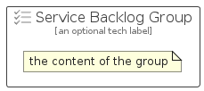

# ServiceBacklog


```text
azure-19/Item/General/ServiceBacklog
```

```text
include('azure-19/Item/General/ServiceBacklog')
```


| Illustration | ServiceBacklog | ServiceBacklogCard | ServiceBacklogGroup |
| :---: | :---: | :---: | :---: |
|  |  |  |  |


## Sprites
The item provides the following sriptes:

- `<$ServiceBacklogXs>`
- `<$ServiceBacklogSm>`
- `<$ServiceBacklogMd>`
- `<$ServiceBacklogLg>`


## ServiceBacklog

### Load remotely
```plantuml
@startuml
' configures the library
!global $LIB_BASE_LOCATION="https://raw.githubusercontent.com/tmorin/plantuml-libs/master/distribution"

' loads the library's bootstrap
!include $LIB_BASE_LOCATION/bootstrap.puml

' loads the package bootstrap
include('azure-19/bootstrap')

' loads the Item which embeds the element ServiceBacklog
include('azure-19/Item/General/ServiceBacklog')

' renders the element
ServiceBacklog('ServiceBacklog', 'Service Backlog', 'an optional tech label', 'an optional description')
@enduml
```

### Load locally
```plantuml
@startuml
' configures the library
!global $INCLUSION_MODE="local"
!global $LIB_BASE_LOCATION="../../.."

' loads the library's bootstrap
!include $LIB_BASE_LOCATION/bootstrap.puml

' loads the package bootstrap
include('azure-19/bootstrap')

' loads the Item which embeds the element ServiceBacklog
include('azure-19/Item/General/ServiceBacklog')

' renders the element
ServiceBacklog('ServiceBacklog', 'Service Backlog', 'an optional tech label', 'an optional description')
@enduml
```

## ServiceBacklogCard

### Load remotely
```plantuml
@startuml
' configures the library
!global $LIB_BASE_LOCATION="https://raw.githubusercontent.com/tmorin/plantuml-libs/master/distribution"

' loads the library's bootstrap
!include $LIB_BASE_LOCATION/bootstrap.puml

' loads the package bootstrap
include('azure-19/bootstrap')

' loads the Item which embeds the element ServiceBacklogCard
include('azure-19/Item/General/ServiceBacklog')

' renders the element
ServiceBacklogCard('ServiceBacklogCard', 'Service Backlog Card', 'an optional description')
@enduml
```

### Load locally
```plantuml
@startuml
' configures the library
!global $INCLUSION_MODE="local"
!global $LIB_BASE_LOCATION="../../.."

' loads the library's bootstrap
!include $LIB_BASE_LOCATION/bootstrap.puml

' loads the package bootstrap
include('azure-19/bootstrap')

' loads the Item which embeds the element ServiceBacklogCard
include('azure-19/Item/General/ServiceBacklog')

' renders the element
ServiceBacklogCard('ServiceBacklogCard', 'Service Backlog Card', 'an optional description')
@enduml
```

## ServiceBacklogGroup

### Load remotely
```plantuml
@startuml
' configures the library
!global $LIB_BASE_LOCATION="https://raw.githubusercontent.com/tmorin/plantuml-libs/master/distribution"

' loads the library's bootstrap
!include $LIB_BASE_LOCATION/bootstrap.puml

' loads the package bootstrap
include('azure-19/bootstrap')

' loads the Item which embeds the element ServiceBacklogGroup
include('azure-19/Item/General/ServiceBacklog')

' renders the element
ServiceBacklogGroup('ServiceBacklogGroup', 'Service Backlog Group', 'an optional tech label') {
    note as note
        the content of the group
    end note
}
@enduml
```

### Load locally
```plantuml
@startuml
' configures the library
!global $INCLUSION_MODE="local"
!global $LIB_BASE_LOCATION="../../.."

' loads the library's bootstrap
!include $LIB_BASE_LOCATION/bootstrap.puml

' loads the package bootstrap
include('azure-19/bootstrap')

' loads the Item which embeds the element ServiceBacklogGroup
include('azure-19/Item/General/ServiceBacklog')

' renders the element
ServiceBacklogGroup('ServiceBacklogGroup', 'Service Backlog Group', 'an optional tech label') {
    note as note
        the content of the group
    end note
}
@enduml
```

