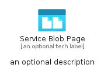
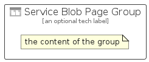

# ServiceBlobPage


```text
azure-19/Item/General/ServiceBlobPage
```

```text
include('azure-19/Item/General/ServiceBlobPage')
```


| Illustration | ServiceBlobPage | ServiceBlobPageCard | ServiceBlobPageGroup |
| :---: | :---: | :---: | :---: |
|  |  |  |  |


## Sprites
The item provides the following sriptes:

- `<$ServiceBlobPageXs>`
- `<$ServiceBlobPageSm>`
- `<$ServiceBlobPageMd>`
- `<$ServiceBlobPageLg>`


## ServiceBlobPage

### Load remotely
```plantuml
@startuml
' configures the library
!global $LIB_BASE_LOCATION="https://raw.githubusercontent.com/tmorin/plantuml-libs/master/distribution"

' loads the library's bootstrap
!include $LIB_BASE_LOCATION/bootstrap.puml

' loads the package bootstrap
include('azure-19/bootstrap')

' loads the Item which embeds the element ServiceBlobPage
include('azure-19/Item/General/ServiceBlobPage')

' renders the element
ServiceBlobPage('ServiceBlobPage', 'Service Blob Page', 'an optional tech label', 'an optional description')
@enduml
```

### Load locally
```plantuml
@startuml
' configures the library
!global $INCLUSION_MODE="local"
!global $LIB_BASE_LOCATION="../../.."

' loads the library's bootstrap
!include $LIB_BASE_LOCATION/bootstrap.puml

' loads the package bootstrap
include('azure-19/bootstrap')

' loads the Item which embeds the element ServiceBlobPage
include('azure-19/Item/General/ServiceBlobPage')

' renders the element
ServiceBlobPage('ServiceBlobPage', 'Service Blob Page', 'an optional tech label', 'an optional description')
@enduml
```

## ServiceBlobPageCard

### Load remotely
```plantuml
@startuml
' configures the library
!global $LIB_BASE_LOCATION="https://raw.githubusercontent.com/tmorin/plantuml-libs/master/distribution"

' loads the library's bootstrap
!include $LIB_BASE_LOCATION/bootstrap.puml

' loads the package bootstrap
include('azure-19/bootstrap')

' loads the Item which embeds the element ServiceBlobPageCard
include('azure-19/Item/General/ServiceBlobPage')

' renders the element
ServiceBlobPageCard('ServiceBlobPageCard', 'Service Blob Page Card', 'an optional description')
@enduml
```

### Load locally
```plantuml
@startuml
' configures the library
!global $INCLUSION_MODE="local"
!global $LIB_BASE_LOCATION="../../.."

' loads the library's bootstrap
!include $LIB_BASE_LOCATION/bootstrap.puml

' loads the package bootstrap
include('azure-19/bootstrap')

' loads the Item which embeds the element ServiceBlobPageCard
include('azure-19/Item/General/ServiceBlobPage')

' renders the element
ServiceBlobPageCard('ServiceBlobPageCard', 'Service Blob Page Card', 'an optional description')
@enduml
```

## ServiceBlobPageGroup

### Load remotely
```plantuml
@startuml
' configures the library
!global $LIB_BASE_LOCATION="https://raw.githubusercontent.com/tmorin/plantuml-libs/master/distribution"

' loads the library's bootstrap
!include $LIB_BASE_LOCATION/bootstrap.puml

' loads the package bootstrap
include('azure-19/bootstrap')

' loads the Item which embeds the element ServiceBlobPageGroup
include('azure-19/Item/General/ServiceBlobPage')

' renders the element
ServiceBlobPageGroup('ServiceBlobPageGroup', 'Service Blob Page Group', 'an optional tech label') {
    note as note
        the content of the group
    end note
}
@enduml
```

### Load locally
```plantuml
@startuml
' configures the library
!global $INCLUSION_MODE="local"
!global $LIB_BASE_LOCATION="../../.."

' loads the library's bootstrap
!include $LIB_BASE_LOCATION/bootstrap.puml

' loads the package bootstrap
include('azure-19/bootstrap')

' loads the Item which embeds the element ServiceBlobPageGroup
include('azure-19/Item/General/ServiceBlobPage')

' renders the element
ServiceBlobPageGroup('ServiceBlobPageGroup', 'Service Blob Page Group', 'an optional tech label') {
    note as note
        the content of the group
    end note
}
@enduml
```

