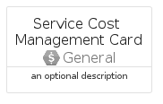

# ServiceCostManagement


```text
azure-19/Item/General/ServiceCostManagement
```

```text
include('azure-19/Item/General/ServiceCostManagement')
```


| Illustration | ServiceCostManagement | ServiceCostManagementCard | ServiceCostManagementGroup |
| :---: | :---: | :---: | :---: |
|  |  |  |  |


## Sprites
The item provides the following sriptes:

- `<$ServiceCostManagementXs>`
- `<$ServiceCostManagementSm>`
- `<$ServiceCostManagementMd>`
- `<$ServiceCostManagementLg>`


## ServiceCostManagement

### Load remotely
```plantuml
@startuml
' configures the library
!global $LIB_BASE_LOCATION="https://raw.githubusercontent.com/tmorin/plantuml-libs/master/distribution"

' loads the library's bootstrap
!include $LIB_BASE_LOCATION/bootstrap.puml

' loads the package bootstrap
include('azure-19/bootstrap')

' loads the Item which embeds the element ServiceCostManagement
include('azure-19/Item/General/ServiceCostManagement')

' renders the element
ServiceCostManagement('ServiceCostManagement', 'Service Cost Management', 'an optional tech label', 'an optional description')
@enduml
```

### Load locally
```plantuml
@startuml
' configures the library
!global $INCLUSION_MODE="local"
!global $LIB_BASE_LOCATION="../../.."

' loads the library's bootstrap
!include $LIB_BASE_LOCATION/bootstrap.puml

' loads the package bootstrap
include('azure-19/bootstrap')

' loads the Item which embeds the element ServiceCostManagement
include('azure-19/Item/General/ServiceCostManagement')

' renders the element
ServiceCostManagement('ServiceCostManagement', 'Service Cost Management', 'an optional tech label', 'an optional description')
@enduml
```

## ServiceCostManagementCard

### Load remotely
```plantuml
@startuml
' configures the library
!global $LIB_BASE_LOCATION="https://raw.githubusercontent.com/tmorin/plantuml-libs/master/distribution"

' loads the library's bootstrap
!include $LIB_BASE_LOCATION/bootstrap.puml

' loads the package bootstrap
include('azure-19/bootstrap')

' loads the Item which embeds the element ServiceCostManagementCard
include('azure-19/Item/General/ServiceCostManagement')

' renders the element
ServiceCostManagementCard('ServiceCostManagementCard', 'Service Cost Management Card', 'an optional description')
@enduml
```

### Load locally
```plantuml
@startuml
' configures the library
!global $INCLUSION_MODE="local"
!global $LIB_BASE_LOCATION="../../.."

' loads the library's bootstrap
!include $LIB_BASE_LOCATION/bootstrap.puml

' loads the package bootstrap
include('azure-19/bootstrap')

' loads the Item which embeds the element ServiceCostManagementCard
include('azure-19/Item/General/ServiceCostManagement')

' renders the element
ServiceCostManagementCard('ServiceCostManagementCard', 'Service Cost Management Card', 'an optional description')
@enduml
```

## ServiceCostManagementGroup

### Load remotely
```plantuml
@startuml
' configures the library
!global $LIB_BASE_LOCATION="https://raw.githubusercontent.com/tmorin/plantuml-libs/master/distribution"

' loads the library's bootstrap
!include $LIB_BASE_LOCATION/bootstrap.puml

' loads the package bootstrap
include('azure-19/bootstrap')

' loads the Item which embeds the element ServiceCostManagementGroup
include('azure-19/Item/General/ServiceCostManagement')

' renders the element
ServiceCostManagementGroup('ServiceCostManagementGroup', 'Service Cost Management Group', 'an optional tech label') {
    note as note
        the content of the group
    end note
}
@enduml
```

### Load locally
```plantuml
@startuml
' configures the library
!global $INCLUSION_MODE="local"
!global $LIB_BASE_LOCATION="../../.."

' loads the library's bootstrap
!include $LIB_BASE_LOCATION/bootstrap.puml

' loads the package bootstrap
include('azure-19/bootstrap')

' loads the Item which embeds the element ServiceCostManagementGroup
include('azure-19/Item/General/ServiceCostManagement')

' renders the element
ServiceCostManagementGroup('ServiceCostManagementGroup', 'Service Cost Management Group', 'an optional tech label') {
    note as note
        the content of the group
    end note
}
@enduml
```

