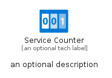
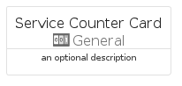
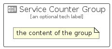

# ServiceCounter


```text
azure-19/Item/General/ServiceCounter
```

```text
include('azure-19/Item/General/ServiceCounter')
```


| Illustration | ServiceCounter | ServiceCounterCard | ServiceCounterGroup |
| :---: | :---: | :---: | :---: |
|  |  |  |  |


## Sprites
The item provides the following sriptes:

- `<$ServiceCounterXs>`
- `<$ServiceCounterSm>`
- `<$ServiceCounterMd>`
- `<$ServiceCounterLg>`


## ServiceCounter

### Load remotely
```plantuml
@startuml
' configures the library
!global $LIB_BASE_LOCATION="https://raw.githubusercontent.com/tmorin/plantuml-libs/master/distribution"

' loads the library's bootstrap
!include $LIB_BASE_LOCATION/bootstrap.puml

' loads the package bootstrap
include('azure-19/bootstrap')

' loads the Item which embeds the element ServiceCounter
include('azure-19/Item/General/ServiceCounter')

' renders the element
ServiceCounter('ServiceCounter', 'Service Counter', 'an optional tech label', 'an optional description')
@enduml
```

### Load locally
```plantuml
@startuml
' configures the library
!global $INCLUSION_MODE="local"
!global $LIB_BASE_LOCATION="../../.."

' loads the library's bootstrap
!include $LIB_BASE_LOCATION/bootstrap.puml

' loads the package bootstrap
include('azure-19/bootstrap')

' loads the Item which embeds the element ServiceCounter
include('azure-19/Item/General/ServiceCounter')

' renders the element
ServiceCounter('ServiceCounter', 'Service Counter', 'an optional tech label', 'an optional description')
@enduml
```

## ServiceCounterCard

### Load remotely
```plantuml
@startuml
' configures the library
!global $LIB_BASE_LOCATION="https://raw.githubusercontent.com/tmorin/plantuml-libs/master/distribution"

' loads the library's bootstrap
!include $LIB_BASE_LOCATION/bootstrap.puml

' loads the package bootstrap
include('azure-19/bootstrap')

' loads the Item which embeds the element ServiceCounterCard
include('azure-19/Item/General/ServiceCounter')

' renders the element
ServiceCounterCard('ServiceCounterCard', 'Service Counter Card', 'an optional description')
@enduml
```

### Load locally
```plantuml
@startuml
' configures the library
!global $INCLUSION_MODE="local"
!global $LIB_BASE_LOCATION="../../.."

' loads the library's bootstrap
!include $LIB_BASE_LOCATION/bootstrap.puml

' loads the package bootstrap
include('azure-19/bootstrap')

' loads the Item which embeds the element ServiceCounterCard
include('azure-19/Item/General/ServiceCounter')

' renders the element
ServiceCounterCard('ServiceCounterCard', 'Service Counter Card', 'an optional description')
@enduml
```

## ServiceCounterGroup

### Load remotely
```plantuml
@startuml
' configures the library
!global $LIB_BASE_LOCATION="https://raw.githubusercontent.com/tmorin/plantuml-libs/master/distribution"

' loads the library's bootstrap
!include $LIB_BASE_LOCATION/bootstrap.puml

' loads the package bootstrap
include('azure-19/bootstrap')

' loads the Item which embeds the element ServiceCounterGroup
include('azure-19/Item/General/ServiceCounter')

' renders the element
ServiceCounterGroup('ServiceCounterGroup', 'Service Counter Group', 'an optional tech label') {
    note as note
        the content of the group
    end note
}
@enduml
```

### Load locally
```plantuml
@startuml
' configures the library
!global $INCLUSION_MODE="local"
!global $LIB_BASE_LOCATION="../../.."

' loads the library's bootstrap
!include $LIB_BASE_LOCATION/bootstrap.puml

' loads the package bootstrap
include('azure-19/bootstrap')

' loads the Item which embeds the element ServiceCounterGroup
include('azure-19/Item/General/ServiceCounter')

' renders the element
ServiceCounterGroup('ServiceCounterGroup', 'Service Counter Group', 'an optional tech label') {
    note as note
        the content of the group
    end note
}
@enduml
```

