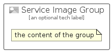

# ServiceImage


```text
azure-19/Item/General/ServiceImage
```

```text
include('azure-19/Item/General/ServiceImage')
```


| Illustration | ServiceImage | ServiceImageCard | ServiceImageGroup |
| :---: | :---: | :---: | :---: |
|  |  |  |  |


## Sprites
The item provides the following sriptes:

- `<$ServiceImageXs>`
- `<$ServiceImageSm>`
- `<$ServiceImageMd>`
- `<$ServiceImageLg>`


## ServiceImage

### Load remotely
```plantuml
@startuml
' configures the library
!global $LIB_BASE_LOCATION="https://raw.githubusercontent.com/tmorin/plantuml-libs/master/distribution"

' loads the library's bootstrap
!include $LIB_BASE_LOCATION/bootstrap.puml

' loads the package bootstrap
include('azure-19/bootstrap')

' loads the Item which embeds the element ServiceImage
include('azure-19/Item/General/ServiceImage')

' renders the element
ServiceImage('ServiceImage', 'Service Image', 'an optional tech label', 'an optional description')
@enduml
```

### Load locally
```plantuml
@startuml
' configures the library
!global $INCLUSION_MODE="local"
!global $LIB_BASE_LOCATION="../../.."

' loads the library's bootstrap
!include $LIB_BASE_LOCATION/bootstrap.puml

' loads the package bootstrap
include('azure-19/bootstrap')

' loads the Item which embeds the element ServiceImage
include('azure-19/Item/General/ServiceImage')

' renders the element
ServiceImage('ServiceImage', 'Service Image', 'an optional tech label', 'an optional description')
@enduml
```

## ServiceImageCard

### Load remotely
```plantuml
@startuml
' configures the library
!global $LIB_BASE_LOCATION="https://raw.githubusercontent.com/tmorin/plantuml-libs/master/distribution"

' loads the library's bootstrap
!include $LIB_BASE_LOCATION/bootstrap.puml

' loads the package bootstrap
include('azure-19/bootstrap')

' loads the Item which embeds the element ServiceImageCard
include('azure-19/Item/General/ServiceImage')

' renders the element
ServiceImageCard('ServiceImageCard', 'Service Image Card', 'an optional description')
@enduml
```

### Load locally
```plantuml
@startuml
' configures the library
!global $INCLUSION_MODE="local"
!global $LIB_BASE_LOCATION="../../.."

' loads the library's bootstrap
!include $LIB_BASE_LOCATION/bootstrap.puml

' loads the package bootstrap
include('azure-19/bootstrap')

' loads the Item which embeds the element ServiceImageCard
include('azure-19/Item/General/ServiceImage')

' renders the element
ServiceImageCard('ServiceImageCard', 'Service Image Card', 'an optional description')
@enduml
```

## ServiceImageGroup

### Load remotely
```plantuml
@startuml
' configures the library
!global $LIB_BASE_LOCATION="https://raw.githubusercontent.com/tmorin/plantuml-libs/master/distribution"

' loads the library's bootstrap
!include $LIB_BASE_LOCATION/bootstrap.puml

' loads the package bootstrap
include('azure-19/bootstrap')

' loads the Item which embeds the element ServiceImageGroup
include('azure-19/Item/General/ServiceImage')

' renders the element
ServiceImageGroup('ServiceImageGroup', 'Service Image Group', 'an optional tech label') {
    note as note
        the content of the group
    end note
}
@enduml
```

### Load locally
```plantuml
@startuml
' configures the library
!global $INCLUSION_MODE="local"
!global $LIB_BASE_LOCATION="../../.."

' loads the library's bootstrap
!include $LIB_BASE_LOCATION/bootstrap.puml

' loads the package bootstrap
include('azure-19/bootstrap')

' loads the Item which embeds the element ServiceImageGroup
include('azure-19/Item/General/ServiceImage')

' renders the element
ServiceImageGroup('ServiceImageGroup', 'Service Image Group', 'an optional tech label') {
    note as note
        the content of the group
    end note
}
@enduml
```

