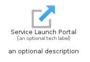
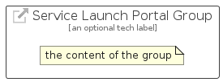

# ServiceLaunchPortal


```text
azure-19/Item/General/ServiceLaunchPortal
```

```text
include('azure-19/Item/General/ServiceLaunchPortal')
```


| Illustration | ServiceLaunchPortal | ServiceLaunchPortalCard | ServiceLaunchPortalGroup |
| :---: | :---: | :---: | :---: |
|  |  |  |  |


## Sprites
The item provides the following sriptes:

- `<$ServiceLaunchPortalXs>`
- `<$ServiceLaunchPortalSm>`
- `<$ServiceLaunchPortalMd>`
- `<$ServiceLaunchPortalLg>`


## ServiceLaunchPortal

### Load remotely
```plantuml
@startuml
' configures the library
!global $LIB_BASE_LOCATION="https://raw.githubusercontent.com/tmorin/plantuml-libs/master/distribution"

' loads the library's bootstrap
!include $LIB_BASE_LOCATION/bootstrap.puml

' loads the package bootstrap
include('azure-19/bootstrap')

' loads the Item which embeds the element ServiceLaunchPortal
include('azure-19/Item/General/ServiceLaunchPortal')

' renders the element
ServiceLaunchPortal('ServiceLaunchPortal', 'Service Launch Portal', 'an optional tech label', 'an optional description')
@enduml
```

### Load locally
```plantuml
@startuml
' configures the library
!global $INCLUSION_MODE="local"
!global $LIB_BASE_LOCATION="../../.."

' loads the library's bootstrap
!include $LIB_BASE_LOCATION/bootstrap.puml

' loads the package bootstrap
include('azure-19/bootstrap')

' loads the Item which embeds the element ServiceLaunchPortal
include('azure-19/Item/General/ServiceLaunchPortal')

' renders the element
ServiceLaunchPortal('ServiceLaunchPortal', 'Service Launch Portal', 'an optional tech label', 'an optional description')
@enduml
```

## ServiceLaunchPortalCard

### Load remotely
```plantuml
@startuml
' configures the library
!global $LIB_BASE_LOCATION="https://raw.githubusercontent.com/tmorin/plantuml-libs/master/distribution"

' loads the library's bootstrap
!include $LIB_BASE_LOCATION/bootstrap.puml

' loads the package bootstrap
include('azure-19/bootstrap')

' loads the Item which embeds the element ServiceLaunchPortalCard
include('azure-19/Item/General/ServiceLaunchPortal')

' renders the element
ServiceLaunchPortalCard('ServiceLaunchPortalCard', 'Service Launch Portal Card', 'an optional description')
@enduml
```

### Load locally
```plantuml
@startuml
' configures the library
!global $INCLUSION_MODE="local"
!global $LIB_BASE_LOCATION="../../.."

' loads the library's bootstrap
!include $LIB_BASE_LOCATION/bootstrap.puml

' loads the package bootstrap
include('azure-19/bootstrap')

' loads the Item which embeds the element ServiceLaunchPortalCard
include('azure-19/Item/General/ServiceLaunchPortal')

' renders the element
ServiceLaunchPortalCard('ServiceLaunchPortalCard', 'Service Launch Portal Card', 'an optional description')
@enduml
```

## ServiceLaunchPortalGroup

### Load remotely
```plantuml
@startuml
' configures the library
!global $LIB_BASE_LOCATION="https://raw.githubusercontent.com/tmorin/plantuml-libs/master/distribution"

' loads the library's bootstrap
!include $LIB_BASE_LOCATION/bootstrap.puml

' loads the package bootstrap
include('azure-19/bootstrap')

' loads the Item which embeds the element ServiceLaunchPortalGroup
include('azure-19/Item/General/ServiceLaunchPortal')

' renders the element
ServiceLaunchPortalGroup('ServiceLaunchPortalGroup', 'Service Launch Portal Group', 'an optional tech label') {
    note as note
        the content of the group
    end note
}
@enduml
```

### Load locally
```plantuml
@startuml
' configures the library
!global $INCLUSION_MODE="local"
!global $LIB_BASE_LOCATION="../../.."

' loads the library's bootstrap
!include $LIB_BASE_LOCATION/bootstrap.puml

' loads the package bootstrap
include('azure-19/bootstrap')

' loads the Item which embeds the element ServiceLaunchPortalGroup
include('azure-19/Item/General/ServiceLaunchPortal')

' renders the element
ServiceLaunchPortalGroup('ServiceLaunchPortalGroup', 'Service Launch Portal Group', 'an optional tech label') {
    note as note
        the content of the group
    end note
}
@enduml
```

