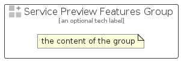

# ServicePreviewFeatures


```text
azure-19/Item/General/ServicePreviewFeatures
```

```text
include('azure-19/Item/General/ServicePreviewFeatures')
```


| Illustration | ServicePreviewFeatures | ServicePreviewFeaturesCard | ServicePreviewFeaturesGroup |
| :---: | :---: | :---: | :---: |
|  |  |  |  |


## Sprites
The item provides the following sriptes:

- `<$ServicePreviewFeaturesXs>`
- `<$ServicePreviewFeaturesSm>`
- `<$ServicePreviewFeaturesMd>`
- `<$ServicePreviewFeaturesLg>`


## ServicePreviewFeatures

### Load remotely
```plantuml
@startuml
' configures the library
!global $LIB_BASE_LOCATION="https://raw.githubusercontent.com/tmorin/plantuml-libs/master/distribution"

' loads the library's bootstrap
!include $LIB_BASE_LOCATION/bootstrap.puml

' loads the package bootstrap
include('azure-19/bootstrap')

' loads the Item which embeds the element ServicePreviewFeatures
include('azure-19/Item/General/ServicePreviewFeatures')

' renders the element
ServicePreviewFeatures('ServicePreviewFeatures', 'Service Preview Features', 'an optional tech label', 'an optional description')
@enduml
```

### Load locally
```plantuml
@startuml
' configures the library
!global $INCLUSION_MODE="local"
!global $LIB_BASE_LOCATION="../../.."

' loads the library's bootstrap
!include $LIB_BASE_LOCATION/bootstrap.puml

' loads the package bootstrap
include('azure-19/bootstrap')

' loads the Item which embeds the element ServicePreviewFeatures
include('azure-19/Item/General/ServicePreviewFeatures')

' renders the element
ServicePreviewFeatures('ServicePreviewFeatures', 'Service Preview Features', 'an optional tech label', 'an optional description')
@enduml
```

## ServicePreviewFeaturesCard

### Load remotely
```plantuml
@startuml
' configures the library
!global $LIB_BASE_LOCATION="https://raw.githubusercontent.com/tmorin/plantuml-libs/master/distribution"

' loads the library's bootstrap
!include $LIB_BASE_LOCATION/bootstrap.puml

' loads the package bootstrap
include('azure-19/bootstrap')

' loads the Item which embeds the element ServicePreviewFeaturesCard
include('azure-19/Item/General/ServicePreviewFeatures')

' renders the element
ServicePreviewFeaturesCard('ServicePreviewFeaturesCard', 'Service Preview Features Card', 'an optional description')
@enduml
```

### Load locally
```plantuml
@startuml
' configures the library
!global $INCLUSION_MODE="local"
!global $LIB_BASE_LOCATION="../../.."

' loads the library's bootstrap
!include $LIB_BASE_LOCATION/bootstrap.puml

' loads the package bootstrap
include('azure-19/bootstrap')

' loads the Item which embeds the element ServicePreviewFeaturesCard
include('azure-19/Item/General/ServicePreviewFeatures')

' renders the element
ServicePreviewFeaturesCard('ServicePreviewFeaturesCard', 'Service Preview Features Card', 'an optional description')
@enduml
```

## ServicePreviewFeaturesGroup

### Load remotely
```plantuml
@startuml
' configures the library
!global $LIB_BASE_LOCATION="https://raw.githubusercontent.com/tmorin/plantuml-libs/master/distribution"

' loads the library's bootstrap
!include $LIB_BASE_LOCATION/bootstrap.puml

' loads the package bootstrap
include('azure-19/bootstrap')

' loads the Item which embeds the element ServicePreviewFeaturesGroup
include('azure-19/Item/General/ServicePreviewFeatures')

' renders the element
ServicePreviewFeaturesGroup('ServicePreviewFeaturesGroup', 'Service Preview Features Group', 'an optional tech label') {
    note as note
        the content of the group
    end note
}
@enduml
```

### Load locally
```plantuml
@startuml
' configures the library
!global $INCLUSION_MODE="local"
!global $LIB_BASE_LOCATION="../../.."

' loads the library's bootstrap
!include $LIB_BASE_LOCATION/bootstrap.puml

' loads the package bootstrap
include('azure-19/bootstrap')

' loads the Item which embeds the element ServicePreviewFeaturesGroup
include('azure-19/Item/General/ServicePreviewFeatures')

' renders the element
ServicePreviewFeaturesGroup('ServicePreviewFeaturesGroup', 'Service Preview Features Group', 'an optional tech label') {
    note as note
        the content of the group
    end note
}
@enduml
```

