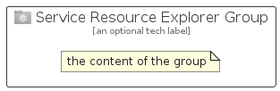

# ServiceResourceExplorer


```text
azure-19/Item/General/ServiceResourceExplorer
```

```text
include('azure-19/Item/General/ServiceResourceExplorer')
```


| Illustration | ServiceResourceExplorer | ServiceResourceExplorerCard | ServiceResourceExplorerGroup |
| :---: | :---: | :---: | :---: |
|  |  |  |  |


## Sprites
The item provides the following sriptes:

- `<$ServiceResourceExplorerXs>`
- `<$ServiceResourceExplorerSm>`
- `<$ServiceResourceExplorerMd>`
- `<$ServiceResourceExplorerLg>`


## ServiceResourceExplorer

### Load remotely
```plantuml
@startuml
' configures the library
!global $LIB_BASE_LOCATION="https://raw.githubusercontent.com/tmorin/plantuml-libs/master/distribution"

' loads the library's bootstrap
!include $LIB_BASE_LOCATION/bootstrap.puml

' loads the package bootstrap
include('azure-19/bootstrap')

' loads the Item which embeds the element ServiceResourceExplorer
include('azure-19/Item/General/ServiceResourceExplorer')

' renders the element
ServiceResourceExplorer('ServiceResourceExplorer', 'Service Resource Explorer', 'an optional tech label', 'an optional description')
@enduml
```

### Load locally
```plantuml
@startuml
' configures the library
!global $INCLUSION_MODE="local"
!global $LIB_BASE_LOCATION="../../.."

' loads the library's bootstrap
!include $LIB_BASE_LOCATION/bootstrap.puml

' loads the package bootstrap
include('azure-19/bootstrap')

' loads the Item which embeds the element ServiceResourceExplorer
include('azure-19/Item/General/ServiceResourceExplorer')

' renders the element
ServiceResourceExplorer('ServiceResourceExplorer', 'Service Resource Explorer', 'an optional tech label', 'an optional description')
@enduml
```

## ServiceResourceExplorerCard

### Load remotely
```plantuml
@startuml
' configures the library
!global $LIB_BASE_LOCATION="https://raw.githubusercontent.com/tmorin/plantuml-libs/master/distribution"

' loads the library's bootstrap
!include $LIB_BASE_LOCATION/bootstrap.puml

' loads the package bootstrap
include('azure-19/bootstrap')

' loads the Item which embeds the element ServiceResourceExplorerCard
include('azure-19/Item/General/ServiceResourceExplorer')

' renders the element
ServiceResourceExplorerCard('ServiceResourceExplorerCard', 'Service Resource Explorer Card', 'an optional description')
@enduml
```

### Load locally
```plantuml
@startuml
' configures the library
!global $INCLUSION_MODE="local"
!global $LIB_BASE_LOCATION="../../.."

' loads the library's bootstrap
!include $LIB_BASE_LOCATION/bootstrap.puml

' loads the package bootstrap
include('azure-19/bootstrap')

' loads the Item which embeds the element ServiceResourceExplorerCard
include('azure-19/Item/General/ServiceResourceExplorer')

' renders the element
ServiceResourceExplorerCard('ServiceResourceExplorerCard', 'Service Resource Explorer Card', 'an optional description')
@enduml
```

## ServiceResourceExplorerGroup

### Load remotely
```plantuml
@startuml
' configures the library
!global $LIB_BASE_LOCATION="https://raw.githubusercontent.com/tmorin/plantuml-libs/master/distribution"

' loads the library's bootstrap
!include $LIB_BASE_LOCATION/bootstrap.puml

' loads the package bootstrap
include('azure-19/bootstrap')

' loads the Item which embeds the element ServiceResourceExplorerGroup
include('azure-19/Item/General/ServiceResourceExplorer')

' renders the element
ServiceResourceExplorerGroup('ServiceResourceExplorerGroup', 'Service Resource Explorer Group', 'an optional tech label') {
    note as note
        the content of the group
    end note
}
@enduml
```

### Load locally
```plantuml
@startuml
' configures the library
!global $INCLUSION_MODE="local"
!global $LIB_BASE_LOCATION="../../.."

' loads the library's bootstrap
!include $LIB_BASE_LOCATION/bootstrap.puml

' loads the package bootstrap
include('azure-19/bootstrap')

' loads the Item which embeds the element ServiceResourceExplorerGroup
include('azure-19/Item/General/ServiceResourceExplorer')

' renders the element
ServiceResourceExplorerGroup('ServiceResourceExplorerGroup', 'Service Resource Explorer Group', 'an optional tech label') {
    note as note
        the content of the group
    end note
}
@enduml
```

