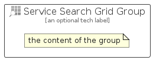

# ServiceSearchGrid


```text
azure-19/Item/General/ServiceSearchGrid
```

```text
include('azure-19/Item/General/ServiceSearchGrid')
```


| Illustration | ServiceSearchGrid | ServiceSearchGridCard | ServiceSearchGridGroup |
| :---: | :---: | :---: | :---: |
|  |  |  |  |


## Sprites
The item provides the following sriptes:

- `<$ServiceSearchGridXs>`
- `<$ServiceSearchGridSm>`
- `<$ServiceSearchGridMd>`
- `<$ServiceSearchGridLg>`


## ServiceSearchGrid

### Load remotely
```plantuml
@startuml
' configures the library
!global $LIB_BASE_LOCATION="https://raw.githubusercontent.com/tmorin/plantuml-libs/master/distribution"

' loads the library's bootstrap
!include $LIB_BASE_LOCATION/bootstrap.puml

' loads the package bootstrap
include('azure-19/bootstrap')

' loads the Item which embeds the element ServiceSearchGrid
include('azure-19/Item/General/ServiceSearchGrid')

' renders the element
ServiceSearchGrid('ServiceSearchGrid', 'Service Search Grid', 'an optional tech label', 'an optional description')
@enduml
```

### Load locally
```plantuml
@startuml
' configures the library
!global $INCLUSION_MODE="local"
!global $LIB_BASE_LOCATION="../../.."

' loads the library's bootstrap
!include $LIB_BASE_LOCATION/bootstrap.puml

' loads the package bootstrap
include('azure-19/bootstrap')

' loads the Item which embeds the element ServiceSearchGrid
include('azure-19/Item/General/ServiceSearchGrid')

' renders the element
ServiceSearchGrid('ServiceSearchGrid', 'Service Search Grid', 'an optional tech label', 'an optional description')
@enduml
```

## ServiceSearchGridCard

### Load remotely
```plantuml
@startuml
' configures the library
!global $LIB_BASE_LOCATION="https://raw.githubusercontent.com/tmorin/plantuml-libs/master/distribution"

' loads the library's bootstrap
!include $LIB_BASE_LOCATION/bootstrap.puml

' loads the package bootstrap
include('azure-19/bootstrap')

' loads the Item which embeds the element ServiceSearchGridCard
include('azure-19/Item/General/ServiceSearchGrid')

' renders the element
ServiceSearchGridCard('ServiceSearchGridCard', 'Service Search Grid Card', 'an optional description')
@enduml
```

### Load locally
```plantuml
@startuml
' configures the library
!global $INCLUSION_MODE="local"
!global $LIB_BASE_LOCATION="../../.."

' loads the library's bootstrap
!include $LIB_BASE_LOCATION/bootstrap.puml

' loads the package bootstrap
include('azure-19/bootstrap')

' loads the Item which embeds the element ServiceSearchGridCard
include('azure-19/Item/General/ServiceSearchGrid')

' renders the element
ServiceSearchGridCard('ServiceSearchGridCard', 'Service Search Grid Card', 'an optional description')
@enduml
```

## ServiceSearchGridGroup

### Load remotely
```plantuml
@startuml
' configures the library
!global $LIB_BASE_LOCATION="https://raw.githubusercontent.com/tmorin/plantuml-libs/master/distribution"

' loads the library's bootstrap
!include $LIB_BASE_LOCATION/bootstrap.puml

' loads the package bootstrap
include('azure-19/bootstrap')

' loads the Item which embeds the element ServiceSearchGridGroup
include('azure-19/Item/General/ServiceSearchGrid')

' renders the element
ServiceSearchGridGroup('ServiceSearchGridGroup', 'Service Search Grid Group', 'an optional tech label') {
    note as note
        the content of the group
    end note
}
@enduml
```

### Load locally
```plantuml
@startuml
' configures the library
!global $INCLUSION_MODE="local"
!global $LIB_BASE_LOCATION="../../.."

' loads the library's bootstrap
!include $LIB_BASE_LOCATION/bootstrap.puml

' loads the package bootstrap
include('azure-19/bootstrap')

' loads the Item which embeds the element ServiceSearchGridGroup
include('azure-19/Item/General/ServiceSearchGrid')

' renders the element
ServiceSearchGridGroup('ServiceSearchGridGroup', 'Service Search Grid Group', 'an optional tech label') {
    note as note
        the content of the group
    end note
}
@enduml
```

