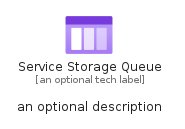
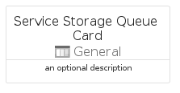

# ServiceStorageQueue


```text
azure-19/Item/General/ServiceStorageQueue
```

```text
include('azure-19/Item/General/ServiceStorageQueue')
```


| Illustration | ServiceStorageQueue | ServiceStorageQueueCard | ServiceStorageQueueGroup |
| :---: | :---: | :---: | :---: |
|  |  |  |  |


## Sprites
The item provides the following sriptes:

- `<$ServiceStorageQueueXs>`
- `<$ServiceStorageQueueSm>`
- `<$ServiceStorageQueueMd>`
- `<$ServiceStorageQueueLg>`


## ServiceStorageQueue

### Load remotely
```plantuml
@startuml
' configures the library
!global $LIB_BASE_LOCATION="https://raw.githubusercontent.com/tmorin/plantuml-libs/master/distribution"

' loads the library's bootstrap
!include $LIB_BASE_LOCATION/bootstrap.puml

' loads the package bootstrap
include('azure-19/bootstrap')

' loads the Item which embeds the element ServiceStorageQueue
include('azure-19/Item/General/ServiceStorageQueue')

' renders the element
ServiceStorageQueue('ServiceStorageQueue', 'Service Storage Queue', 'an optional tech label', 'an optional description')
@enduml
```

### Load locally
```plantuml
@startuml
' configures the library
!global $INCLUSION_MODE="local"
!global $LIB_BASE_LOCATION="../../.."

' loads the library's bootstrap
!include $LIB_BASE_LOCATION/bootstrap.puml

' loads the package bootstrap
include('azure-19/bootstrap')

' loads the Item which embeds the element ServiceStorageQueue
include('azure-19/Item/General/ServiceStorageQueue')

' renders the element
ServiceStorageQueue('ServiceStorageQueue', 'Service Storage Queue', 'an optional tech label', 'an optional description')
@enduml
```

## ServiceStorageQueueCard

### Load remotely
```plantuml
@startuml
' configures the library
!global $LIB_BASE_LOCATION="https://raw.githubusercontent.com/tmorin/plantuml-libs/master/distribution"

' loads the library's bootstrap
!include $LIB_BASE_LOCATION/bootstrap.puml

' loads the package bootstrap
include('azure-19/bootstrap')

' loads the Item which embeds the element ServiceStorageQueueCard
include('azure-19/Item/General/ServiceStorageQueue')

' renders the element
ServiceStorageQueueCard('ServiceStorageQueueCard', 'Service Storage Queue Card', 'an optional description')
@enduml
```

### Load locally
```plantuml
@startuml
' configures the library
!global $INCLUSION_MODE="local"
!global $LIB_BASE_LOCATION="../../.."

' loads the library's bootstrap
!include $LIB_BASE_LOCATION/bootstrap.puml

' loads the package bootstrap
include('azure-19/bootstrap')

' loads the Item which embeds the element ServiceStorageQueueCard
include('azure-19/Item/General/ServiceStorageQueue')

' renders the element
ServiceStorageQueueCard('ServiceStorageQueueCard', 'Service Storage Queue Card', 'an optional description')
@enduml
```

## ServiceStorageQueueGroup

### Load remotely
```plantuml
@startuml
' configures the library
!global $LIB_BASE_LOCATION="https://raw.githubusercontent.com/tmorin/plantuml-libs/master/distribution"

' loads the library's bootstrap
!include $LIB_BASE_LOCATION/bootstrap.puml

' loads the package bootstrap
include('azure-19/bootstrap')

' loads the Item which embeds the element ServiceStorageQueueGroup
include('azure-19/Item/General/ServiceStorageQueue')

' renders the element
ServiceStorageQueueGroup('ServiceStorageQueueGroup', 'Service Storage Queue Group', 'an optional tech label') {
    note as note
        the content of the group
    end note
}
@enduml
```

### Load locally
```plantuml
@startuml
' configures the library
!global $INCLUSION_MODE="local"
!global $LIB_BASE_LOCATION="../../.."

' loads the library's bootstrap
!include $LIB_BASE_LOCATION/bootstrap.puml

' loads the package bootstrap
include('azure-19/bootstrap')

' loads the Item which embeds the element ServiceStorageQueueGroup
include('azure-19/Item/General/ServiceStorageQueue')

' renders the element
ServiceStorageQueueGroup('ServiceStorageQueueGroup', 'Service Storage Queue Group', 'an optional tech label') {
    note as note
        the content of the group
    end note
}
@enduml
```

