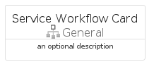
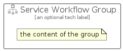

# ServiceWorkflow


```text
azure-19/Item/General/ServiceWorkflow
```

```text
include('azure-19/Item/General/ServiceWorkflow')
```


| Illustration | ServiceWorkflow | ServiceWorkflowCard | ServiceWorkflowGroup |
| :---: | :---: | :---: | :---: |
|  |  |  |  |


## Sprites
The item provides the following sriptes:

- `<$ServiceWorkflowXs>`
- `<$ServiceWorkflowSm>`
- `<$ServiceWorkflowMd>`
- `<$ServiceWorkflowLg>`


## ServiceWorkflow

### Load remotely
```plantuml
@startuml
' configures the library
!global $LIB_BASE_LOCATION="https://raw.githubusercontent.com/tmorin/plantuml-libs/master/distribution"

' loads the library's bootstrap
!include $LIB_BASE_LOCATION/bootstrap.puml

' loads the package bootstrap
include('azure-19/bootstrap')

' loads the Item which embeds the element ServiceWorkflow
include('azure-19/Item/General/ServiceWorkflow')

' renders the element
ServiceWorkflow('ServiceWorkflow', 'Service Workflow', 'an optional tech label', 'an optional description')
@enduml
```

### Load locally
```plantuml
@startuml
' configures the library
!global $INCLUSION_MODE="local"
!global $LIB_BASE_LOCATION="../../.."

' loads the library's bootstrap
!include $LIB_BASE_LOCATION/bootstrap.puml

' loads the package bootstrap
include('azure-19/bootstrap')

' loads the Item which embeds the element ServiceWorkflow
include('azure-19/Item/General/ServiceWorkflow')

' renders the element
ServiceWorkflow('ServiceWorkflow', 'Service Workflow', 'an optional tech label', 'an optional description')
@enduml
```

## ServiceWorkflowCard

### Load remotely
```plantuml
@startuml
' configures the library
!global $LIB_BASE_LOCATION="https://raw.githubusercontent.com/tmorin/plantuml-libs/master/distribution"

' loads the library's bootstrap
!include $LIB_BASE_LOCATION/bootstrap.puml

' loads the package bootstrap
include('azure-19/bootstrap')

' loads the Item which embeds the element ServiceWorkflowCard
include('azure-19/Item/General/ServiceWorkflow')

' renders the element
ServiceWorkflowCard('ServiceWorkflowCard', 'Service Workflow Card', 'an optional description')
@enduml
```

### Load locally
```plantuml
@startuml
' configures the library
!global $INCLUSION_MODE="local"
!global $LIB_BASE_LOCATION="../../.."

' loads the library's bootstrap
!include $LIB_BASE_LOCATION/bootstrap.puml

' loads the package bootstrap
include('azure-19/bootstrap')

' loads the Item which embeds the element ServiceWorkflowCard
include('azure-19/Item/General/ServiceWorkflow')

' renders the element
ServiceWorkflowCard('ServiceWorkflowCard', 'Service Workflow Card', 'an optional description')
@enduml
```

## ServiceWorkflowGroup

### Load remotely
```plantuml
@startuml
' configures the library
!global $LIB_BASE_LOCATION="https://raw.githubusercontent.com/tmorin/plantuml-libs/master/distribution"

' loads the library's bootstrap
!include $LIB_BASE_LOCATION/bootstrap.puml

' loads the package bootstrap
include('azure-19/bootstrap')

' loads the Item which embeds the element ServiceWorkflowGroup
include('azure-19/Item/General/ServiceWorkflow')

' renders the element
ServiceWorkflowGroup('ServiceWorkflowGroup', 'Service Workflow Group', 'an optional tech label') {
    note as note
        the content of the group
    end note
}
@enduml
```

### Load locally
```plantuml
@startuml
' configures the library
!global $INCLUSION_MODE="local"
!global $LIB_BASE_LOCATION="../../.."

' loads the library's bootstrap
!include $LIB_BASE_LOCATION/bootstrap.puml

' loads the package bootstrap
include('azure-19/bootstrap')

' loads the Item which embeds the element ServiceWorkflowGroup
include('azure-19/Item/General/ServiceWorkflow')

' renders the element
ServiceWorkflowGroup('ServiceWorkflowGroup', 'Service Workflow Group', 'an optional tech label') {
    note as note
        the content of the group
    end note
}
@enduml
```

