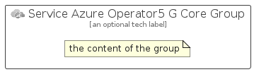

# ServiceAzureOperator5GCore


```text
azure-19/Item/HybridMulticloud/ServiceAzureOperator5GCore
```

```text
include('azure-19/Item/HybridMulticloud/ServiceAzureOperator5GCore')
```


| Illustration | ServiceAzureOperator5GCore | ServiceAzureOperator5GCoreCard | ServiceAzureOperator5GCoreGroup |
| :---: | :---: | :---: | :---: |
|  |  |  |  |


## Sprites
The item provides the following sriptes:

- `<$ServiceAzureOperator5GCoreXs>`
- `<$ServiceAzureOperator5GCoreSm>`
- `<$ServiceAzureOperator5GCoreMd>`
- `<$ServiceAzureOperator5GCoreLg>`


## ServiceAzureOperator5GCore

### Load remotely
```plantuml
@startuml
' configures the library
!global $LIB_BASE_LOCATION="https://raw.githubusercontent.com/tmorin/plantuml-libs/master/distribution"

' loads the library's bootstrap
!include $LIB_BASE_LOCATION/bootstrap.puml

' loads the package bootstrap
include('azure-19/bootstrap')

' loads the Item which embeds the element ServiceAzureOperator5GCore
include('azure-19/Item/HybridMulticloud/ServiceAzureOperator5GCore')

' renders the element
ServiceAzureOperator5GCore('ServiceAzureOperator5GCore', 'Service Azure Operator5 G Core', 'an optional tech label', 'an optional description')
@enduml
```

### Load locally
```plantuml
@startuml
' configures the library
!global $INCLUSION_MODE="local"
!global $LIB_BASE_LOCATION="../../.."

' loads the library's bootstrap
!include $LIB_BASE_LOCATION/bootstrap.puml

' loads the package bootstrap
include('azure-19/bootstrap')

' loads the Item which embeds the element ServiceAzureOperator5GCore
include('azure-19/Item/HybridMulticloud/ServiceAzureOperator5GCore')

' renders the element
ServiceAzureOperator5GCore('ServiceAzureOperator5GCore', 'Service Azure Operator5 G Core', 'an optional tech label', 'an optional description')
@enduml
```

## ServiceAzureOperator5GCoreCard

### Load remotely
```plantuml
@startuml
' configures the library
!global $LIB_BASE_LOCATION="https://raw.githubusercontent.com/tmorin/plantuml-libs/master/distribution"

' loads the library's bootstrap
!include $LIB_BASE_LOCATION/bootstrap.puml

' loads the package bootstrap
include('azure-19/bootstrap')

' loads the Item which embeds the element ServiceAzureOperator5GCoreCard
include('azure-19/Item/HybridMulticloud/ServiceAzureOperator5GCore')

' renders the element
ServiceAzureOperator5GCoreCard('ServiceAzureOperator5GCoreCard', 'Service Azure Operator5 G Core Card', 'an optional description')
@enduml
```

### Load locally
```plantuml
@startuml
' configures the library
!global $INCLUSION_MODE="local"
!global $LIB_BASE_LOCATION="../../.."

' loads the library's bootstrap
!include $LIB_BASE_LOCATION/bootstrap.puml

' loads the package bootstrap
include('azure-19/bootstrap')

' loads the Item which embeds the element ServiceAzureOperator5GCoreCard
include('azure-19/Item/HybridMulticloud/ServiceAzureOperator5GCore')

' renders the element
ServiceAzureOperator5GCoreCard('ServiceAzureOperator5GCoreCard', 'Service Azure Operator5 G Core Card', 'an optional description')
@enduml
```

## ServiceAzureOperator5GCoreGroup

### Load remotely
```plantuml
@startuml
' configures the library
!global $LIB_BASE_LOCATION="https://raw.githubusercontent.com/tmorin/plantuml-libs/master/distribution"

' loads the library's bootstrap
!include $LIB_BASE_LOCATION/bootstrap.puml

' loads the package bootstrap
include('azure-19/bootstrap')

' loads the Item which embeds the element ServiceAzureOperator5GCoreGroup
include('azure-19/Item/HybridMulticloud/ServiceAzureOperator5GCore')

' renders the element
ServiceAzureOperator5GCoreGroup('ServiceAzureOperator5GCoreGroup', 'Service Azure Operator5 G Core Group', 'an optional tech label') {
    note as note
        the content of the group
    end note
}
@enduml
```

### Load locally
```plantuml
@startuml
' configures the library
!global $INCLUSION_MODE="local"
!global $LIB_BASE_LOCATION="../../.."

' loads the library's bootstrap
!include $LIB_BASE_LOCATION/bootstrap.puml

' loads the package bootstrap
include('azure-19/bootstrap')

' loads the Item which embeds the element ServiceAzureOperator5GCoreGroup
include('azure-19/Item/HybridMulticloud/ServiceAzureOperator5GCore')

' renders the element
ServiceAzureOperator5GCoreGroup('ServiceAzureOperator5GCoreGroup', 'Service Azure Operator5 G Core Group', 'an optional tech label') {
    note as note
        the content of the group
    end note
}
@enduml
```

