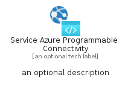

# ServiceAzureProgrammableConnectivity


```text
azure-19/Item/HybridMulticloud/ServiceAzureProgrammableConnectivity
```

```text
include('azure-19/Item/HybridMulticloud/ServiceAzureProgrammableConnectivity')
```


| Illustration | ServiceAzureProgrammableConnectivity | ServiceAzureProgrammableConnectivityCard | ServiceAzureProgrammableConnectivityGroup |
| :---: | :---: | :---: | :---: |
|  |  |  |  |


## Sprites
The item provides the following sriptes:

- `<$ServiceAzureProgrammableConnectivityXs>`
- `<$ServiceAzureProgrammableConnectivitySm>`
- `<$ServiceAzureProgrammableConnectivityMd>`
- `<$ServiceAzureProgrammableConnectivityLg>`


## ServiceAzureProgrammableConnectivity

### Load remotely
```plantuml
@startuml
' configures the library
!global $LIB_BASE_LOCATION="https://raw.githubusercontent.com/tmorin/plantuml-libs/master/distribution"

' loads the library's bootstrap
!include $LIB_BASE_LOCATION/bootstrap.puml

' loads the package bootstrap
include('azure-19/bootstrap')

' loads the Item which embeds the element ServiceAzureProgrammableConnectivity
include('azure-19/Item/HybridMulticloud/ServiceAzureProgrammableConnectivity')

' renders the element
ServiceAzureProgrammableConnectivity('ServiceAzureProgrammableConnectivity', 'Service Azure Programmable Connectivity', 'an optional tech label', 'an optional description')
@enduml
```

### Load locally
```plantuml
@startuml
' configures the library
!global $INCLUSION_MODE="local"
!global $LIB_BASE_LOCATION="../../.."

' loads the library's bootstrap
!include $LIB_BASE_LOCATION/bootstrap.puml

' loads the package bootstrap
include('azure-19/bootstrap')

' loads the Item which embeds the element ServiceAzureProgrammableConnectivity
include('azure-19/Item/HybridMulticloud/ServiceAzureProgrammableConnectivity')

' renders the element
ServiceAzureProgrammableConnectivity('ServiceAzureProgrammableConnectivity', 'Service Azure Programmable Connectivity', 'an optional tech label', 'an optional description')
@enduml
```

## ServiceAzureProgrammableConnectivityCard

### Load remotely
```plantuml
@startuml
' configures the library
!global $LIB_BASE_LOCATION="https://raw.githubusercontent.com/tmorin/plantuml-libs/master/distribution"

' loads the library's bootstrap
!include $LIB_BASE_LOCATION/bootstrap.puml

' loads the package bootstrap
include('azure-19/bootstrap')

' loads the Item which embeds the element ServiceAzureProgrammableConnectivityCard
include('azure-19/Item/HybridMulticloud/ServiceAzureProgrammableConnectivity')

' renders the element
ServiceAzureProgrammableConnectivityCard('ServiceAzureProgrammableConnectivityCard', 'Service Azure Programmable Connectivity Card', 'an optional description')
@enduml
```

### Load locally
```plantuml
@startuml
' configures the library
!global $INCLUSION_MODE="local"
!global $LIB_BASE_LOCATION="../../.."

' loads the library's bootstrap
!include $LIB_BASE_LOCATION/bootstrap.puml

' loads the package bootstrap
include('azure-19/bootstrap')

' loads the Item which embeds the element ServiceAzureProgrammableConnectivityCard
include('azure-19/Item/HybridMulticloud/ServiceAzureProgrammableConnectivity')

' renders the element
ServiceAzureProgrammableConnectivityCard('ServiceAzureProgrammableConnectivityCard', 'Service Azure Programmable Connectivity Card', 'an optional description')
@enduml
```

## ServiceAzureProgrammableConnectivityGroup

### Load remotely
```plantuml
@startuml
' configures the library
!global $LIB_BASE_LOCATION="https://raw.githubusercontent.com/tmorin/plantuml-libs/master/distribution"

' loads the library's bootstrap
!include $LIB_BASE_LOCATION/bootstrap.puml

' loads the package bootstrap
include('azure-19/bootstrap')

' loads the Item which embeds the element ServiceAzureProgrammableConnectivityGroup
include('azure-19/Item/HybridMulticloud/ServiceAzureProgrammableConnectivity')

' renders the element
ServiceAzureProgrammableConnectivityGroup('ServiceAzureProgrammableConnectivityGroup', 'Service Azure Programmable Connectivity Group', 'an optional tech label') {
    note as note
        the content of the group
    end note
}
@enduml
```

### Load locally
```plantuml
@startuml
' configures the library
!global $INCLUSION_MODE="local"
!global $LIB_BASE_LOCATION="../../.."

' loads the library's bootstrap
!include $LIB_BASE_LOCATION/bootstrap.puml

' loads the package bootstrap
include('azure-19/bootstrap')

' loads the Item which embeds the element ServiceAzureProgrammableConnectivityGroup
include('azure-19/Item/HybridMulticloud/ServiceAzureProgrammableConnectivity')

' renders the element
ServiceAzureProgrammableConnectivityGroup('ServiceAzureProgrammableConnectivityGroup', 'Service Azure Programmable Connectivity Group', 'an optional tech label') {
    note as note
        the content of the group
    end note
}
@enduml
```

