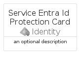
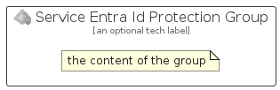

# ServiceEntraIdProtection


```text
azure-19/Item/Identity/ServiceEntraIdProtection
```

```text
include('azure-19/Item/Identity/ServiceEntraIdProtection')
```


| Illustration | ServiceEntraIdProtection | ServiceEntraIdProtectionCard | ServiceEntraIdProtectionGroup |
| :---: | :---: | :---: | :---: |
|  |  |  |  |


## Sprites
The item provides the following sriptes:

- `<$ServiceEntraIdProtectionXs>`
- `<$ServiceEntraIdProtectionSm>`
- `<$ServiceEntraIdProtectionMd>`
- `<$ServiceEntraIdProtectionLg>`


## ServiceEntraIdProtection

### Load remotely
```plantuml
@startuml
' configures the library
!global $LIB_BASE_LOCATION="https://raw.githubusercontent.com/tmorin/plantuml-libs/master/distribution"

' loads the library's bootstrap
!include $LIB_BASE_LOCATION/bootstrap.puml

' loads the package bootstrap
include('azure-19/bootstrap')

' loads the Item which embeds the element ServiceEntraIdProtection
include('azure-19/Item/Identity/ServiceEntraIdProtection')

' renders the element
ServiceEntraIdProtection('ServiceEntraIdProtection', 'Service Entra Id Protection', 'an optional tech label', 'an optional description')
@enduml
```

### Load locally
```plantuml
@startuml
' configures the library
!global $INCLUSION_MODE="local"
!global $LIB_BASE_LOCATION="../../.."

' loads the library's bootstrap
!include $LIB_BASE_LOCATION/bootstrap.puml

' loads the package bootstrap
include('azure-19/bootstrap')

' loads the Item which embeds the element ServiceEntraIdProtection
include('azure-19/Item/Identity/ServiceEntraIdProtection')

' renders the element
ServiceEntraIdProtection('ServiceEntraIdProtection', 'Service Entra Id Protection', 'an optional tech label', 'an optional description')
@enduml
```

## ServiceEntraIdProtectionCard

### Load remotely
```plantuml
@startuml
' configures the library
!global $LIB_BASE_LOCATION="https://raw.githubusercontent.com/tmorin/plantuml-libs/master/distribution"

' loads the library's bootstrap
!include $LIB_BASE_LOCATION/bootstrap.puml

' loads the package bootstrap
include('azure-19/bootstrap')

' loads the Item which embeds the element ServiceEntraIdProtectionCard
include('azure-19/Item/Identity/ServiceEntraIdProtection')

' renders the element
ServiceEntraIdProtectionCard('ServiceEntraIdProtectionCard', 'Service Entra Id Protection Card', 'an optional description')
@enduml
```

### Load locally
```plantuml
@startuml
' configures the library
!global $INCLUSION_MODE="local"
!global $LIB_BASE_LOCATION="../../.."

' loads the library's bootstrap
!include $LIB_BASE_LOCATION/bootstrap.puml

' loads the package bootstrap
include('azure-19/bootstrap')

' loads the Item which embeds the element ServiceEntraIdProtectionCard
include('azure-19/Item/Identity/ServiceEntraIdProtection')

' renders the element
ServiceEntraIdProtectionCard('ServiceEntraIdProtectionCard', 'Service Entra Id Protection Card', 'an optional description')
@enduml
```

## ServiceEntraIdProtectionGroup

### Load remotely
```plantuml
@startuml
' configures the library
!global $LIB_BASE_LOCATION="https://raw.githubusercontent.com/tmorin/plantuml-libs/master/distribution"

' loads the library's bootstrap
!include $LIB_BASE_LOCATION/bootstrap.puml

' loads the package bootstrap
include('azure-19/bootstrap')

' loads the Item which embeds the element ServiceEntraIdProtectionGroup
include('azure-19/Item/Identity/ServiceEntraIdProtection')

' renders the element
ServiceEntraIdProtectionGroup('ServiceEntraIdProtectionGroup', 'Service Entra Id Protection Group', 'an optional tech label') {
    note as note
        the content of the group
    end note
}
@enduml
```

### Load locally
```plantuml
@startuml
' configures the library
!global $INCLUSION_MODE="local"
!global $LIB_BASE_LOCATION="../../.."

' loads the library's bootstrap
!include $LIB_BASE_LOCATION/bootstrap.puml

' loads the package bootstrap
include('azure-19/bootstrap')

' loads the Item which embeds the element ServiceEntraIdProtectionGroup
include('azure-19/Item/Identity/ServiceEntraIdProtection')

' renders the element
ServiceEntraIdProtectionGroup('ServiceEntraIdProtectionGroup', 'Service Entra Id Protection Group', 'an optional tech label') {
    note as note
        the content of the group
    end note
}
@enduml
```

